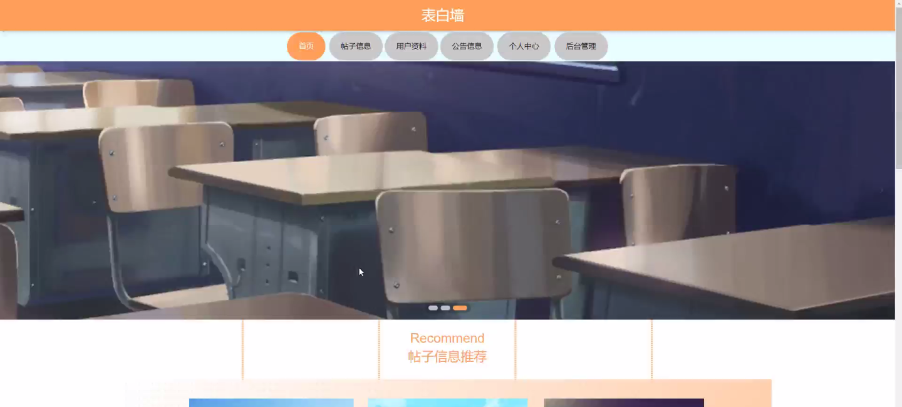
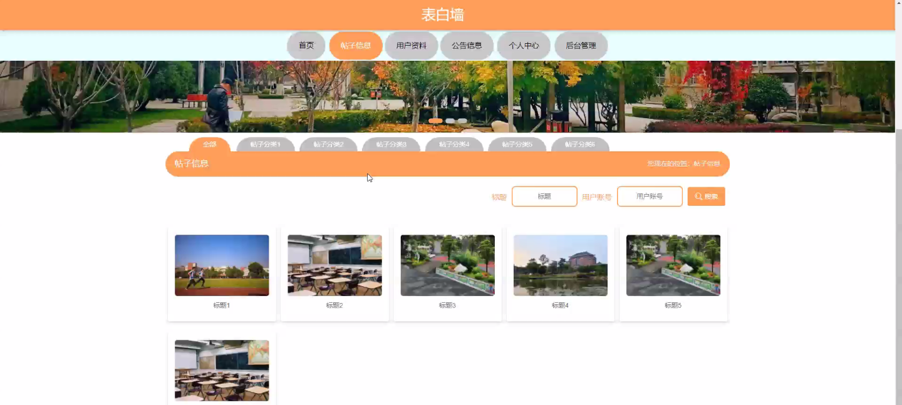
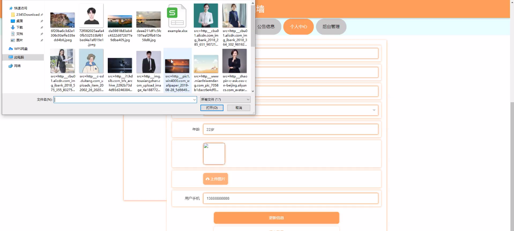
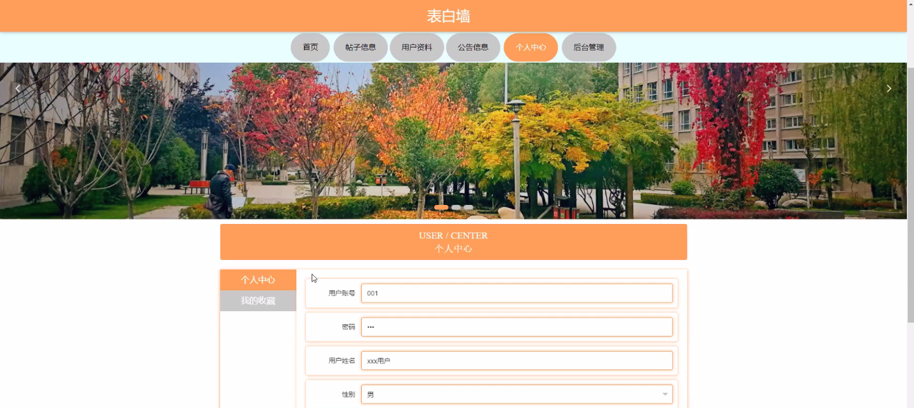
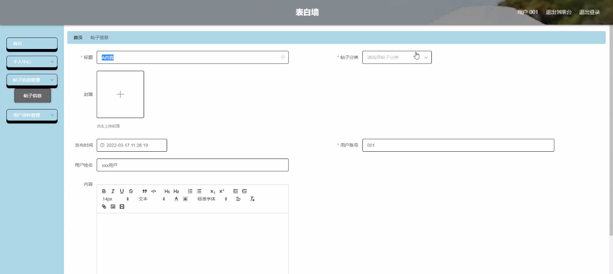
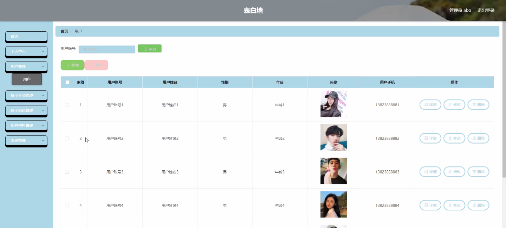

****本项目包含程序+源码+数据库+LW+调试部署环境，文末可获取一份本项目的java源码和数据库参考。****

## ******开题报告******

研究背景：
随着社交媒体的普及和发展，表白墙作为一种新兴的社交形式逐渐受到年轻人的喜爱。表白墙是一个供用户发布表白信息的平台，用户可以匿名或实名发布自己对他人的情感表达。这种形式的出现不仅满足了人们表达情感的需求，也给予了被表白者一种特殊的关注和认可。然而，目前存在的表白墙系统还存在一些问题，如信息质量无法保证、用户体验不佳等，因此有必要进行深入研究和改进。

研究意义：
研究表白墙系统的功能和性能对于提升用户体验、增加用户粘性以及促进社交交流具有重要意义。通过深入分析和优化系统功能，可以提高用户的使用体验，增加用户的参与度和活跃度，进而促进用户之间的情感交流和社交互动。同时，研究表白墙系统还有助于挖掘用户行为数据，为相关领域的市场营销、心理学研究等提供参考依据。

研究目的：
本研究旨在通过对表白墙系统的功能和性能进行深入研究，解决目前存在的问题，提升用户体验和社交交流效果。具体目标包括但不限于：优化用户界面设计，提高用户的使用便捷性；改进信息发布和管理机制，提高信息质量和真实性；增加个性化推荐功能，提供更精准的匹配和推荐服务；提升系统的稳定性和安全性，保护用户隐私。

研究内容： 本研究将主要围绕表白墙系统的以下功能展开研究：

  1. 用户功能：研究用户注册、登录、个人资料设置等功能的优化，提高用户的使用便捷性和个性化体验。

  2. 帖子分类功能：研究帖子分类算法和机制，实现对表白信息的自动分类和标签化，提高信息检索的准确性和效率。

  3. 帖子信息功能：研究帖子信息的展示方式和排版布局，优化用户阅读体验，提高信息传达的效果。

  4. 用户资料功能：研究用户资料的完善和展示方式，提供更多个性化的信息展示和匹配服务，增加用户的互动和社交机会。

拟解决的主要问题：
本研究拟解决的主要问题包括但不限于：信息质量无法保证、用户体验不佳、个性化推荐不准确、系统稳定性和安全性等方面存在的问题。通过对系统功能和性能的深入研究和优化，旨在提升用户体验、增加用户粘性，并解决当前表白墙系统存在的问题。

研究方案和预期成果：
本研究将采用综合研究方法，包括文献调研、用户调研、系统设计与实现等环节，以实现对表白墙系统功能和性能的深入研究。预期成果包括但不限于：优化的用户界面设计、改进的信息发布和管理机制、增强的个性化推荐功能、提升的系统稳定性和安全性等方面的成果。通过这些成果的应用和实践，预计能够提高用户的使用体验、促进社交交流效果，并为相关领域的研究和实践提供参考依据。

进度安排：

2022年9月至10月：开题报告编写和提交，完成开题报告的撰写并提交给指导教师进行审核。

2022年11月至2023年1月：系统设计和开发，根据开题报告的要求，进行系统设计和编码工作。

2023年2月至3月：论文撰写和初稿完成，开始撰写论文，并在这个阶段完成论文的初稿。

2023年4月至5月：论文修改和最终定稿，根据指导教师的意见对论文进行修改，并完成最终的定稿。

2023年5月：论文答辩和提交，参加论文答辩并根据答辩结果进行修改，最后将论文提交给学院或学校。

参考文献：

[1]喻佳,吴丹新.基于SpringBoot的Web快速开发框架[J].电脑编程技巧与维护,2021,(09):31-33.

[2]李鹏.基于SpringBoot快速开发平台的实现[J].电子技术与软件工程,2021,(12):36-37.

[3]叶开平,蔡维晟,陈家敏,邓斯妮.基于SpringBoot的综测可视化管理系统的研究与设计[J].电脑知识与技术,2021,(12):100-104.

[4]江健锋,徐振平.Springboot最小系统的设计与实现[J].电脑知识与技术,2021,(04):62-63.

[5]赵炯,司圣杰,周奇才,熊肖磊.通用信息获取系统设计与实现[J].起重运输机械,2020,(16):89-97.

[6]吴英宾.一种内外网数据交互系统的设计与实现[J].软件工程,2020,(08):25-27.

****以上是本项目程序开发之前开题报告内容，最终成品以下面界面为准，大家可以酌情参考使用。要源码参考请在文末进行获取！！****

## ******本项目的界面展示******

