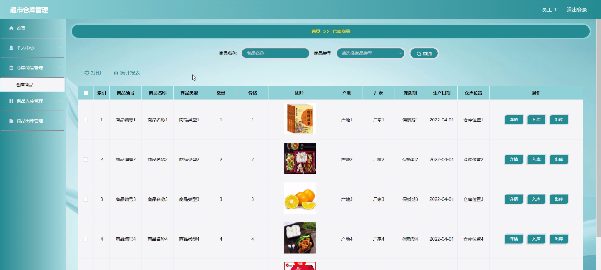
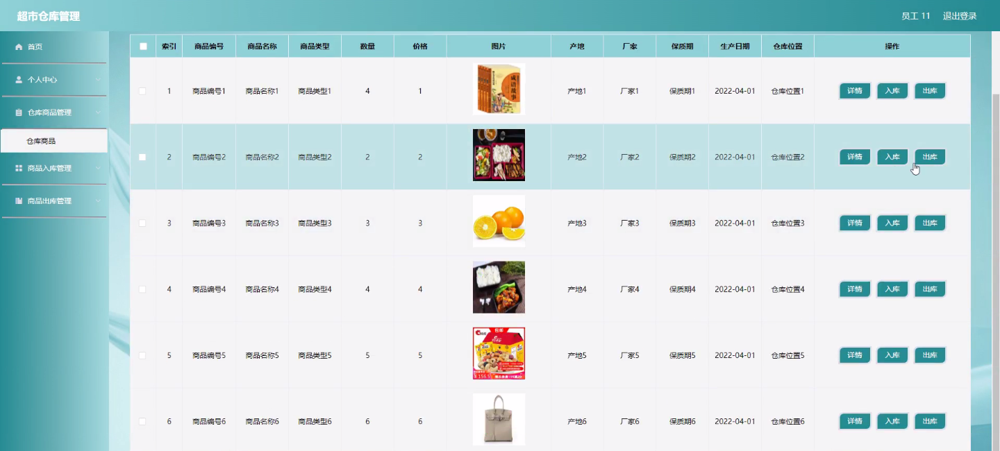
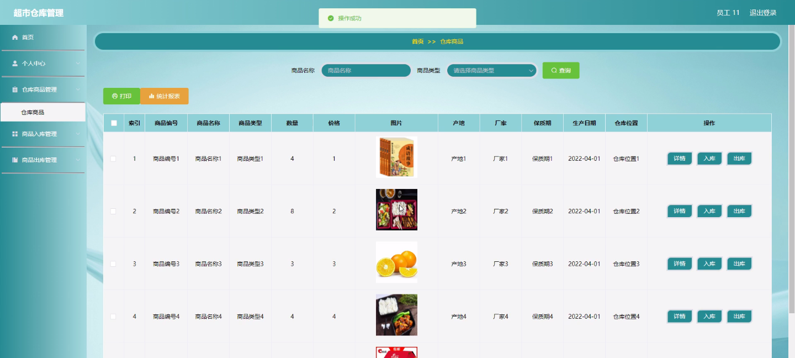
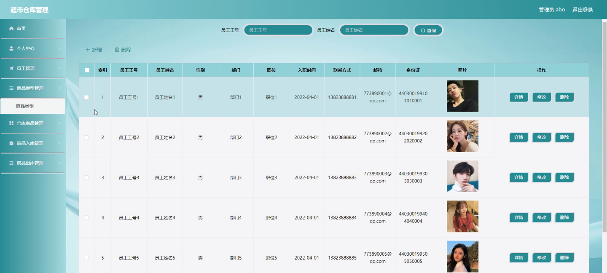
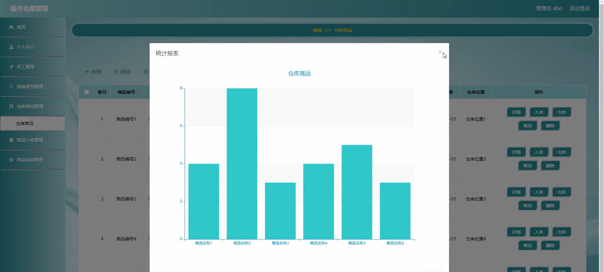
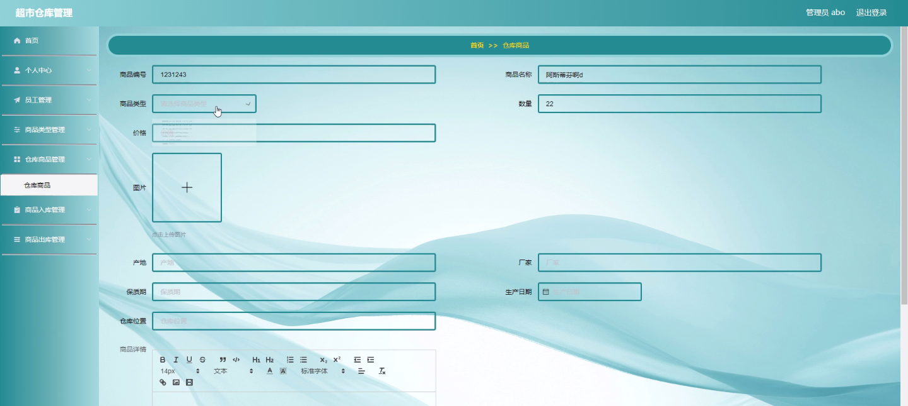

****本项目包含程序+源码+数据库+LW+调试部署环境，文末可获取一份本项目的java源码和数据库参考。****

## ******开题报告******

研究背景：
超市仓库管理是现代零售业中不可或缺的一环。随着消费者需求的增长和商品种类的多样化，超市仓库面临着日益复杂的管理挑战。传统的手工管理方式已经无法满足高效、准确、及时的需求。因此，开展超市仓库管理系统的研究具有重要的实际意义。

研究意义：
通过建立和优化超市仓库管理系统，可以提高仓库运作效率，减少人力成本，降低错误率，提升服务质量，从而更好地满足消费者的需求。同时，合理利用仓库空间和资源，能够有效控制库存，并提供准确的数据支持决策，为企业的发展提供有力支撑。

研究目的：
本研究旨在设计和开发一套高效、智能的超市仓库管理系统，以提升超市仓库的管理水平和运作效率。通过对系统功能的研究和优化，实现员工管理、商品类型管理、仓库商品管理、商品入库和商品出库等核心功能的自动化和智能化，从而提高仓库管理的准确性、实时性和可操作性。

研究内容： 本研究的主要内容包括以下系统功能的设计和优化：

  1. 员工管理：建立员工信息数据库，包括员工基本信息、权限管理等，实现员工的登录、权限控制和工作分配等功能。

  2. 商品类型管理：建立商品类型数据库，包括商品类别、属性、规格等信息，实现对不同商品类型的分类管理和查询功能。

  3. 仓库商品管理：建立仓库商品数据库，包括商品库存、位置、状态等信息，实现对仓库商品的录入、修改、查询和统计功能。

  4. 商品入库：实现商品入库的流程管理，包括采购订单的生成、入库单的录入、商品数量的更新等功能，确保商品入库的准确性和及时性。

  5. 商品出库：实现商品出库的流程管理，包括销售订单的生成、出库单的录入、商品数量的更新等功能，确保商品出库的准确性和及时性。

拟解决的主要问题： 在超市仓库管理中，存在人力成本高、操作繁琐、信息不准确等问题。本研究旨在通过引入智能化技术和优化系统功能，解决以下主要问题：

  1. 提高仓库管理的效率和准确性，降低人力成本和错误率。

  2. 实现对仓库商品的实时监控和统计，提供准确的数据支持决策。

  3. 简化员工操作流程，提高工作效率和用户体验。

  4. 提供可视化界面和报表功能，方便管理人员进行数据分析和业务监控。

研究方案和预期成果：
本研究将采用软件开发的方法，结合超市仓库管理的实际需求，设计和开发一套高效、智能的超市仓库管理系统。通过对系统功能的优化和智能化技术的引入，预期实现以下成果：

  1. 设计出符合超市仓库管理需求的系统架构和功能模块。

  2. 开发出稳定、可靠的超市仓库管理系统，并进行测试和优化。

  3. 实现系统的自动化和智能化，提高仓库管理的效率和准确性。

  4. 提供友好的用户界面和操作流程，提升员工的工作效率和用户体验。

  5. 提供丰富的数据分析和报表功能，为管理人员提供准确的决策支持。

进度安排：

2022年9月至10月：需求分析和规划，进行用户需求调研和分析，确定系统功能和目标。

2022年11月至2023年1月：系统设计和开发，完成系统架构设计和技术选型，并开始编写代码。

2023年2月至3月：测试和优化，进行单元测试和集成测试，修复问题并优化系统性能。

2023年4月至5月：文档编写和培训，编写用户手册和系统文档，并进行相关人员的培训。

2023年5月：上线部署和维护，将系统部署到生产环境中，并定期进行维护和升级。

参考文献：

[1]王振华.SpringBoot在教学效果评估系统中的应用[J].电子技术,2023,(05):67-69.

[2]王明泉.基于SpringBoot远程热部署的探索和应用[J].信息与电脑(理论版),2023,(07):1-4.

[3]王亚东,李晓霞,陈强强,剡美娜.基于SpringBoot的需求发布平台设计[J].信息与电脑(理论版),2023,(01):105-107.

[4]陈新府豪.基于SpringBoot和Vue框架的创新方法推理系统的设计与实现[D].导师：黄静.浙江理工大学,2022.

[5]霍福华,韩慧.基于SpringBoot微服务架构下前后端分离的MVVM模型[J].电子技术与软件工程,2022,(01):73-76.

[6]韩策,张娜,王松亭,张凯,何方,袁峰.SpringBoot OPC客户端设计与研究[J].电子世界,2021,(19):25-26.

****以上是本项目程序开发之前开题报告内容，最终成品以下面界面为准，大家可以酌情参考使用。要源码参考请在文末进行获取！！****

## ******本项目的界面展示******

