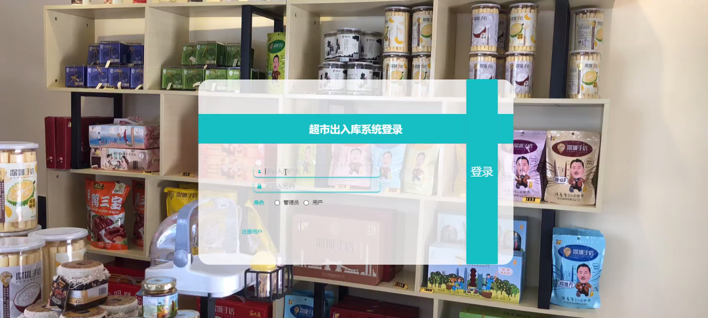
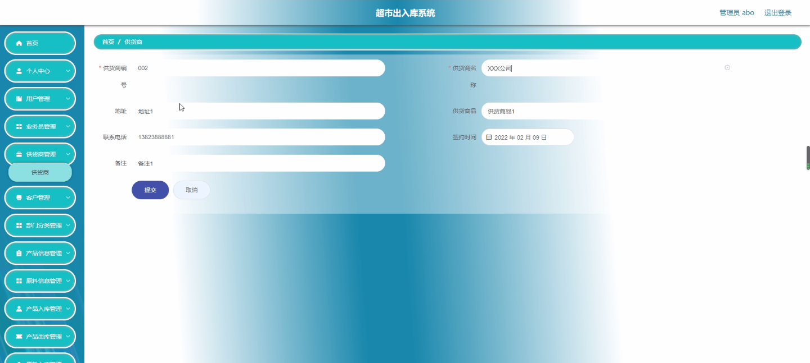
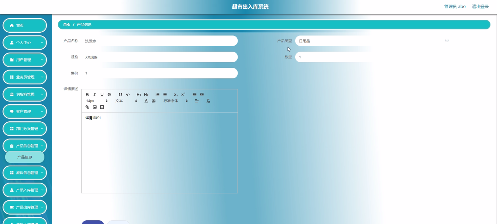
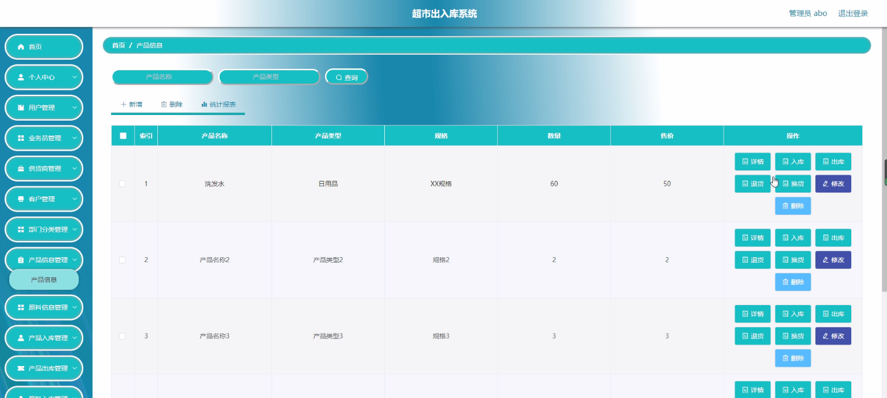
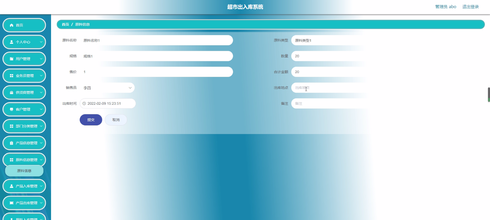
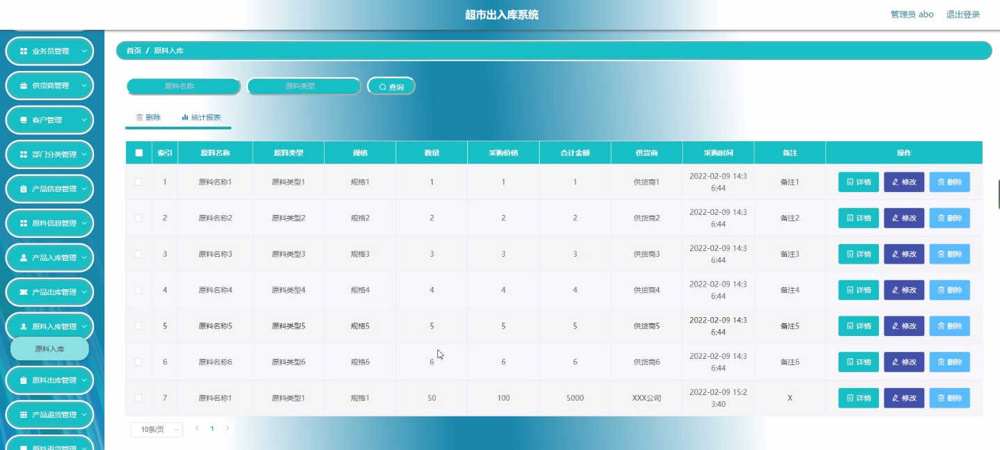
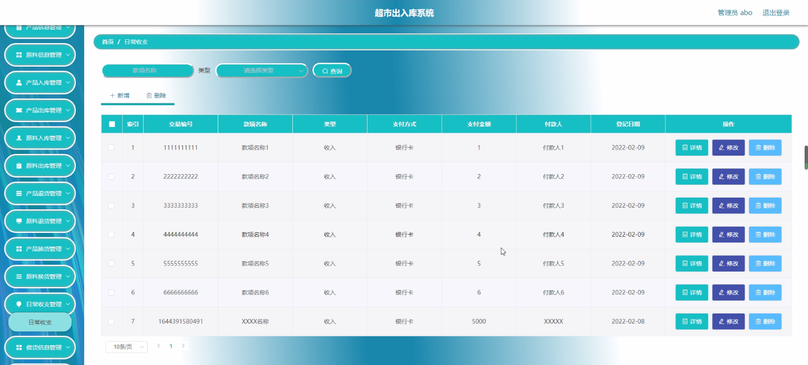
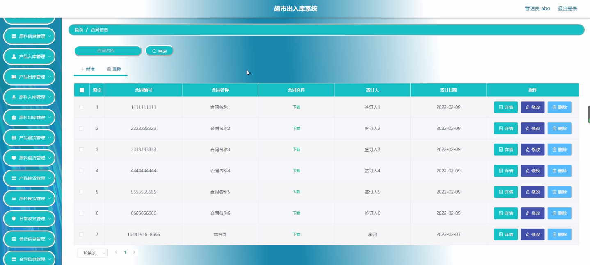

****本项目包含程序+源码+数据库+LW+调试部署环境，文末可获取一份本项目的java源码和数据库参考。****

## ******开题报告******

研究背景：
随着社会经济的快速发展和人们生活水平的提高，超市作为一种便捷的购物方式已经成为人们日常生活中不可或缺的一部分。然而，随之而来的是超市管理面临的巨大挑战，尤其是出入库管理方面。传统的手工记录方式已经无法满足超市快速发展的需求，因此需要建立一个高效、准确的超市出入库系统。

研究意义：
超市出入库系统的建立对于提高超市管理效率、降低人力成本具有重要意义。通过引入先进的信息技术，可以实现对商品和原材料的精确追踪和管理，减少了人为操作的错误和遗漏，提高了数据的准确性和可靠性。同时，超市出入库系统还可以为超市提供全面的数据分析和决策支持，帮助超市更好地了解销售情况、优化库存管理，提升竞争力。

研究目的：
本研究旨在设计和开发一套功能完善、易于操作的超市出入库系统，以解决传统超市管理中存在的问题。通过该系统，超市能够实现对商品和原材料的全程管理，提高出入库效率，减少错误和遗漏，提升超市整体管理水平。

研究内容： 本研究将围绕超市出入库系统的功能展开，主要包括以下方面内容：

  1. 业务员管理：包括业务员信息的录入、查询和统计分析等功能。
  2. 供货商管理：包括供货商信息的录入、查询和合作关系管理等功能。
  3. 客户管理：包括客户信息的录入、查询和消费记录管理等功能。
  4. 部门分类管理：包括部门分类信息的录入、查询和统计分析等功能。
  5. 产品信息管理：包括产品信息的录入、查询和库存管理等功能。
  6. 原料信息管理：包括原料信息的录入、查询和库存管理等功能。
  7. 出入库管理：包括产品入库、产品出库、原料入库、原料出库等功能。
  8. 退货管理：包括产品退货和原料退货的处理功能。
  9. 换货管理：包括产品换货和原料换货的处理功能。
  10. 日常收支管理：包括日常收支记录和统计分析等功能。
  11. 借货信息管理：包括借货信息的录入、查询和归还管理等功能。
  12. 合同信息管理：包括合同信息的录入、查询和管理等功能。
  13. 用户管理：包括用户权限管理和系统登录等功能。

拟解决的主要问题： 通过设计和开发超市出入库系统，我们将解决以下主要问题：

  1. 提高出入库效率：通过系统化管理和自动化操作，减少人为错误和遗漏，提高出入库效率。
  2. 提升数据准确性：通过精确追踪和管理商品和原材料的流向，提高数据的准确性和可靠性。
  3. 优化库存管理：通过全面了解销售情况和库存状况，实现合理的库存管理，减少滞销和过期商品。
  4. 改善决策支持：通过数据分析和统计报表，为超市提供全面的决策支持，帮助优化运营策略和销售策略。

研究方案和预期成果：
本研究将采用软件工程的方法，结合需求分析、系统设计和编码实现等步骤，开发一套符合超市管理需求的出入库系统。预期成果包括一个功能完善、易于操作的超市出入库系统，并进行实际应用和验证。通过该系统的使用，预期能够提高超市管理效率，降低人力成本，提升超市整体竞争力。

进度安排：

2022年9月至10月：开题报告编写和提交，完成开题报告的撰写并提交给指导教师进行审核。

2022年11月至2023年1月：系统设计和开发，根据开题报告的要求，进行系统设计和编码工作。

2023年2月至3月：论文撰写和初稿完成，开始撰写论文，并在这个阶段完成论文的初稿。

2023年4月至5月：论文修改和最终定稿，根据指导教师的意见对论文进行修改，并完成最终的定稿。

2023年5月：论文答辩和提交，参加论文答辩并根据答辩结果进行修改，最后将论文提交给学院或学校。

参考文献：

[1]喻佳,吴丹新.基于SpringBoot的Web快速开发框架[J].电脑编程技巧与维护,2021,(09):31-33.

[2]李鹏.基于SpringBoot快速开发平台的实现[J].电子技术与软件工程,2021,(12):36-37.

[3]叶开平,蔡维晟,陈家敏,邓斯妮.基于SpringBoot的综测可视化管理系统的研究与设计[J].电脑知识与技术,2021,(12):100-104.

[4]江健锋,徐振平.Springboot最小系统的设计与实现[J].电脑知识与技术,2021,(04):62-63.

[5]赵炯,司圣杰,周奇才,熊肖磊.通用信息获取系统设计与实现[J].起重运输机械,2020,(16):89-97.

[6]吴英宾.一种内外网数据交互系统的设计与实现[J].软件工程,2020,(08):25-27.

****以上是本项目程序开发之前开题报告内容，最终成品以下面界面为准，大家可以酌情参考使用。要源码参考请在文末进行获取！！****

## ******本项目的界面展示******

