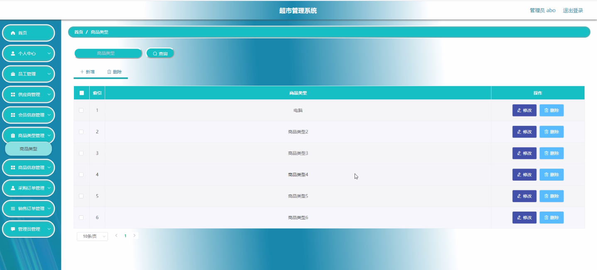
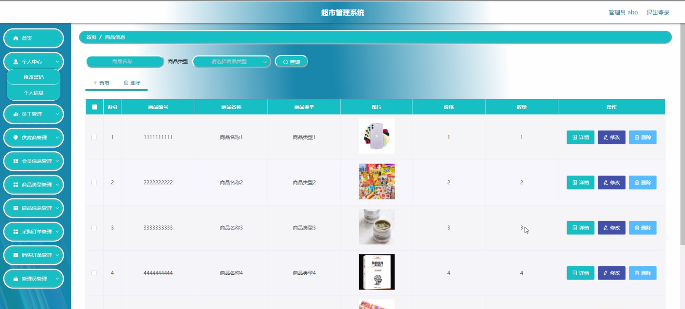
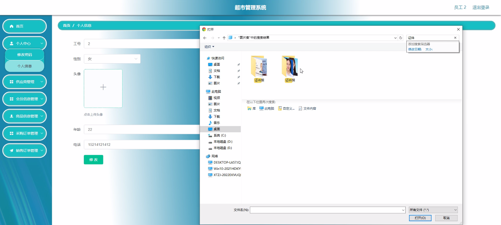
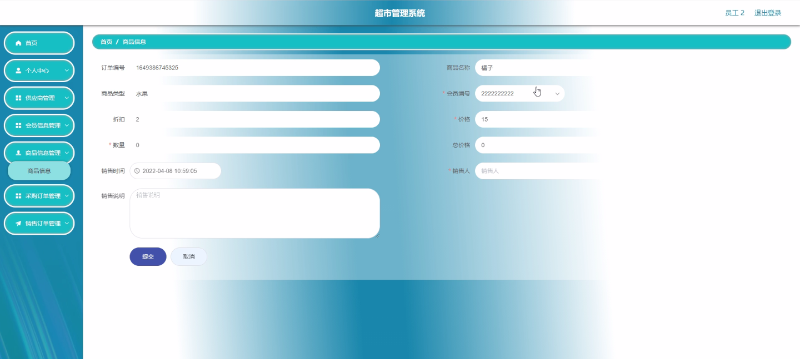
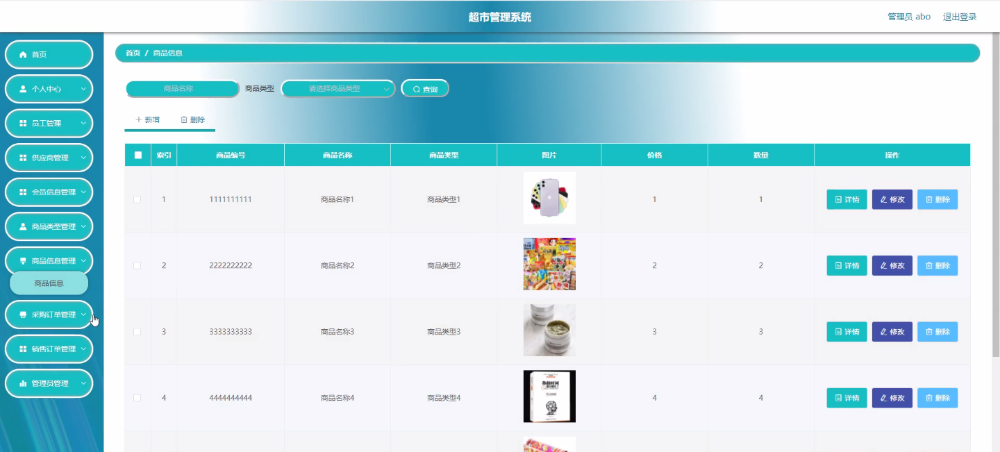
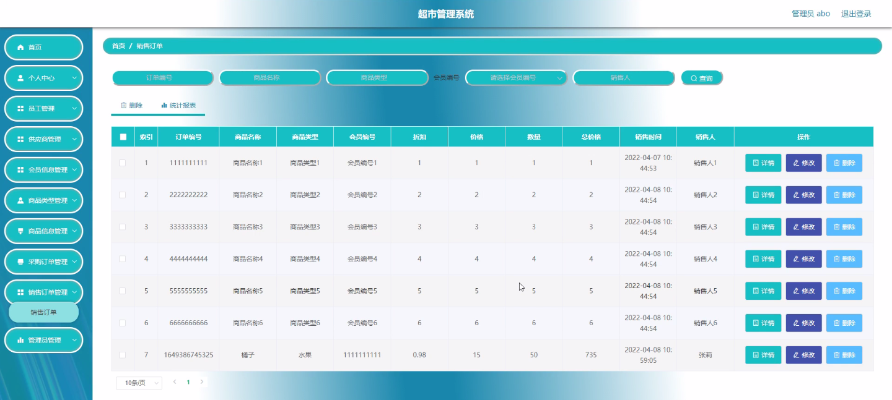

****本项目包含程序+源码+数据库+LW+调试部署环境，文末可获取一份本项目的java源码和数据库参考。****

## ******开题报告******

研究背景：
随着社会经济的发展和人们生活水平的提高，超市作为一种便捷的购物方式已经成为人们日常生活中不可或缺的一部分。然而，传统的超市管理方式存在着许多问题，如信息管理不规范、业务流程不畅、效率低下等。因此，开发一个高效的超市管理系统具有重要的现实意义。

研究意义：
超市管理系统的开发可以帮助超市实现信息化管理，提高工作效率和服务质量。通过该系统，可以更好地管理员工、供应商、会员信息以及商品类型和商品信息等相关数据，从而实现对采购订单和销售订单等业务流程的有效管理和监控。这将大大简化超市的运营流程，提高管理水平，提升顾客满意度，促进超市的持续发展。

研究目的：
本研究旨在开发一套功能完善、操作简便、性能稳定的超市管理系统，以解决传统超市管理方式存在的问题。通过引入先进的信息技术手段，实现超市各项业务的全面管理和优化，提高超市管理的科学性和智能化水平，进而提升超市的竞争力和市场地位。

研究内容：
本研究的主要内容包括员工管理、供应商管理、会员信息管理、商品类型管理、商品信息管理、采购订单管理和销售订单管理等系统功能。具体而言，将设计并实现一个员工管理模块，用于管理超市员工的基本信息、考勤记录、薪资发放等；供应商管理模块用于管理与超市合作的供应商信息、进货价格、供货周期等；会员信息管理模块用于管理超市会员的个人信息、消费记录、积分等；商品类型管理模块用于对超市商品进行分类管理；商品信息管理模块用于管理商品的基本信息、库存情况、价格等；采购订单管理模块用于管理超市的采购订单、供应商交易记录等；销售订单管理模块用于管理超市的销售订单、顾客购买记录等。

拟解决的主要问题：
通过开发超市管理系统，我们将解决传统超市管理方式存在的信息管理不规范、业务流程不畅、效率低下等问题。该系统将提供一种高效、便捷的管理方式，使得超市能够更好地掌握员工、供应商、会员和商品等相关数据，实现全面的业务管理和优化。

研究方案和预期成果：
本研究将采用面向对象的软件开发方法，结合数据库技术和网络技术，设计并实现一个功能完善、操作简便、性能稳定的超市管理系统。通过对系统进行全面测试和优化，预计可以实现员工、供应商、会员信息、商品类型、商品信息、采购订单、销售订单等系统功能的有效管理和监控。预期成果包括一个可靠的超市管理系统，并具备良好的用户界面和用户体验，能够满足超市管理的需求，提高工作效率和服务质量。

进度安排：

2022年9月至10月：需求分析和规划，明确系统功能和目标，制定项目计划。

2022年11月至2023年1月：系统设计和编码，完成详细的系统设计并开始编写代码。

2023年2月至3月：用户界面开发和数据库开发，开发用户友好的界面和设计数据库结构。

2023年4月至5月：功能测试、文档编写和上线部署，对系统进行全面的功能测试并编写用户手册。

2023年5月：维护和升级，定期对系统进行维护和升级，修复bug和添加新功能。

参考文献：

[1]邱小群,邓丽艳,陈海潮.基于B/S的信息管理系统设计和实现[J].信息与电脑(理论版),2022,(20):146-148.

[2]谢霜.基于Java技术的网络管理体系结构的应用[J].网络安全技术与应用,2022,(10):14-15.

[3]宋锦华.高职院校Java程序设计课程改革研究[J].科技视界,2022,(20):133-135.

[4]曹嵩彭,王鹏宇.浅析Java语言在软件开发中的应用[J].信息记录材料,2022,(03):114-116.

[5]朱澈,余俊达.武汉东湖学院.基于Java的软硬件信息管理系统V1.0[Z].项目立项编号.鉴定单位.鉴定日期:

****以上是本项目程序开发之前开题报告内容，最终成品以下面界面为准，大家可以酌情参考使用。要源码参考请在文末进行获取！！****

## ******本项目的界面展示******

