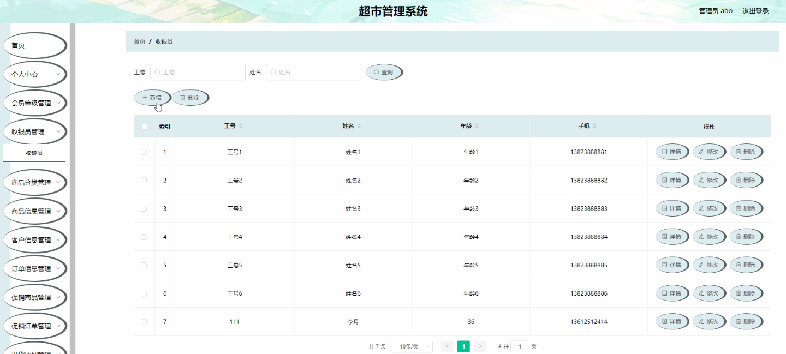
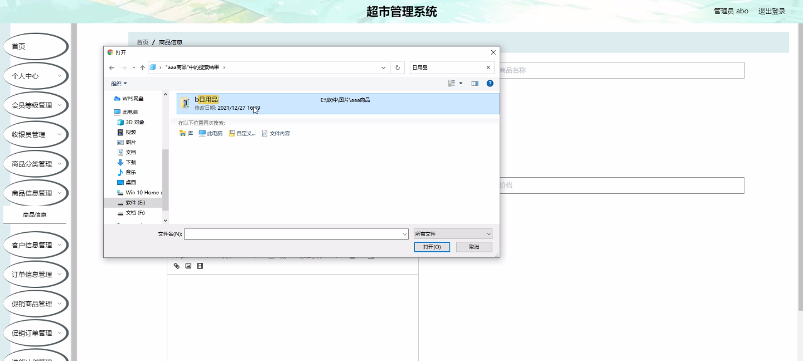
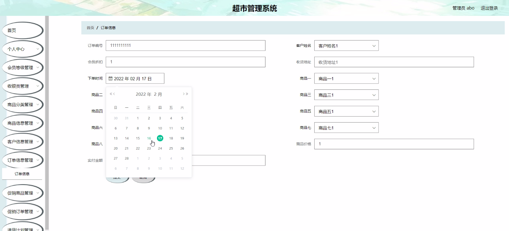
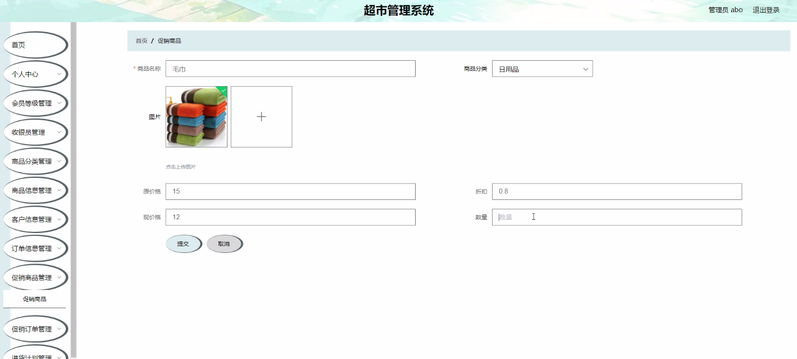
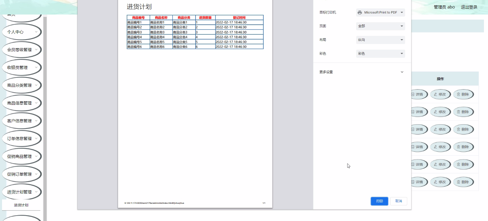
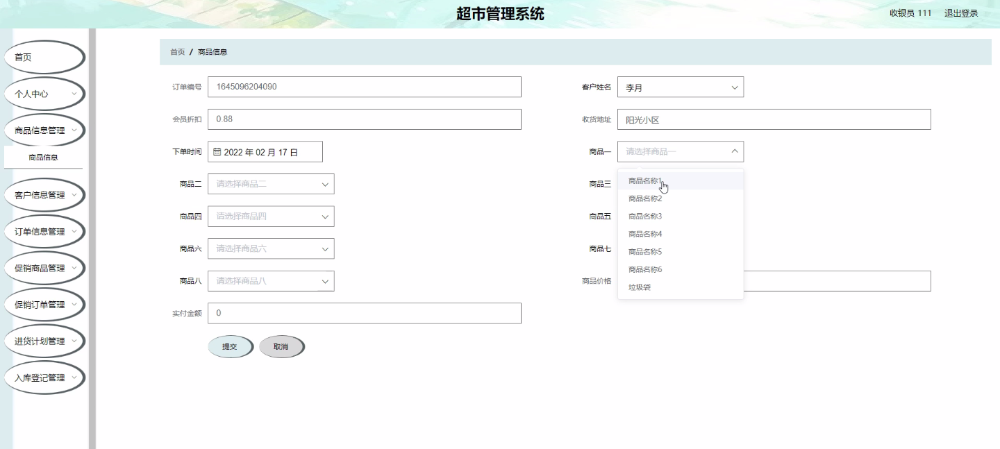
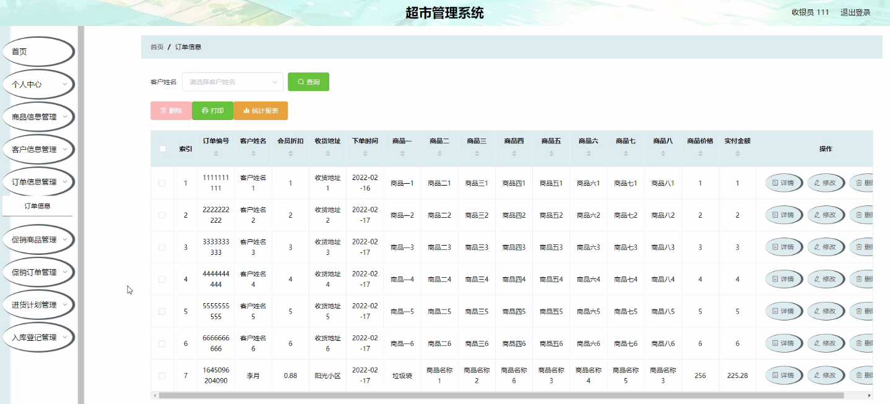

****本项目包含程序+源码+数据库+LW+调试部署环境，文末可获取一份本项目的java源码和数据库参考。****

## ******开题报告******

研究背景：
随着社会经济的快速发展和人们生活水平的提高，超市作为一种便捷的购物方式在我们的日常生活中扮演着重要角色。然而，传统的超市管理方式已经无法满足现代消费者的需求，对于超市管理系统的要求也越来越高。因此，开发一个高效、智能的超市管理系统具有重要的现实意义。

研究意义：
通过研究和开发一个先进的超市管理系统，可以提高超市的运营效率，优化资源配置，降低成本，提升服务质量，增强超市竞争力。同时，该系统还可以帮助超市管理者更好地了解市场需求，制定科学的经营策略，提高决策效果，从而实现超市的可持续发展。

研究目的：
本研究的目的是设计和开发一个功能完善、操作简便、性能稳定的超市管理系统，以满足超市管理的各项需求。通过该系统，超市管理者可以方便地进行商品分类、商品信息管理、客户信息管理、会员等级管理、订单信息管理、促销商品管理、促销订单管理、进货计划管理、入库登记等操作，从而实现超市的高效运营和管理。

研究内容：
本研究的主要内容包括以下系统功能：收银员管理、商品分类管理、商品信息管理、客户信息管理、会员等级管理、订单信息管理、促销商品管理、促销订单管理、进货计划管理、入库登记管理等。通过对这些功能的研究和开发，可以实现超市管理的全面自动化和智能化。

拟解决的主要问题：

  1. 如何设计一个用户友好、操作简便的超市管理系统？
  2. 如何实现超市各项功能的高效运行和协同工作？
  3. 如何确保超市管理系统的稳定性和安全性？
  4. 如何提供数据分析和决策支持功能，帮助超市管理者制定科学的经营策略？
  5. 如何与其他相关系统进行无缝集成，实现信息共享和流程优化？

研究方案：
本研究将采用软件工程的方法，结合需求分析、系统设计、编码实现和测试验证等步骤，逐步完成超市管理系统的开发。同时，还将借鉴现有的先进技术和管理经验，提出相应的解决方案，并进行系统评估和优化，以确保系统的质量和性能。

预期成果：
通过本研究，预期可以开发出一个功能完善、性能稳定的超市管理系统，实现超市管理的全面自动化和智能化。该系统将提高超市的运营效率，优化资源配置，降低成本，提升服务质量，增强超市竞争力。同时，还将为超市管理者提供数据分析和决策支持功能，帮助其制定科学的经营策略，实现超市的可持续发展。

进度安排：

2022年9月至10月：需求分析和规划，进行用户需求调研和分析，确定系统功能和目标。

2022年11月至2023年1月：系统设计和开发，完成系统架构设计和技术选型，并开始编写代码。

2023年2月至3月：测试和优化，进行单元测试和集成测试，修复问题并优化系统性能。

2023年4月至5月：文档编写和培训，编写用户手册和系统文档，并进行相关人员的培训。

2023年5月：上线部署和维护，将系统部署到生产环境中，并定期进行维护和升级。

参考文献：

[1]王振华.SpringBoot在教学效果评估系统中的应用[J].电子技术,2023,(05):67-69.

[2]王明泉.基于SpringBoot远程热部署的探索和应用[J].信息与电脑(理论版),2023,(07):1-4.

[3]王亚东,李晓霞,陈强强,剡美娜.基于SpringBoot的需求发布平台设计[J].信息与电脑(理论版),2023,(01):105-107.

[4]陈新府豪.基于SpringBoot和Vue框架的创新方法推理系统的设计与实现[D].导师：黄静.浙江理工大学,2022.

[5]霍福华,韩慧.基于SpringBoot微服务架构下前后端分离的MVVM模型[J].电子技术与软件工程,2022,(01):73-76.

[6]韩策,张娜,王松亭,张凯,何方,袁峰.SpringBoot OPC客户端设计与研究[J].电子世界,2021,(19):25-26.

****以上是本项目程序开发之前开题报告内容，最终成品以下面界面为准，大家可以酌情参考使用。要源码参考请在文末进行获取！！****

## ******本项目的界面展示******

