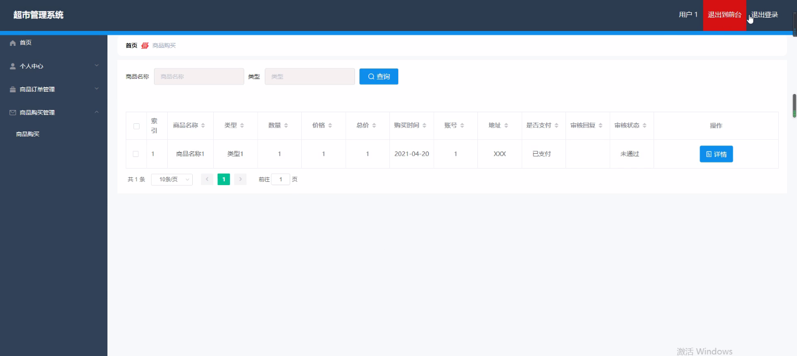
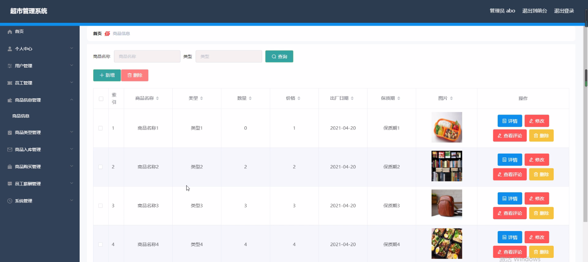
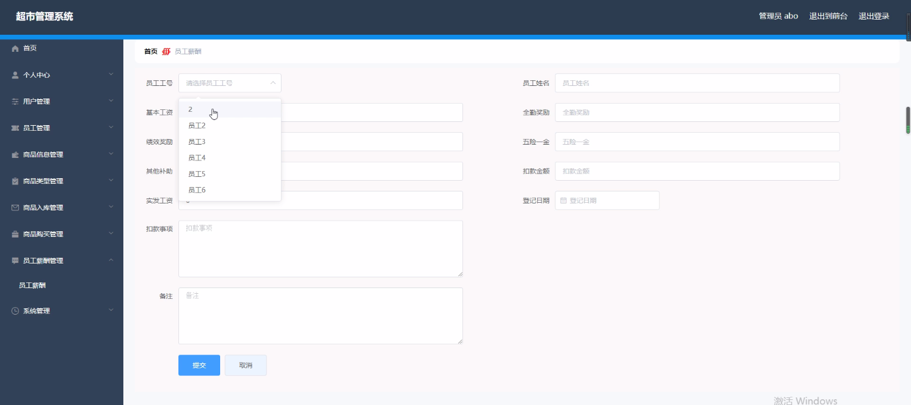
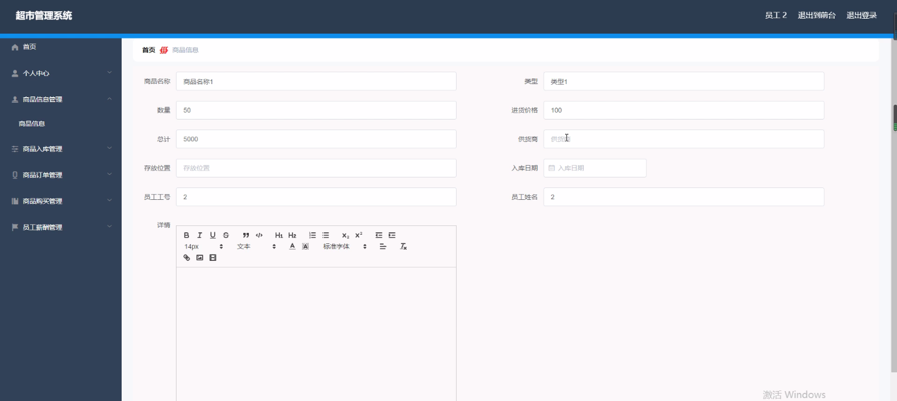
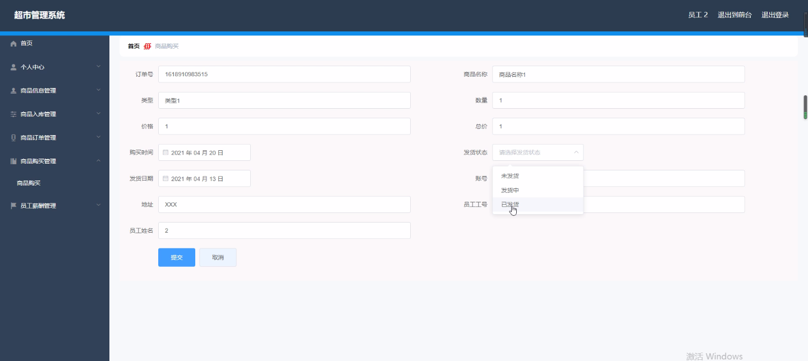

****本项目包含程序+源码+数据库+LW+调试部署环境，文末可获取一份本项目的java源码和数据库参考。****

## ******开题报告******

研究背景：
随着社会的不断发展和经济的快速增长，超市作为一种重要的零售业态，在人们的日常生活中扮演着越来越重要的角色。超市管理系统作为支撑超市运营的关键工具，对于提高超市的效率、优化资源配置、提升用户体验具有重要意义。然而，当前超市管理系统在功能完善性、信息化程度和智能化水平等方面仍存在一些问题和挑战。

研究意义：
本研究旨在通过深入分析超市管理系统的现状和存在的问题，探索如何利用先进的技术手段和管理方法来改进超市管理系统，提高其运营效率和服务质量。通过研究超市管理系统，可以为超市行业提供科学合理的管理模式和经验，促进超市行业的健康发展，提升整个零售业的竞争力。

研究目的：
本研究的目的是构建一个功能完善、信息化程度高、智能化水平较高的超市管理系统，以满足超市运营过程中的各项需求，并提升超市的管理效率和服务质量。通过研究超市管理系统，可以实现对超市运营过程的全面监控和管理，提高商品的销售效率，优化员工的工作流程，提升用户的购物体验。

研究内容：
本研究的主要内容包括以下几个方面：用户管理、员工管理、商品信息管理、商品类型管理、商品入库管理、商品订单管理、商品购买管理和员工薪酬管理等系统功能。通过对这些功能进行深入研究和分析，可以建立起一个完整的超市管理系统，实现对超市运营过程中各项关键数据和操作的全面管理和控制。

拟解决的主要问题：
在研究过程中，我们将重点解决以下几个主要问题：如何设计一个用户友好、易于操作的超市管理系统界面；如何实现对员工的有效管理和考核；如何实现对商品信息的准确记录和管理；如何优化商品入库和订单处理流程；如何提高商品购买过程的便捷性和安全性；如何合理设置员工薪酬和激励机制等。

研究方案和预期成果：
本研究将采用综合研究方法，包括文献调研、案例分析、系统设计和实验验证等。通过对超市管理系统的需求分析和功能设计，结合先进的技术手段和管理方法，构建一个高效、智能的超市管理系统。预期成果包括：完善的超市管理系统原型、优化的运营流程和管理模式、提升的工作效率和用户满意度等。

进度安排：

2022年9月至10月：需求分析和规划，明确系统功能和目标，制定项目计划。

2022年11月至2023年1月：系统设计和编码，完成详细的系统设计并开始编写代码。

2023年2月至3月：用户界面开发和数据库开发，开发用户友好的界面和设计数据库结构。

2023年4月至5月：功能测试、文档编写和上线部署，对系统进行全面的功能测试并编写用户手册。

2023年5月：维护和升级，定期对系统进行维护和升级，修复bug和添加新功能。

参考文献：

[1]邱小群,邓丽艳,陈海潮.基于B/S的信息管理系统设计和实现[J].信息与电脑(理论版),2022,(20):146-148.

[2]谢霜.基于Java技术的网络管理体系结构的应用[J].网络安全技术与应用,2022,(10):14-15.

[3]宋锦华.高职院校Java程序设计课程改革研究[J].科技视界,2022,(20):133-135.

[4]曹嵩彭,王鹏宇.浅析Java语言在软件开发中的应用[J].信息记录材料,2022,(03):114-116.

[5]朱澈,余俊达.武汉东湖学院.基于Java的软硬件信息管理系统V1.0[Z].项目立项编号.鉴定单位.鉴定日期:

****以上是本项目程序开发之前开题报告内容，最终成品以下面界面为准，大家可以酌情参考使用。要源码参考请在文末进行获取！！****

## ******本项目的界面展示******

