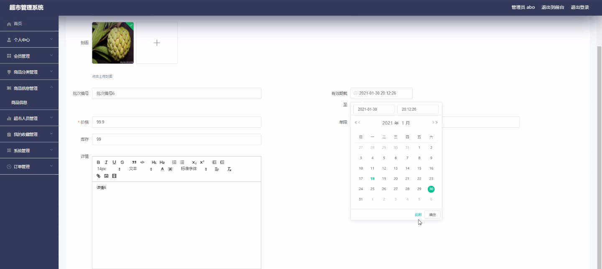
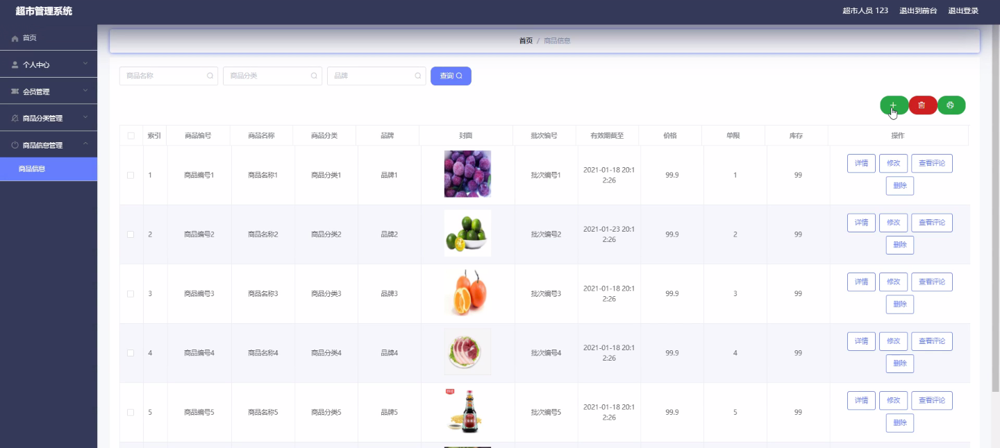
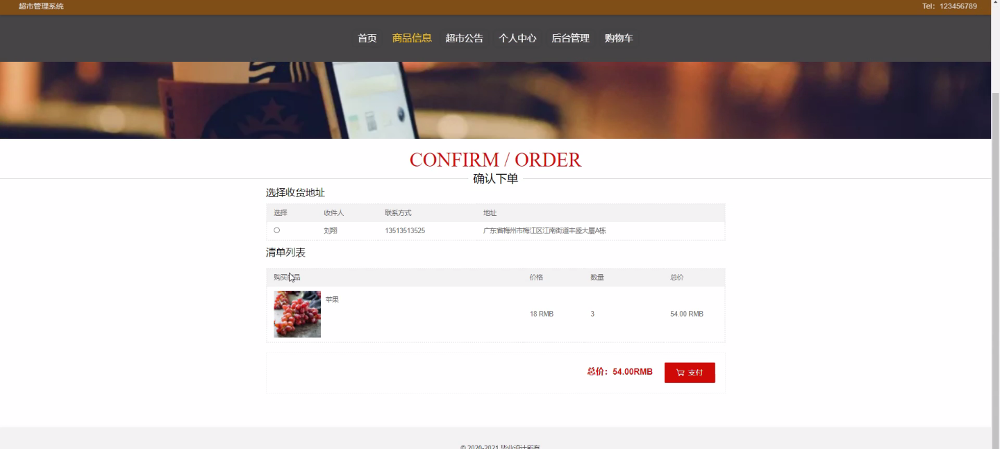
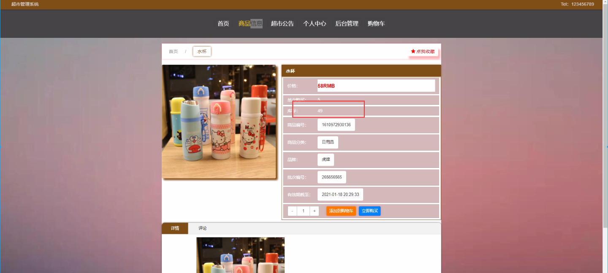
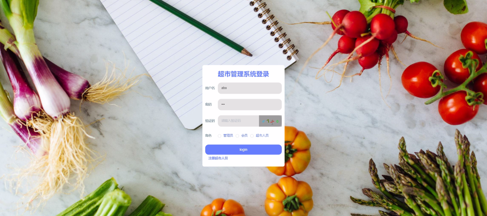
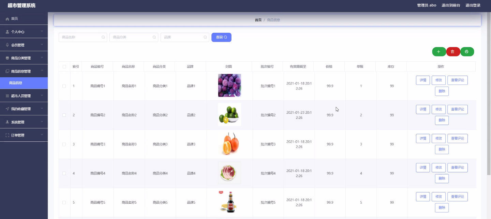

****本项目包含程序+源码+数据库+LW+调试部署环境，文末可获取一份本项目的java源码和数据库参考。****

## ******开题报告******

研究背景：
随着社会经济的发展和人们生活水平的提高，超市作为一种重要的零售形式在我们的日常生活中扮演着越来越重要的角色。然而，传统的超市管理方式已经无法满足现代化管理的需求。传统的超市管理存在着信息不对称、效率低下、资源浪费等问题，给超市的运营和管理带来了很大的困扰。

研究意义：
因此，开发一个高效、智能的超市管理系统具有重要的实际意义。这样的系统可以帮助超市实现信息的快速共享和准确传递，提高工作效率，降低成本，优化资源配置，提升服务质量，提供更好的购物体验，进而增加超市的竞争力和盈利能力。

研究目的：
本研究旨在设计和开发一种先进的超市管理系统，以满足现代化超市管理的需求。通过引入信息技术和智能算法，该系统将能够有效地管理商品分类、商品信息、会员、超市人员等各个系统功能，提高超市的管理水平和运营效率，为顾客提供更好的购物体验。

研究内容： 本研究的主要内容包括商品分类、商品信息、会员、超市人员等系统功能的设计和开发。具体而言，我们将从以下几个方面进行研究：

  1. 商品分类：设计合理的商品分类体系，以便顾客能够快速找到所需商品，并为超市管理者提供有效的库存管理和销售分析。

  2. 商品信息：建立完善的商品信息管理系统，包括商品名称、价格、库存量、供应商等信息的录入、查询和更新，以保证商品信息的准确性和及时性。

  3. 会员管理：开发会员管理模块，实现会员注册、积分管理、优惠券发放等功能，提升顾客的忠诚度和购物体验。

  4. 超市人员管理：设计人员管理模块，包括员工信息的录入、考勤管理、薪资计算等功能，提高人力资源管理的效率和精确度。

拟解决的主要问题： 在研究过程中，我们将重点解决以下几个问题：

  1. 如何设计一个合理的商品分类体系，使顾客能够快速找到所需商品？

  2. 如何建立一个完善的商品信息管理系统，确保商品信息的准确性和及时性？

  3. 如何开发一个高效的会员管理模块，提升顾客的忠诚度和购物体验？

  4. 如何设计一个人员管理模块，提高人力资源管理的效率和精确度？

研究方案和预期成果： 为了解决上述问题，我们将采用系统分析与设计的方法，结合信息技术和智能算法，开发一套完整的超市管理系统。预期的成果包括：

  1. 设计出一个合理的商品分类体系，使顾客能够快速找到所需商品。

  2. 建立一个完善的商品信息管理系统，确保商品信息的准确性和及时性。

  3. 开发一个高效的会员管理模块，提升顾客的忠诚度和购物体验。

  4. 设计一个人员管理模块，提高人力资源管理的效率和精确度。

进度安排：

2022年9月至10月：开题报告编写和提交，完成开题报告的撰写并提交给指导教师进行审核。

2022年11月至2023年1月：系统设计和开发，根据开题报告的要求，进行系统设计和编码工作。

2023年2月至3月：论文撰写和初稿完成，开始撰写论文，并在这个阶段完成论文的初稿。

2023年4月至5月：论文修改和最终定稿，根据指导教师的意见对论文进行修改，并完成最终的定稿。

2023年5月：论文答辩和提交，参加论文答辩并根据答辩结果进行修改，最后将论文提交给学院或学校。

参考文献：

[1]喻佳,吴丹新.基于SpringBoot的Web快速开发框架[J].电脑编程技巧与维护,2021,(09):31-33.

[2]李鹏.基于SpringBoot快速开发平台的实现[J].电子技术与软件工程,2021,(12):36-37.

[3]叶开平,蔡维晟,陈家敏,邓斯妮.基于SpringBoot的综测可视化管理系统的研究与设计[J].电脑知识与技术,2021,(12):100-104.

[4]江健锋,徐振平.Springboot最小系统的设计与实现[J].电脑知识与技术,2021,(04):62-63.

[5]赵炯,司圣杰,周奇才,熊肖磊.通用信息获取系统设计与实现[J].起重运输机械,2020,(16):89-97.

[6]吴英宾.一种内外网数据交互系统的设计与实现[J].软件工程,2020,(08):25-27.

****以上是本项目程序开发之前开题报告内容，最终成品以下面界面为准，大家可以酌情参考使用。要源码参考请在文末进行获取！！****

## ******本项目的界面展示******

