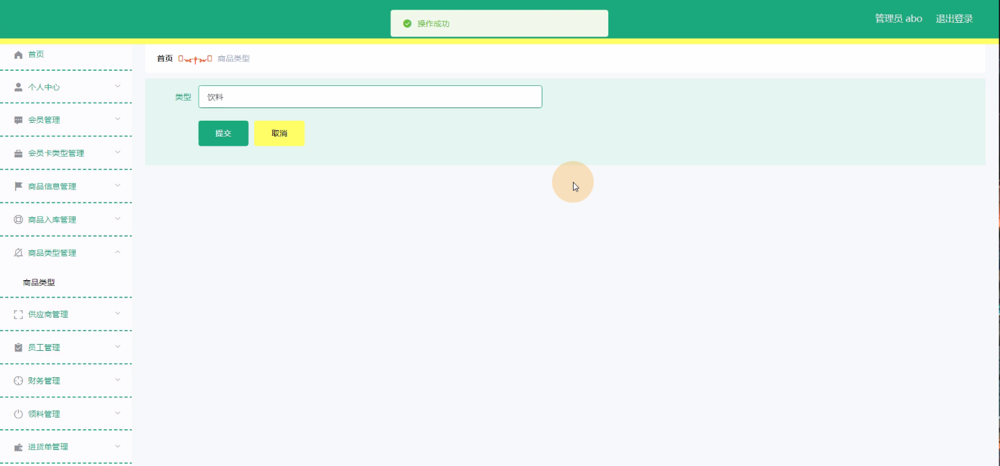

****本项目包含程序+源码+数据库+LW+调试部署环境，文末可获取一份本项目的java源码和数据库参考。****

## ******开题报告******

研究背景：
随着社会经济的发展和人们生活水平的提高，超市作为一种重要的零售业态，在我们的日常生活中扮演着至关重要的角色。然而，传统的超市管理方式存在一些问题，例如信息不透明、效率低下、成本高昂等。因此，开发一个高效的超市管理系统变得尤为重要。

研究意义：
超市管理系统的开发和应用对于提高超市的运营效率、优化资源配置、提升顾客体验具有重要意义。通过引入先进的信息技术和管理方法，可以实现超市各项业务的自动化、智能化和集约化，从而提高超市的竞争力和盈利能力。

研究目的：
本研究旨在开发一套完善的超市管理系统，以满足超市日常运营的需求。通过该系统，超市管理者可以更加高效地进行商品管理、会员管理、财务管理等工作，提高工作效率和准确性。同时，系统还可以提供数据分析和决策支持功能，帮助管理者制定科学合理的经营策略，提升超市的竞争力。

研究内容：
本研究的主要内容包括以下系统功能：会员管理、会员卡类型管理、商品信息管理、商品入库管理、商品类型管理、供应商管理、员工管理、财务管理、领料管理、进货单管理、销售管理和客户管理。通过对这些功能的设计和实现，可以构建一个完整的超市管理系统。

拟解决的主要问题：

  1. 信息不透明：传统超市管理方式下，各个环节的信息流通不畅，导致信息不透明，难以及时掌握超市运营状况。本系统将通过数据集中管理和实时更新，提高信息的透明度和可访问性。
  2. 效率低下：传统超市管理方式下，很多工作需要人工操作，效率低下且容易出错。本系统将引入自动化和智能化技术，减少人工操作，提高工作效率。
  3. 成本高昂：传统超市管理方式下，由于信息不准确和资源浪费，超市经营成本较高。本系统将通过优化资源配置和精细化管理，降低超市经营成本。

研究方案和预期成果：
本研究将采用软件开发的方法，结合数据库技术和前端开发技术，设计和实现一个基于Web的超市管理系统。预期成果包括一个功能完善、操作简便、界面友好的超市管理系统，能够满足超市日常运营的需求，并提供数据分析和决策支持功能。该系统将帮助超市管理者提高工作效率、降低经营成本，并提升超市的竞争力和盈利能力。

进度安排：

2022年9月至10月：需求分析和规划，进行用户需求调研和分析，确定系统功能和目标。

2022年11月至2023年1月：系统设计和开发，完成系统架构设计和技术选型，并开始编写代码。

2023年2月至3月：测试和优化，进行单元测试和集成测试，修复问题并优化系统性能。

2023年4月至5月：文档编写和培训，编写用户手册和系统文档，并进行相关人员的培训。

2023年5月：上线部署和维护，将系统部署到生产环境中，并定期进行维护和升级。

参考文献：

[1]王振华.SpringBoot在教学效果评估系统中的应用[J].电子技术,2023,(05):67-69.

[2]王明泉.基于SpringBoot远程热部署的探索和应用[J].信息与电脑(理论版),2023,(07):1-4.

[3]王亚东,李晓霞,陈强强,剡美娜.基于SpringBoot的需求发布平台设计[J].信息与电脑(理论版),2023,(01):105-107.

[4]陈新府豪.基于SpringBoot和Vue框架的创新方法推理系统的设计与实现[D].导师：黄静.浙江理工大学,2022.

[5]霍福华,韩慧.基于SpringBoot微服务架构下前后端分离的MVVM模型[J].电子技术与软件工程,2022,(01):73-76.

[6]韩策,张娜,王松亭,张凯,何方,袁峰.SpringBoot OPC客户端设计与研究[J].电子世界,2021,(19):25-26.

****以上是本项目程序开发之前开题报告内容，最终成品以下面界面为准，大家可以酌情参考使用。要源码参考请在文末进行获取！！****

## ******本项目的界面展示******

