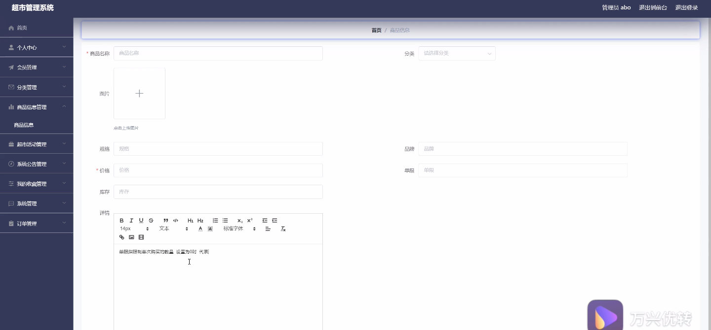
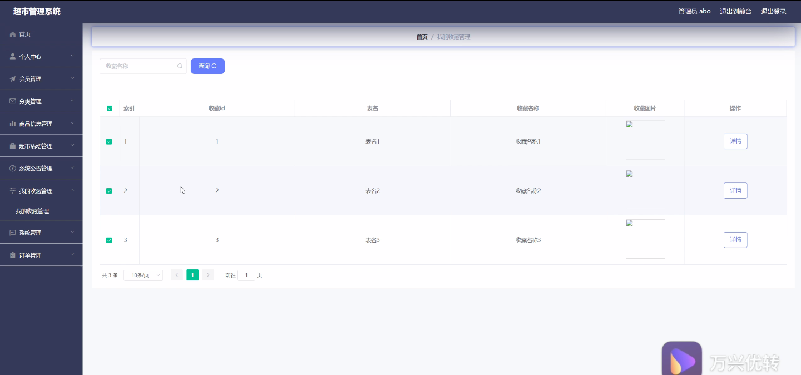
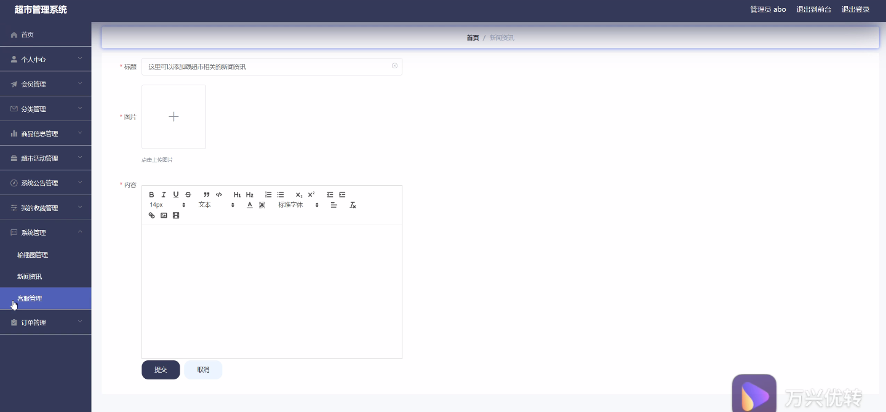
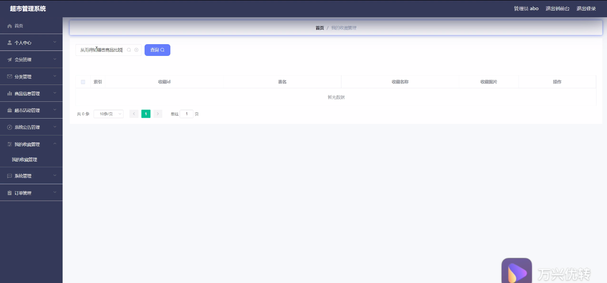
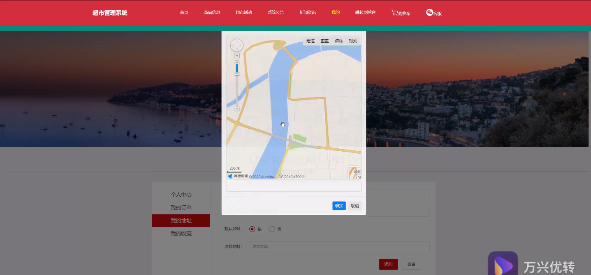
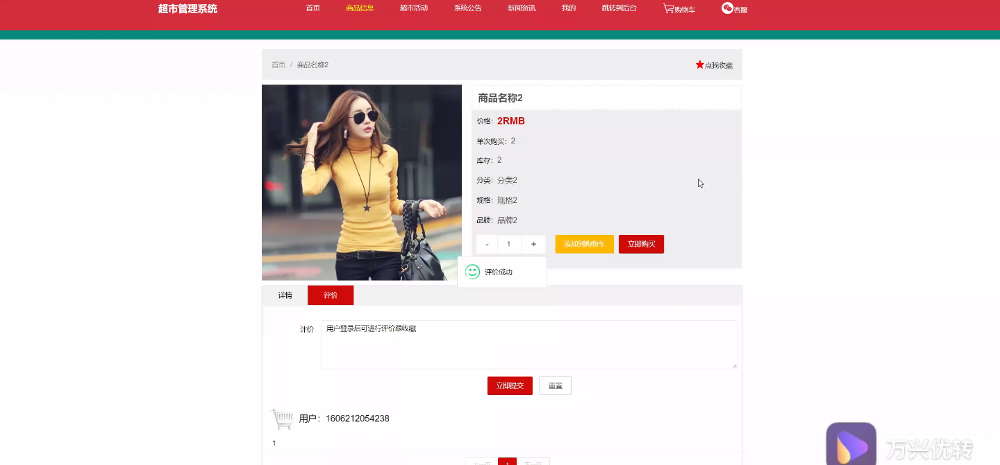

****本项目包含程序+源码+数据库+LW+调试部署环境，文末可获取一份本项目的java源码和数据库参考。****

## ******开题报告******

研究背景：
随着社会经济的发展和人们生活水平的提高，超市作为一种便捷、多样化的购物方式在我们的日常生活中扮演着重要的角色。然而，传统的超市管理方式已经无法满足现代消费者的需求，需要借助信息技术来提升超市管理效率和服务质量。因此，开发一个高效、智能的超市管理系统具有重要的研究意义和实际应用价值。

研究意义：
超市管理系统的研究和开发将有助于提升超市的管理水平和服务质量。通过引入先进的信息技术，可以实现对商品库存、销售数据、用户需求等方面的精确监控和分析，从而优化超市的运营策略，提高商品供应链的效率，增强超市与顾客之间的互动体验。同时，超市管理系统的研究还能够为其他零售行业提供借鉴和参考，推动整个零售行业的数字化转型。

研究目的：
本研究旨在设计和开发一套完善的超市管理系统，以提升超市的管理效率和服务质量。具体目标包括但不限于：优化商品库存管理，减少过剩和缺货现象；实现对销售数据的实时监控和分析，为超市运营决策提供科学依据；改善用户购物体验，提供个性化推荐和定制服务；加强超市与供应商之间的合作和沟通，优化供应链管理流程。

研究内容： 本研究的主要内容涵盖以下系统功能：

  1. 用户管理：包括用户注册、登录、个人信息管理等功能，以实现个性化服务和用户权限管理。
  2. 分类管理：对商品进行分类管理，方便用户浏览和搜索，提高购物效率。
  3. 商品信息管理：包括商品的基本信息、价格、库存等管理，以实现精确的库存控制和商品管理。
  4. 超市活动管理：发布和管理超市的促销活动，吸引顾客参与，提升销售额。
  5. 系统公告管理：发布超市的公告信息，包括特殊通知、活动信息等，方便用户获取相关信息。
  6. 供应商信息管理：管理超市的供应商信息，包括联系方式、商品供应情况等，以优化供应链管理。

拟解决的主要问题：
本研究旨在解决传统超市管理方式存在的一系列问题，包括库存管理不精确、销售数据分析困难、用户购物体验不佳、供应链管理效率低等。通过引入先进的信息技术和系统设计，可以提高超市管理的科学性和智能化水平，解决上述问题，提升超市的竞争力和市场地位。

研究方案和预期成果：
本研究将采用软件工程的方法，结合数据库技术、网络技术和人机交互技术，设计和开发一个高效、智能的超市管理系统。预期成果包括但不限于：完善的系统功能模块、稳定可靠的系统运行、精确的库存管理、实时的销售数据监控和分析、个性化的用户推荐和定制服务、高效的供应链管理等。通过实际应用和评估，验证系统的有效性和可行性，为超市管理提供科学依据和技术支持。

进度安排：

2022年9月至10月：需求分析和规划，进行用户需求调研和分析，确定系统功能和目标。

2022年11月至2023年1月：系统设计和开发，完成系统架构设计和技术选型，并开始编写代码。

2023年2月至3月：测试和优化，进行单元测试和集成测试，修复问题并优化系统性能。

2023年4月至5月：文档编写和培训，编写用户手册和系统文档，并进行相关人员的培训。

2023年5月：上线部署和维护，将系统部署到生产环境中，并定期进行维护和升级。

参考文献：

[1]王振华.SpringBoot在教学效果评估系统中的应用[J].电子技术,2023,(05):67-69.

[2]王明泉.基于SpringBoot远程热部署的探索和应用[J].信息与电脑(理论版),2023,(07):1-4.

[3]王亚东,李晓霞,陈强强,剡美娜.基于SpringBoot的需求发布平台设计[J].信息与电脑(理论版),2023,(01):105-107.

[4]陈新府豪.基于SpringBoot和Vue框架的创新方法推理系统的设计与实现[D].导师：黄静.浙江理工大学,2022.

[5]霍福华,韩慧.基于SpringBoot微服务架构下前后端分离的MVVM模型[J].电子技术与软件工程,2022,(01):73-76.

[6]韩策,张娜,王松亭,张凯,何方,袁峰.SpringBoot OPC客户端设计与研究[J].电子世界,2021,(19):25-26.

****以上是本项目程序开发之前开题报告内容，最终成品以下面界面为准，大家可以酌情参考使用。要源码参考请在文末进行获取！！****

## ******本项目的界面展示******

