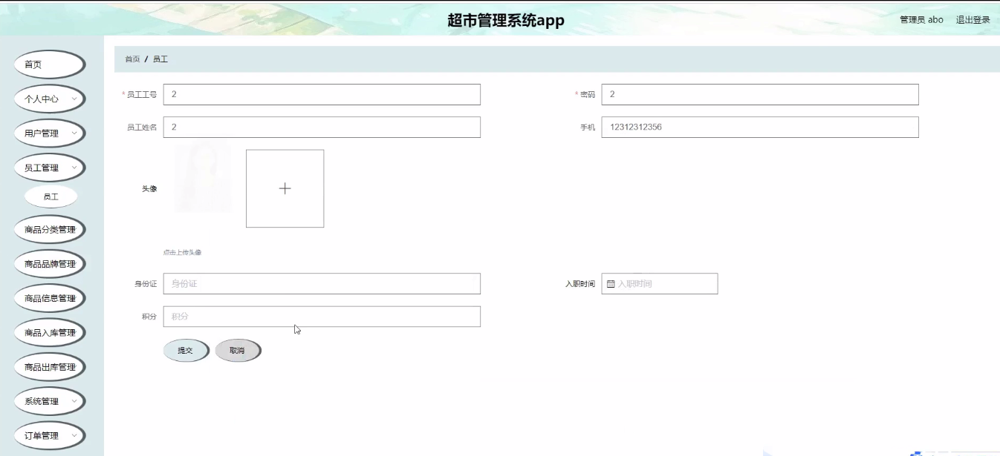
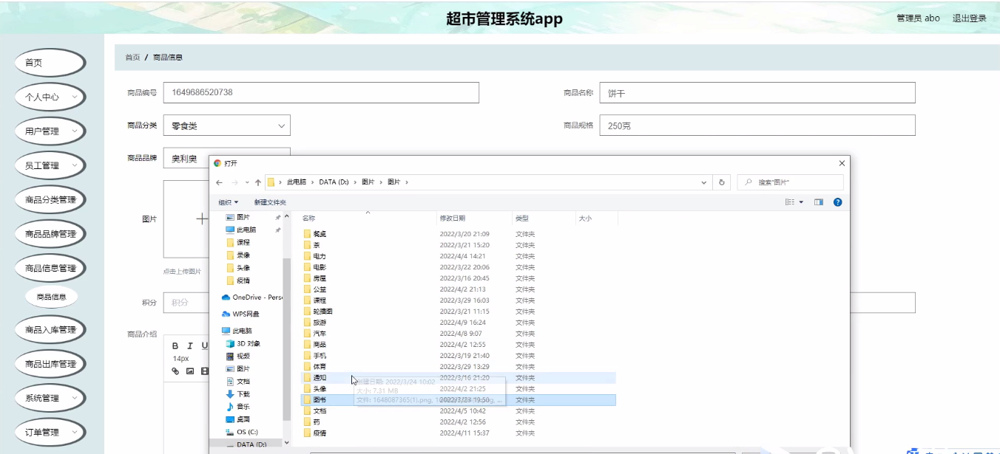
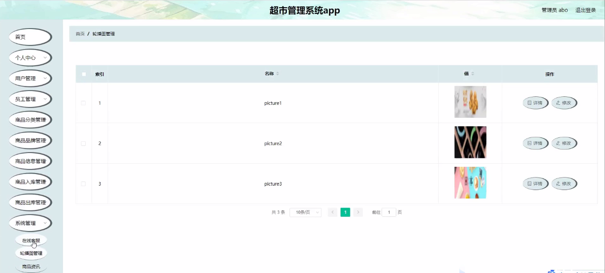

****本项目包含程序+源码+数据库+LW+调试部署环境，文末可获取一份本项目的java源码和数据库参考。****

## ******开题报告******

研究背景：
随着社会经济的快速发展和人们生活水平的提高，超市作为一种便捷、多样化的购物方式已经成为现代城市中不可或缺的一部分。然而，随之而来的是超市管理面临的挑战也越来越多。传统的手工管理方式已经无法满足超市规模不断扩大和运营效率提升的需求。因此，研究开发一套高效、智能的超市管理系统具有重要的现实意义。

研究意义：
超市管理系统的研究与开发对于提高超市的管理效率、降低运营成本、优化用户体验具有重要意义。通过引入先进的信息技术和管理方法，可以实现超市各项业务的自动化、集中化管理，提高员工工作效率，减少人力资源的浪费，从而提升超市的竞争力和盈利能力。

研究目的：
本研究旨在设计和开发一套完善的超市管理系统，以解决传统超市管理中存在的诸多问题。通过系统化的数据管理、智能化的决策支持和高效的业务流程，实现超市管理的科学化、规范化和精细化，提升超市的运营效率和管理水平。

研究内容：
本研究的主要内容包括以下系统功能：用户管理、员工管理、商品分类管理、商品品牌管理、商品信息管理、商品入库管理、商品出库管理等。通过对这些功能的设计和开发，实现超市各项业务的全面管理和优化。

拟解决的主要问题：

  1. 如何实现用户管理，包括注册、登录、个人信息管理等功能？
  2. 如何高效地管理员工信息，包括员工档案、考勤、薪资等？
  3. 如何进行商品分类管理，确保商品分类准确、清晰，并方便用户查找？
  4. 如何管理商品品牌，包括品牌信息录入、品牌推广等？
  5. 如何管理商品信息，包括商品库存、价格、促销活动等？

研究方案：
本研究将采用软件工程的方法，通过需求分析、系统设计、编码实现和测试验证等步骤，逐步完成超市管理系统的开发。同时，结合现代信息技术和管理理念，引入数据挖掘、人工智能等技术手段，提升系统的智能化和自动化水平。

预期成果：
通过本研究，预期可以设计和开发一套功能完善、性能稳定的超市管理系统，实现超市各项业务的全面管理和优化。该系统将提高超市的运营效率，降低管理成本，提升用户体验，为超市的可持续发展提供有力支撑。

进度安排：

2022年9月至10月：开题报告编写和提交，完成开题报告的撰写并提交给指导教师进行审核。

2022年11月至2023年1月：系统设计和开发，根据开题报告的要求，进行系统设计和编码工作。

2023年2月至3月：论文撰写和初稿完成，开始撰写论文，并在这个阶段完成论文的初稿。

2023年4月至5月：论文修改和最终定稿，根据指导教师的意见对论文进行修改，并完成最终的定稿。

2023年5月：论文答辩和提交，参加论文答辩并根据答辩结果进行修改，最后将论文提交给学院或学校。

参考文献：

[1]喻佳,吴丹新.基于SpringBoot的Web快速开发框架[J].电脑编程技巧与维护,2021,(09):31-33.

[2]李鹏.基于SpringBoot快速开发平台的实现[J].电子技术与软件工程,2021,(12):36-37.

[3]叶开平,蔡维晟,陈家敏,邓斯妮.基于SpringBoot的综测可视化管理系统的研究与设计[J].电脑知识与技术,2021,(12):100-104.

[4]江健锋,徐振平.Springboot最小系统的设计与实现[J].电脑知识与技术,2021,(04):62-63.

[5]赵炯,司圣杰,周奇才,熊肖磊.通用信息获取系统设计与实现[J].起重运输机械,2020,(16):89-97.

[6]吴英宾.一种内外网数据交互系统的设计与实现[J].软件工程,2020,(08):25-27.

****以上是本项目程序开发之前开题报告内容，最终成品以下面界面为准，大家可以酌情参考使用。要源码参考请在文末进行获取！！****

## ******本项目的界面展示******

