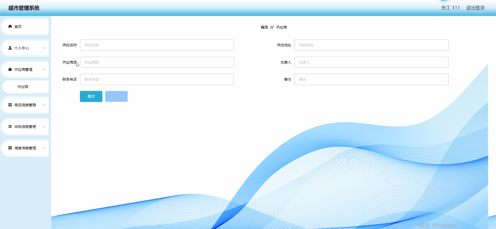
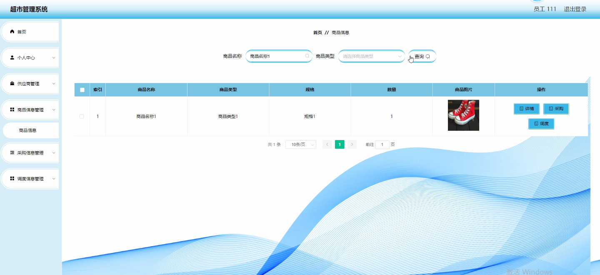
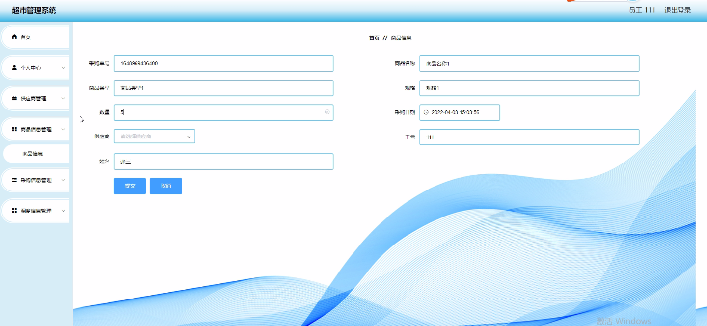
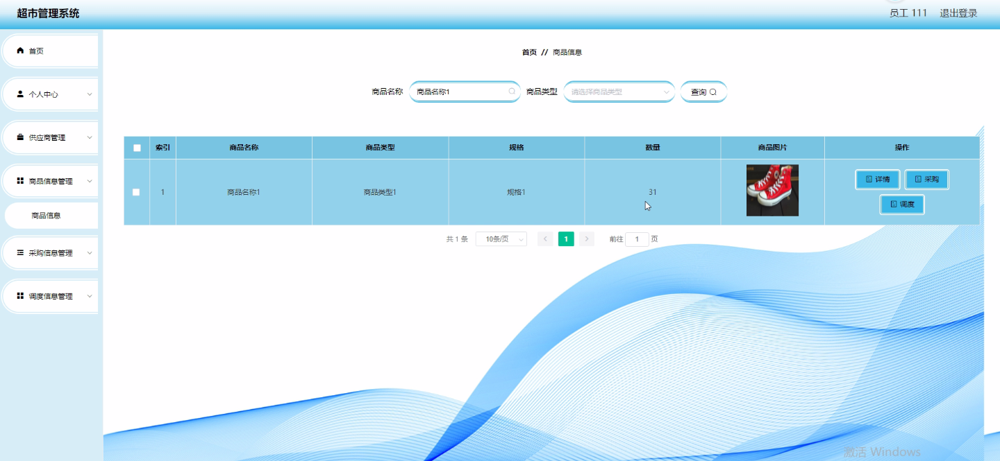
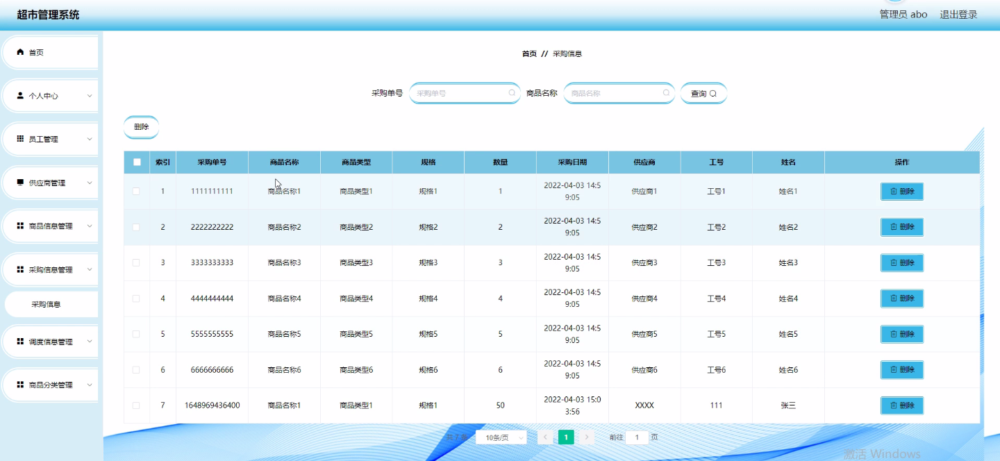

****本项目包含程序+源码+数据库+LW+调试部署环境，文末可获取一份本项目的java源码和数据库参考。****

## ******开题报告******

研究背景：
随着社会经济的快速发展和人们生活水平的提高，超市作为一种便捷的购物方式在我们的日常生活中扮演着重要的角色。然而，传统的超市管理方式已经无法满足现代化管理的需求。传统的超市管理往往依赖于人工操作，容易出现信息不准确、效率低下等问题。因此，开发一个高效、智能的超市管理系统对于提升超市运营效率和服务质量具有重要意义。

研究意义：
超市管理系统的研究和开发，可以有效解决传统超市管理存在的问题，提高超市的运营效率和管理水平。通过引入先进的信息技术和管理方法，可以实现超市各个环节的自动化、智能化，提高员工工作效率，优化供应链管理，提升商品管理和调度效果，为顾客提供更好的购物体验。同时，超市管理系统的研究还可以为其他行业的管理提供借鉴和参考，推动整个社会管理水平的提升。

研究目的：
本研究旨在设计和开发一套完善的超市管理系统，以满足现代超市管理的需求。通过对员工、供应商、商品信息、采购信息、调度信息、商品分类等系统功能进行研究和开发，实现超市管理的自动化和智能化。具体目标包括提高超市的运营效率、降低管理成本、优化供应链管理、提升商品管理和调度效果，为顾客提供更好的购物体验。

研究内容： 本研究的主要内容包括以下系统功能的设计和开发：

  1. 员工管理：包括员工信息的录入、考勤管理、工资计算等功能，旨在提高员工工作效率和管理水平。
  2. 供应商管理：包括供应商信息的维护、采购合同管理、供应商评价等功能，旨在优化供应链管理，确保商品的质量和供应稳定性。
  3. 商品信息管理：包括商品信息的录入、库存管理、价格调整等功能，旨在提高商品管理的准确性和效率。
  4. 采购信息管理：包括采购订单的生成、供应商配送跟踪、采购费用管理等功能，旨在优化采购流程，降低采购成本。
  5. 调度信息管理：包括货物配送的路线规划、司机调度、配送跟踪等功能，旨在提高配送效率和准确性。
  6. 商品分类管理：包括商品分类的设置、销售统计分析等功能，旨在为超市经营决策提供数据支持。

拟解决的主要问题：
本研究旨在解决传统超市管理存在的信息不准确、效率低下等问题。通过引入先进的信息技术和管理方法，实现超市管理的自动化和智能化，提高员工工作效率，优化供应链管理，提升商品管理和调度效果。通过解决这些问题，可以提升超市的运营效率和服务质量，满足顾客日益增长的购物需求。

研究方案和预期成果：
本研究将采用系统开发的方法，结合先进的信息技术和管理理念，设计和开发一套完善的超市管理系统。通过需求分析、系统设计、编码实现和系统测试等步骤，逐步完成系统的开发和优化。预期成果包括一个功能完备、操作简便、稳定可靠的超市管理系统，并通过实际应用验证其有效性和可行性。

进度安排：

2022年9月至10月：开题报告编写和提交，完成开题报告的撰写并提交给指导教师进行审核。

2022年11月至2023年1月：系统设计和开发，根据开题报告的要求，进行系统设计和编码工作。

2023年2月至3月：论文撰写和初稿完成，开始撰写论文，并在这个阶段完成论文的初稿。

2023年4月至5月：论文修改和最终定稿，根据指导教师的意见对论文进行修改，并完成最终的定稿。

2023年5月：论文答辩和提交，参加论文答辩并根据答辩结果进行修改，最后将论文提交给学院或学校。

参考文献：

[1]喻佳,吴丹新.基于SpringBoot的Web快速开发框架[J].电脑编程技巧与维护,2021,(09):31-33.

[2]李鹏.基于SpringBoot快速开发平台的实现[J].电子技术与软件工程,2021,(12):36-37.

[3]叶开平,蔡维晟,陈家敏,邓斯妮.基于SpringBoot的综测可视化管理系统的研究与设计[J].电脑知识与技术,2021,(12):100-104.

[4]江健锋,徐振平.Springboot最小系统的设计与实现[J].电脑知识与技术,2021,(04):62-63.

[5]赵炯,司圣杰,周奇才,熊肖磊.通用信息获取系统设计与实现[J].起重运输机械,2020,(16):89-97.

[6]吴英宾.一种内外网数据交互系统的设计与实现[J].软件工程,2020,(08):25-27.

****以上是本项目程序开发之前开题报告内容，最终成品以下面界面为准，大家可以酌情参考使用。要源码参考请在文末进行获取！！****

## ******本项目的界面展示******

