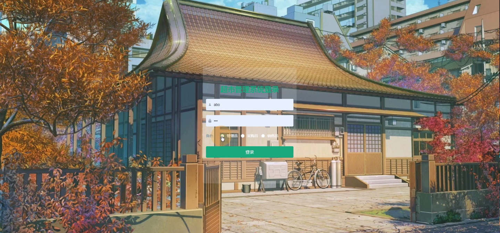
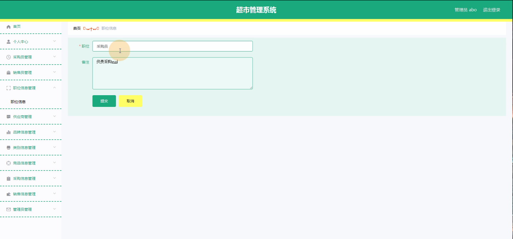
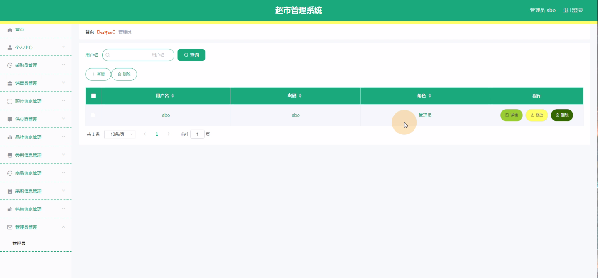
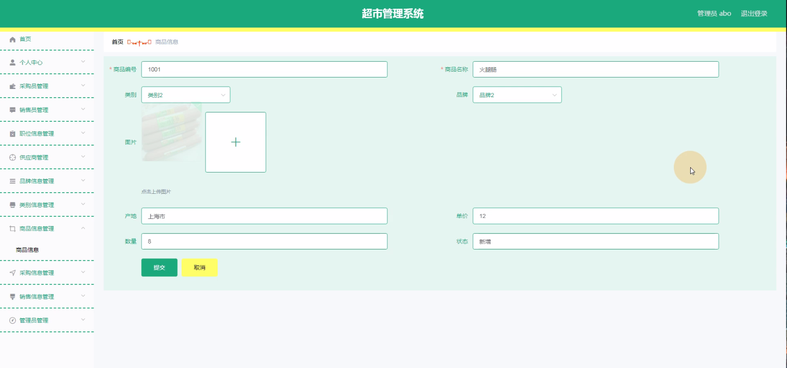
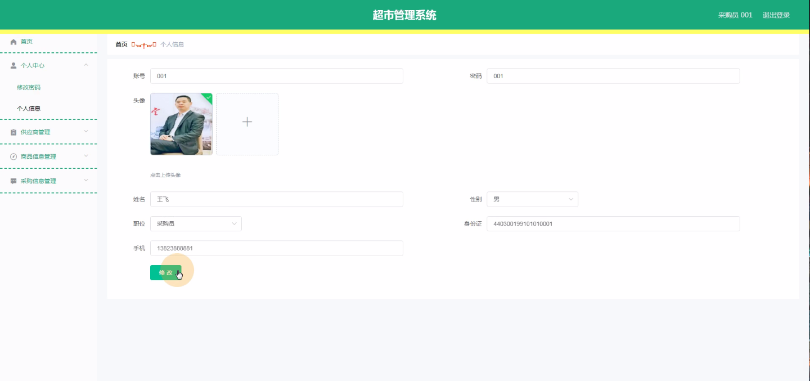
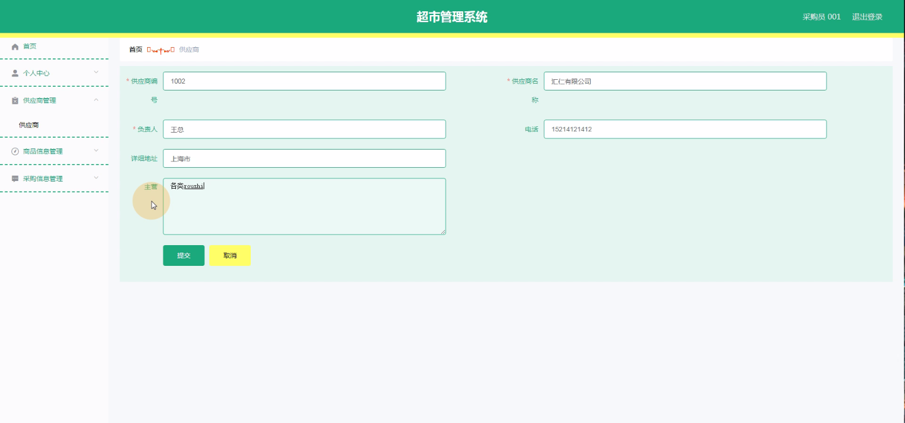
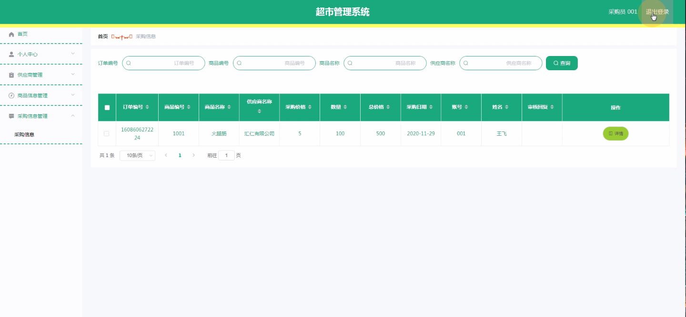
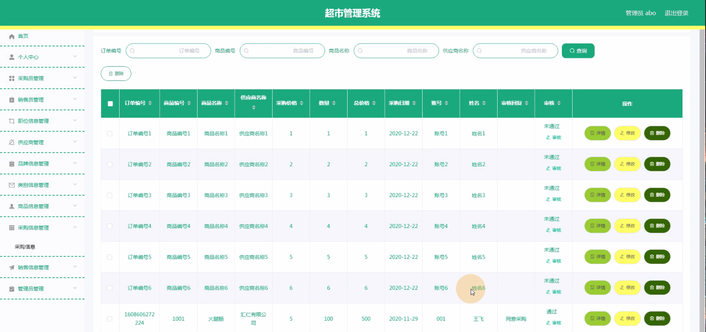

****本项目包含程序+源码+数据库+LW+调试部署环境，文末可获取一份本项目的java源码和数据库参考。****

## ******开题报告******

研究背景：
随着社会经济的发展和人们生活水平的提高，超市作为一种重要的零售业态，在人们的日常生活中扮演着越来越重要的角色。超市管理系统的出现，为超市的运营和管理提供了便利和效率，使得超市能够更好地满足消费者的需求，提升服务质量和效益。然而，随着超市规模的不断扩大和业务的复杂化，传统的超市管理方式已经无法满足日益增长的管理需求，因此需要开发一种全面、高效的超市管理系统。

研究意义：
超市管理系统的研究具有重要的理论和实践意义。首先，通过对超市管理系统的研究，可以深入了解超市运营和管理的特点和规律，为超市的发展提供科学依据。其次，超市管理系统的研究可以推动超市行业的信息化进程，提升超市的管理水平和竞争力。最后，超市管理系统的研究成果还可以为其他零售企业提供借鉴和参考，促进整个零售业的发展。

研究目的：
本研究旨在开发一种全面、高效的超市管理系统，以满足超市规模不断扩大和业务复杂化的需求。具体目标包括：提升超市的运营效率和管理水平，优化采购和销售流程，提高商品信息的准确性和实时性，增强超市与供应商之间的合作和沟通，提升超市的服务质量和顾客满意度。

研究内容： 本研究将围绕超市管理系统的功能展开研究，主要包括以下内容：

  1. 采购员管理：包括采购员的信息管理、权限设置、任务分配等。
  2. 销售员管理：包括销售员的信息管理、销售记录统计、销售业绩评估等。
  3. 职位信息管理：包括职位的设定、薪资管理、晋升评定等。
  4. 供应商管理：包括供应商的信息管理、合作协议管理、供货跟踪等。
  5. 品牌信息管理：包括品牌的录入、更新、展示等。
  6. 类别信息管理：包括商品类别的设定、分类管理、属性定义等。
  7. 商品信息管理：包括商品的基本信息、库存管理、价格调整等。
  8. 采购信息管理：包括采购订单的生成、审核、入库等。
  9. 销售信息管理：包括销售订单的生成、发货、退货等。

拟解决的主要问题： 在开发超市管理系统的过程中，我们将重点解决以下问题：

  1. 如何实现超市各功能模块之间的协同工作，确保信息的及时传递和准确性。
  2. 如何设计一个用户友好的界面，方便操作人员使用和管理。
  3. 如何提高系统的稳定性和安全性，防止数据泄露和系统故障。
  4. 如何利用数据分析技术，为超市的经营决策提供科学依据。
  5. 如何进行系统的维护和更新，以适应超市业务的变化和发展。

研究方案和预期成果：
本研究将采用软件工程的方法论，结合需求分析、系统设计、编码实现和测试验证等步骤，开发一套全面、高效的超市管理系统。预期成果包括：一个功能完善、界面友好的超市管理系统原型，并通过实际应用验证其可行性和有效性。同时，预计通过该系统的应用，能够提升超市的运营效率、管理水平和服务质量，为超市的发展提供有力支撑。

进度安排：

2022年9月至10月：需求分析和规划，明确系统功能和目标，制定项目计划。

2022年11月至2023年1月：系统设计和编码，完成详细的系统设计并开始编写代码。

2023年2月至3月：用户界面开发和数据库开发，开发用户友好的界面和设计数据库结构。

2023年4月至5月：功能测试、文档编写和上线部署，对系统进行全面的功能测试并编写用户手册。

2023年5月：维护和升级，定期对系统进行维护和升级，修复bug和添加新功能。

参考文献：

[1]邱小群,邓丽艳,陈海潮.基于B/S的信息管理系统设计和实现[J].信息与电脑(理论版),2022,(20):146-148.

[2]谢霜.基于Java技术的网络管理体系结构的应用[J].网络安全技术与应用,2022,(10):14-15.

[3]宋锦华.高职院校Java程序设计课程改革研究[J].科技视界,2022,(20):133-135.

[4]曹嵩彭,王鹏宇.浅析Java语言在软件开发中的应用[J].信息记录材料,2022,(03):114-116.

[5]朱澈,余俊达.武汉东湖学院.基于Java的软硬件信息管理系统V1.0[Z].项目立项编号.鉴定单位.鉴定日期:

****以上是本项目程序开发之前开题报告内容，最终成品以下面界面为准，大家可以酌情参考使用。要源码参考请在文末进行获取！！****

## ******本项目的界面展示******

