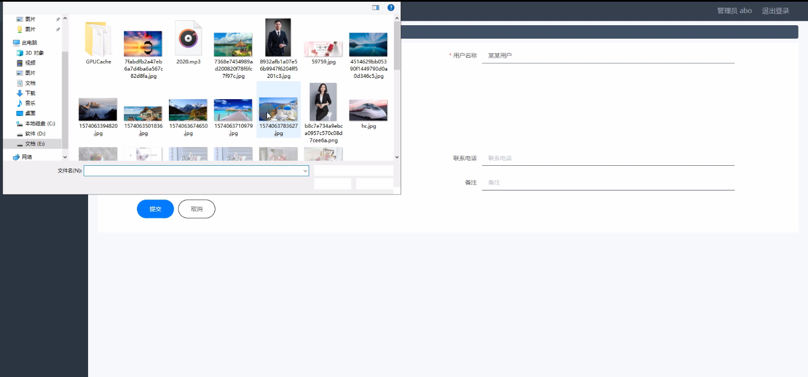
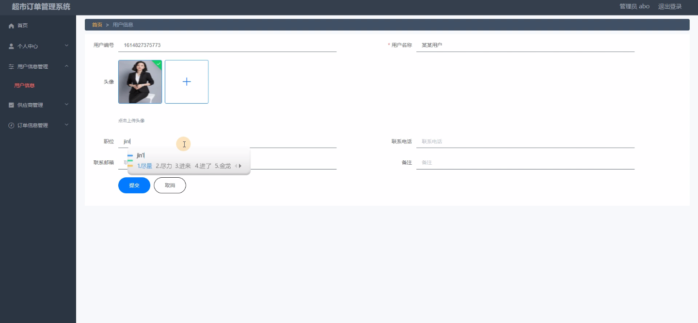

****本项目包含程序+源码+数据库+LW+调试部署环境，文末可获取一份本项目的java源码和数据库参考。****

## ******开题报告******

研究背景：
随着社会经济的发展和人们生活水平的提高，超市作为一种便捷的购物方式逐渐成为人们日常生活中不可或缺的一部分。然而，随之而来的是超市订单管理系统面临的挑战。传统的手工管理方式已经无法满足超市快速发展的需求，因此，开发一个高效、智能的超市订单管理系统变得尤为重要。

研究意义：
超市订单管理系统的开发对于提高超市的运营效率、降低管理成本具有重要意义。通过引入信息技术，可以实现订单的自动化处理、供应链的优化以及销售数据的统计与分析，从而帮助超市更好地管理商品进货、库存和销售等环节，提升超市的竞争力和盈利能力。

研究目的：
本研究旨在设计和开发一套功能完善、易于操作的超市订单管理系统，以满足超市日常运营管理的需求。通过该系统，超市管理人员可以方便地管理用户信息、供应商信息、订单信息、商品信息等，实现商品进货、退货、销售统计等功能，提高订单处理的效率和准确性，优化超市的运营流程。

研究内容： 本研究的主要内容包括以下系统功能：

  1. 用户信息管理：包括用户注册、登录、个人信息维护等功能，以便用户能够方便地进行购物和查询订单信息。
  2. 供应商信息管理：包括供应商的基本信息、联系方式、商品供应情况等，以便超市管理人员能够及时了解供应商的情况并与其进行有效的沟通和合作。
  3. 订单信息管理：包括订单的生成、修改、查询、删除等功能，以及订单状态的跟踪和更新，确保订单处理的准确性和及时性。
  4. 商品信息管理：包括商品的分类、属性、价格、库存等信息的管理，以便超市管理人员能够清晰地了解商品的情况，并根据需求进行进货和调整销售策略。
  5. 商品进货管理：包括商品进货的录入、库存的更新、供应商结算等功能，以确保超市能够及时补充商品库存，满足顾客的购买需求。
  6. 商品退货管理：包括顾客退货的处理、库存的更新、退款的操作等功能，以保证超市与顾客之间的良好关系，并及时处理退货事宜。
  7. 销售统计管理：包括销售数据的收集、分析和报表生成等功能，以便超市管理人员能够了解商品销售情况，制定合理的销售策略和促销活动。
  8. 销售出库管理：包括订单出库的操作、库存的更新、物流配送等功能，以确保订单能够及时送达顾客手中，提升顾客满意度。

拟解决的主要问题：

  1. 传统手工管理方式效率低下，无法满足超市快速发展的需求。
  2. 订单处理过程繁琐，容易出现错误和延误。
  3. 商品进货和退货管理不规范，影响超市库存的准确性和及时性。
  4. 销售数据统计和分析缺乏科学性和准确性，难以为超市提供有针对性的经营决策。
  5. 顾客购物体验不佳，无法满足个性化需求。

研究方案和预期成果：
本研究将采用软件开发的方法，结合数据库技术和网络技术，设计和开发一套基于Web的超市订单管理系统。通过系统的实施和应用，预期可以实现以下成果：

  1. 提高超市订单处理的效率和准确性，降低人力成本和错误率。
  2. 优化超市的供应链管理，实现商品进货和退货的规范化和自动化。
  3. 提供科学、准确的销售数据统计和分析报表，为超市经营决策提供参考依据。
  4. 提升顾客购物体验，满足个性化需求，增强顾客忠诚度。
  5. 促进超市的发展和竞争力提升，实现经济效益和社会效益的双赢。

进度安排：

2022年9月至10月：需求分析和规划，明确系统功能和目标，制定项目计划。

2022年11月至2023年1月：系统设计和编码，完成详细的系统设计并开始编写代码。

2023年2月至3月：用户界面开发和数据库开发，开发用户友好的界面和设计数据库结构。

2023年4月至5月：功能测试、文档编写和上线部署，对系统进行全面的功能测试并编写用户手册。

2023年5月：维护和升级，定期对系统进行维护和升级，修复bug和添加新功能。

参考文献：

[1]邱小群,邓丽艳,陈海潮.基于B/S的信息管理系统设计和实现[J].信息与电脑(理论版),2022,(20):146-148.

[2]谢霜.基于Java技术的网络管理体系结构的应用[J].网络安全技术与应用,2022,(10):14-15.

[3]宋锦华.高职院校Java程序设计课程改革研究[J].科技视界,2022,(20):133-135.

[4]曹嵩彭,王鹏宇.浅析Java语言在软件开发中的应用[J].信息记录材料,2022,(03):114-116.

[5]朱澈,余俊达.武汉东湖学院.基于Java的软硬件信息管理系统V1.0[Z].项目立项编号.鉴定单位.鉴定日期:

****以上是本项目程序开发之前开题报告内容，最终成品以下面界面为准，大家可以酌情参考使用。要源码参考请在文末进行获取！！****

## ******本项目的界面展示******

