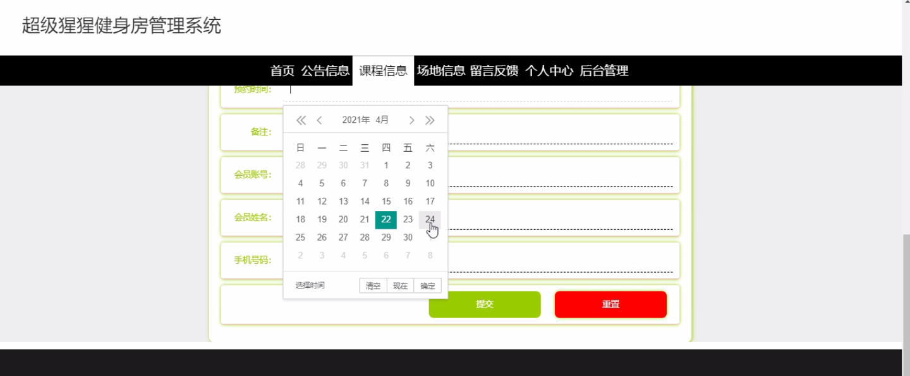
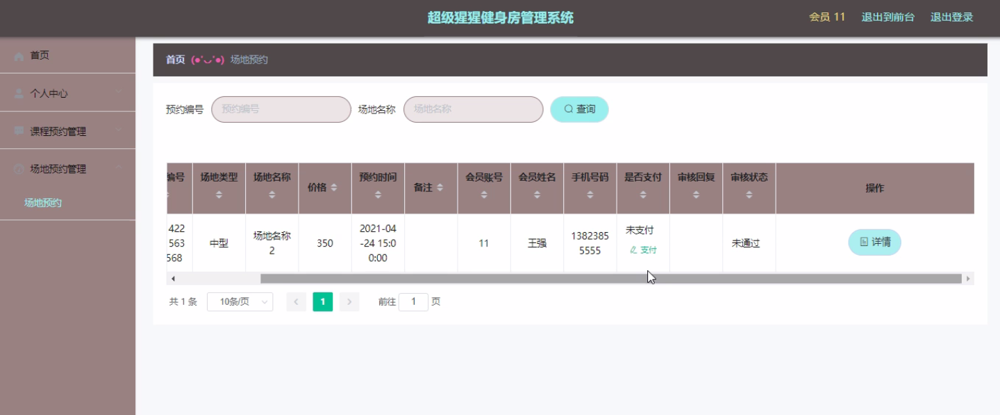
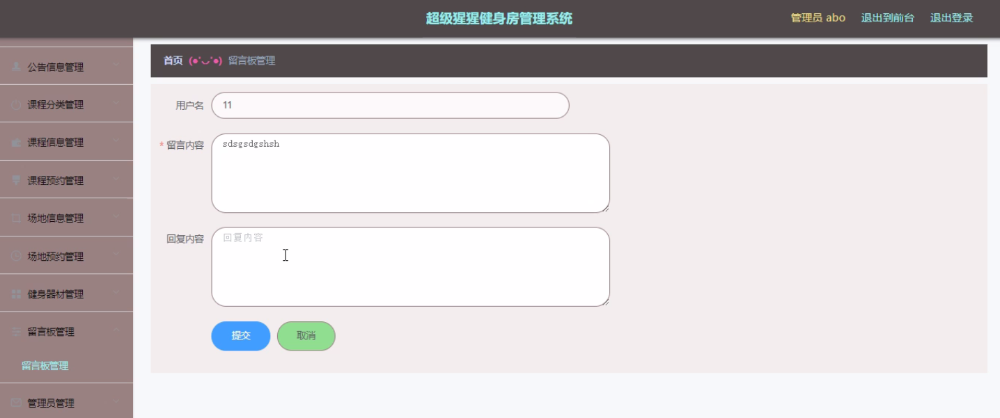
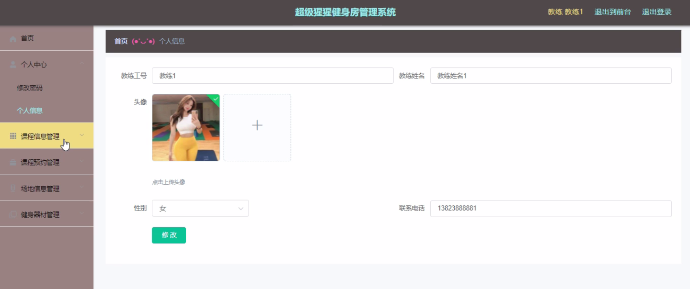
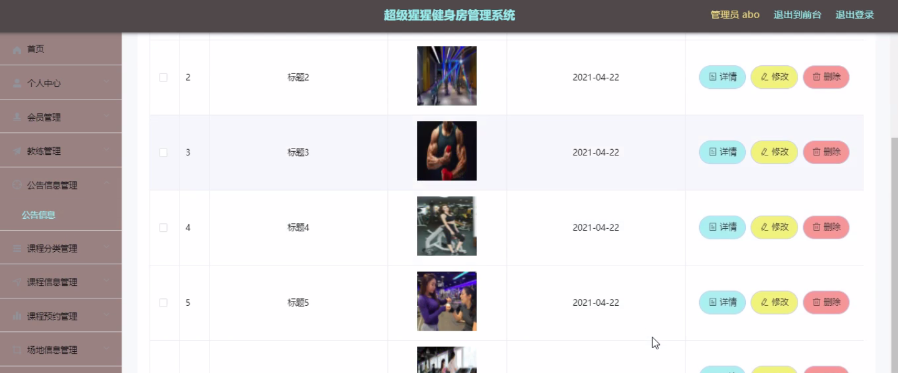
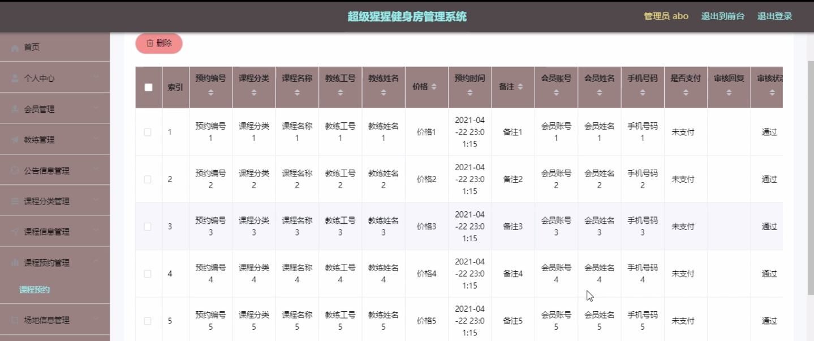

****本项目包含程序+源码+数据库+LW+调试部署环境，文末可获取一份本项目的java源码和数据库参考。****

## ******开题报告******

研究背景：
随着现代社会生活节奏的加快和人们健康意识的增强，健身已经成为越来越多人日常生活中不可或缺的一部分。然而，传统的健身房管理方式存在一些问题，如信息不透明、预约不便捷、教练资源分配不均等。因此，开发一款高效、智能的健身房管理系统具有重要的现实意义。

研究意义：
超级猩猩健身房管理系统的开发将提升健身房的管理水平和服务质量，满足用户对健身的需求，促进健康生活方式的普及。通过引入先进的技术手段，优化健身房的运营流程，提高管理效率，为用户提供更好的健身体验。

研究目的：
本研究旨在设计和开发一套全面、高效的超级猩猩健身房管理系统，以解决传统健身房管理方式存在的问题。通过该系统，用户可以方便地查询健身房的会员信息、教练信息、课程信息等，并进行在线预约和场地安排，提高用户满意度和健身房的运营效益。

研究内容： 本研究的主要内容包括以下系统功能：

  1. 会员管理：实现会员信息的录入、查询和统计，方便健身房对会员进行管理和服务。
  2. 教练管理：提供教练的个人信息、专业技能等，方便用户选择适合自己的教练。
  3. 课程信息：展示各类健身课程的详细信息，包括时间、地点、费用等，方便用户选择和预约。
  4. 课程分类：将健身课程按照不同的分类进行整理，方便用户查找和筛选。
  5. 公告信息：发布健身房的最新公告和通知，及时传达重要信息给用户。
  6. 课程预约：用户可以在线预约心仪的健身课程，避免排队等待的麻烦。
  7. 场地信息：提供健身房场地的相关信息，包括设施、容量等，方便用户选择适合的场地。
  8. 场地预约：用户可以在线预约健身房的场地，确保使用场地的顺利安排。
  9. 健身器材：展示健身房的各种健身器材，供用户参考和选择。

拟解决的主要问题：
通过超级猩猩健身房管理系统的开发，将解决传统健身房管理方式存在的信息不透明、预约不便捷、教练资源分配不均等问题。用户可以通过系统方便地获取所需信息，并进行在线预约和安排，提高健身房的管理效率和用户体验。

研究方案和预期成果：
本研究将采用软件开发的方法，结合数据库技术和网络技术，设计和实现超级猩猩健身房管理系统。预期成果包括一个功能完善、操作简便的系统，能够满足用户的各类需求，并提供良好的用户体验。该系统将有效提升健身房的管理水平和服务质量，促进健康生活方式的普及。

进度安排：

2022年9月至10月：需求分析和规划，明确系统功能和目标，制定项目计划。

2022年11月至2023年1月：系统设计和编码，完成详细的系统设计并开始编写代码。

2023年2月至3月：用户界面开发和数据库开发，开发用户友好的界面和设计数据库结构。

2023年4月至5月：功能测试、文档编写和上线部署，对系统进行全面的功能测试并编写用户手册。

2023年5月：维护和升级，定期对系统进行维护和升级，修复bug和添加新功能。

参考文献：

[1]邱小群,邓丽艳,陈海潮.基于B/S的信息管理系统设计和实现[J].信息与电脑(理论版),2022,(20):146-148.

[2]谢霜.基于Java技术的网络管理体系结构的应用[J].网络安全技术与应用,2022,(10):14-15.

[3]宋锦华.高职院校Java程序设计课程改革研究[J].科技视界,2022,(20):133-135.

[4]曹嵩彭,王鹏宇.浅析Java语言在软件开发中的应用[J].信息记录材料,2022,(03):114-116.

[5]朱澈,余俊达.武汉东湖学院.基于Java的软硬件信息管理系统V1.0[Z].项目立项编号.鉴定单位.鉴定日期:

****以上是本项目程序开发之前开题报告内容，最终成品以下面界面为准，大家可以酌情参考使用。要源码参考请在文末进行获取！！****

## ******本项目的界面展示******

