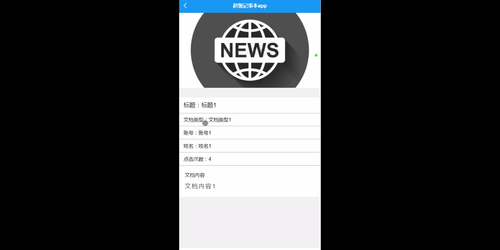
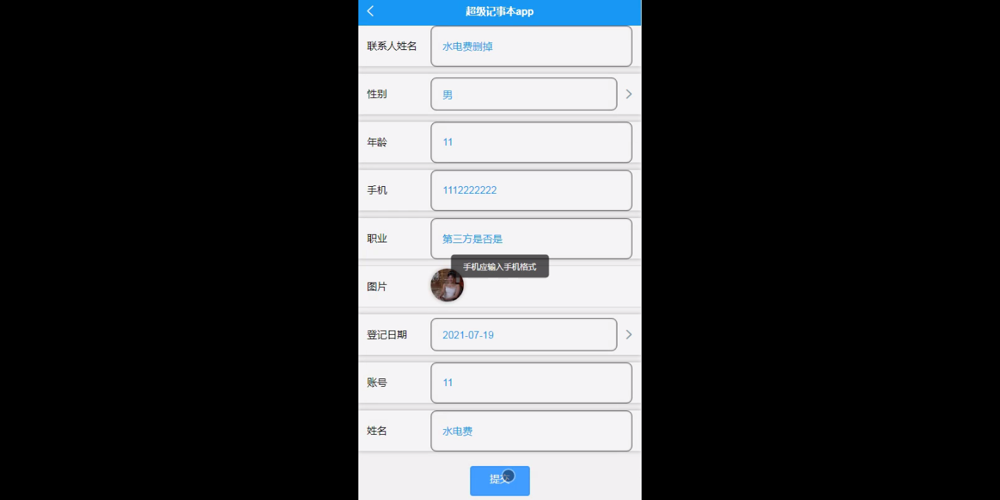
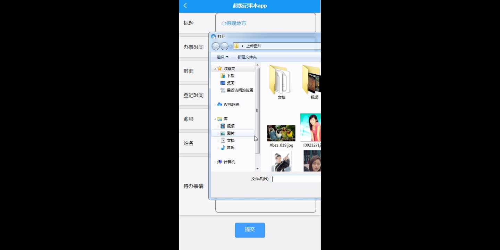
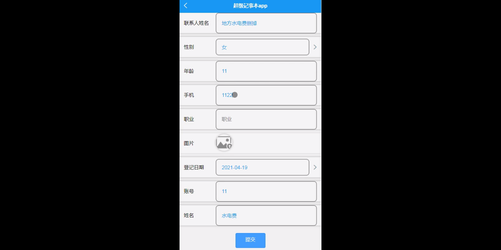
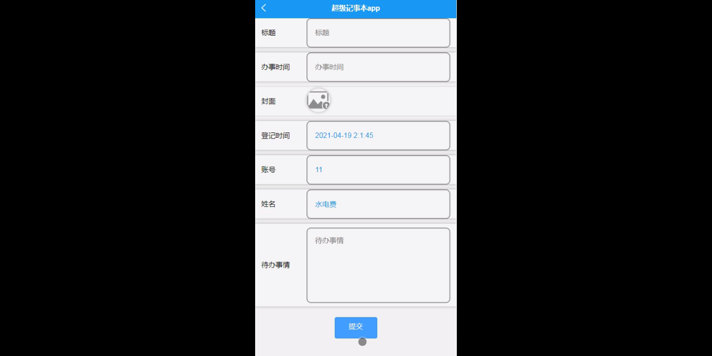
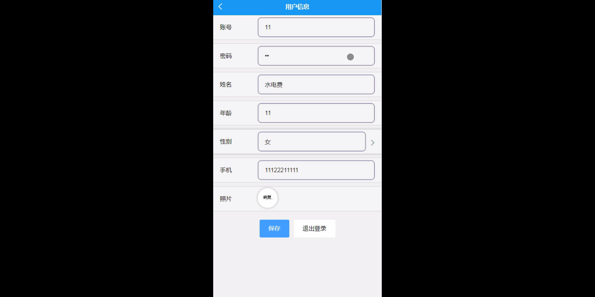

****本项目包含程序+源码+数据库+LW+调试部署环境，文末可获取一份本项目的java源码和数据库参考。****

## ******开题报告******

研究背景：
在当今信息化社会中，人们面临着海量的信息和任务，如何高效地管理和组织这些信息成为了一个重要的问题。传统的纸质笔记本已经无法满足人们对于信息管理的需求，因此，开发一种功能强大、易于使用的电子记事本成为了迫切的需求。

研究意义：
电子记事本的出现将极大地提升人们的工作效率和生活品质。通过电子记事本，用户可以随时随地记录和查看各种信息，如个人备忘录、待办事项、通讯录等。它不仅可以帮助人们更好地组织和管理信息，还可以提供智能化的辅助功能，如自动分类、提醒和搜索等，使得信息的获取和利用更加便捷和高效。

研究目的：
本研究旨在设计和开发一款功能全面、操作简便的超级记事本系统，以满足人们对于信息管理的需求。通过深入分析用户需求和行为习惯，我们将致力于提供一个高度个性化的用户体验，同时兼顾系统的稳定性和安全性，为用户提供一个可靠的信息管理平台。

研究内容： 本研究的主要内容包括以下系统功能：

  1. 用户管理：实现用户注册、登录和个人信息管理等功能，确保用户身份的安全和隐私的保护。

  2. 用户文档：提供一个便捷的文档编辑和管理工具，支持多种格式的文档创建、保存和分享，满足用户对于文档处理的需求。

  3. 通讯录：建立一个完善的通讯录系统，方便用户管理和查找联系人信息，支持快速拨号和短信发送等功能。

  4. 待办事项：设计一个强大的待办事项管理模块，帮助用户记录和跟踪任务，设置提醒和优先级，提高工作效率。

拟解决的主要问题： 在开发超级记事本系统的过程中，我们将重点解决以下问题：

  1. 如何设计一个简洁直观的用户界面，使得用户能够快速上手并高效地使用系统功能？

  2. 如何实现数据的安全存储和传输，保护用户的个人隐私和信息安全？

  3. 如何利用智能化技术，为用户提供个性化的服务和推荐，提升用户体验和满意度？

  4. 如何处理大量数据和复杂操作时的系统性能问题，确保系统的稳定性和高效性？

  5. 如何与其他应用和平台进行集成，实现数据的互通和共享，提供更广泛的服务和功能？

研究方案和预期成果： 我们将采用用户需求调研、原型设计、系统开发和测试等方法，逐步完成超级记事本系统的开发。预期的成果包括：

  1. 设计出一款界面简洁、操作便捷的超级记事本系统，满足用户对于信息管理的各种需求。

  2. 实现用户管理、用户文档、通讯录和待办事项等核心功能模块，确保系统的完整性和稳定性。

  3. 提供智能化的辅助功能，如自动分类、提醒和搜索等，提升用户的工作效率和体验。

  4. 通过用户反馈和系统测试，不断优化和改进系统，提供更好的用户体验和服务。

  5. 推广和应用超级记事本系统，为用户提供更便捷、高效的信息管理解决方案。

进度安排：

2022年9月至10月：开题报告编写和提交，完成开题报告的撰写并提交给指导教师进行审核。

2022年11月至2023年1月：系统设计和开发，根据开题报告的要求，进行系统设计和编码工作。

2023年2月至3月：论文撰写和初稿完成，开始撰写论文，并在这个阶段完成论文的初稿。

2023年4月至5月：论文修改和最终定稿，根据指导教师的意见对论文进行修改，并完成最终的定稿。

2023年5月：论文答辩和提交，参加论文答辩并根据答辩结果进行修改，最后将论文提交给学院或学校。

参考文献：

[1]喻佳,吴丹新.基于SpringBoot的Web快速开发框架[J].电脑编程技巧与维护,2021,(09):31-33.

[2]李鹏.基于SpringBoot快速开发平台的实现[J].电子技术与软件工程,2021,(12):36-37.

[3]叶开平,蔡维晟,陈家敏,邓斯妮.基于SpringBoot的综测可视化管理系统的研究与设计[J].电脑知识与技术,2021,(12):100-104.

[4]江健锋,徐振平.Springboot最小系统的设计与实现[J].电脑知识与技术,2021,(04):62-63.

[5]赵炯,司圣杰,周奇才,熊肖磊.通用信息获取系统设计与实现[J].起重运输机械,2020,(16):89-97.

[6]吴英宾.一种内外网数据交互系统的设计与实现[J].软件工程,2020,(08):25-27.

****以上是本项目程序开发之前开题报告内容，最终成品以下面界面为准，大家可以酌情参考使用。要源码参考请在文末进行获取！！****

## ******本项目的界面展示******

