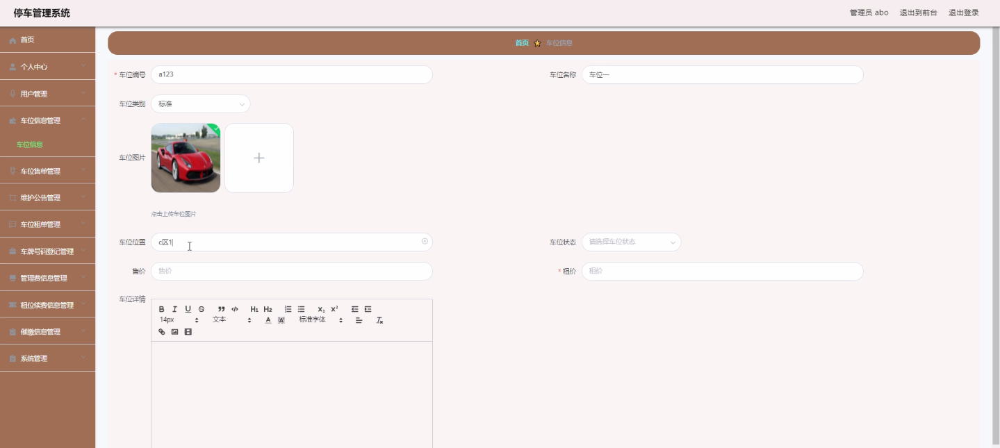
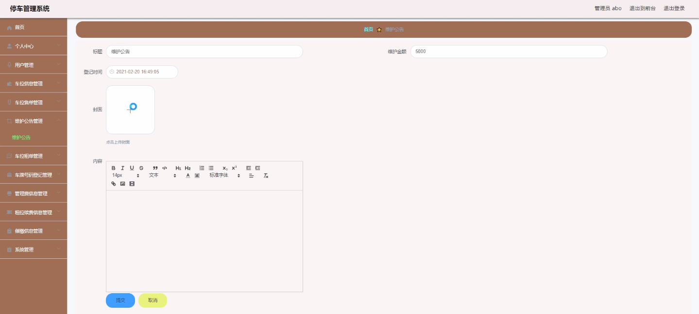
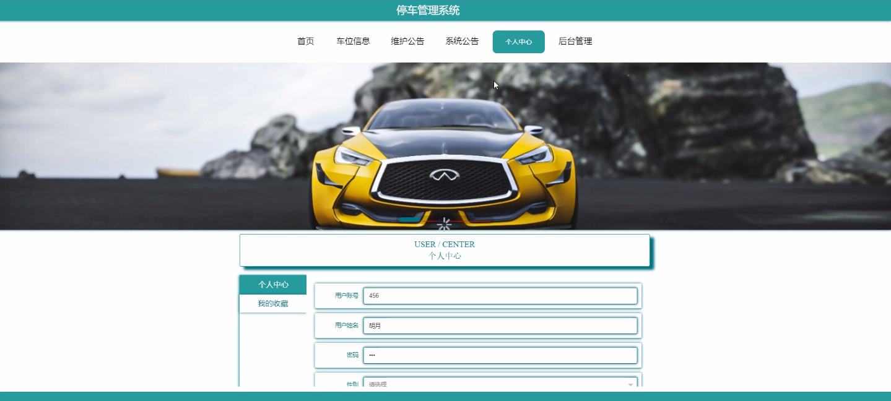
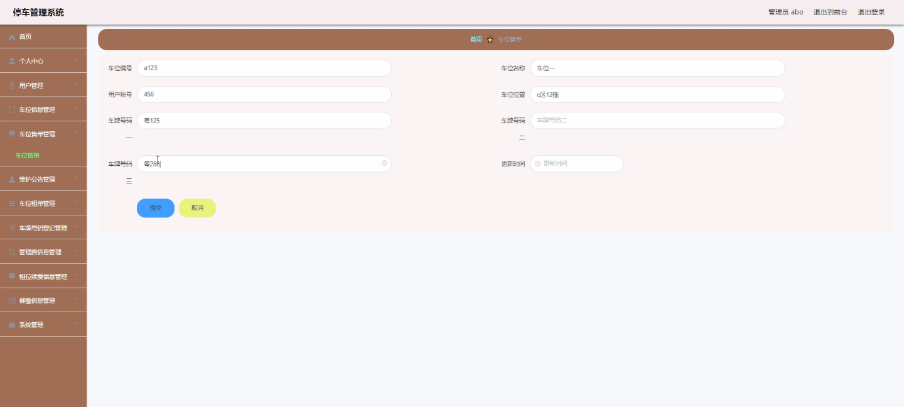
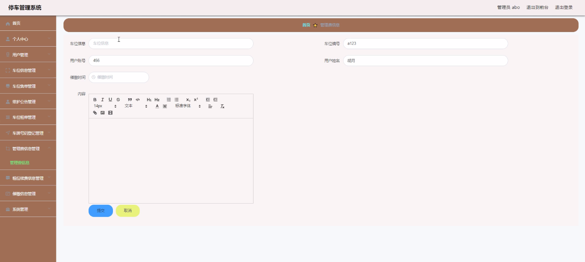
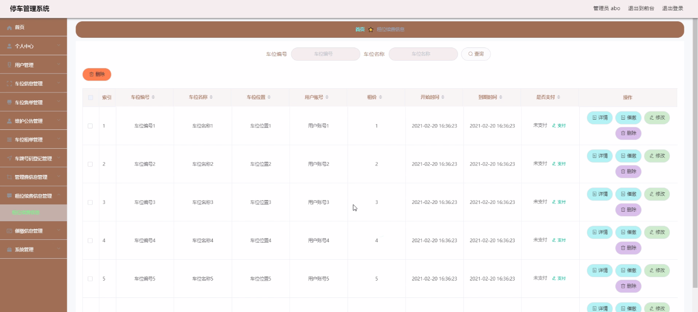

****本项目包含程序+源码+数据库+LW+调试部署环境，文末可获取一份本项目的java源码和数据库参考。****

## ******开题报告******

研究背景：
随着城市化进程的加快，车辆数量不断增加，停车难成为了一个普遍存在的问题。而车库作为解决停车难的重要设施之一，其管理和收费工作也变得越来越复杂。传统的人工管理方式已经无法满足日益增长的车辆数量和管理需求，因此需要引入车库收费管理系统来提高管理效率和服务质量。

研究意义：
车库收费管理系统的引入对于车库管理方面具有重要的意义。首先，通过系统化的管理，可以提高车位利用率，减少停车时间和拥堵现象，改善城市交通状况。其次，系统可以实现自动化的收费功能，提高收费效率，减少人力成本，同时减少因人为原因导致的错误和纠纷。此外，系统还可以提供各种数据报表和分析，为车库管理者提供决策依据，优化车库运营。

研究目的：
本研究旨在设计和开发一套完善的车库收费管理系统，以提高车库管理的效率和服务质量。通过系统的应用，实现车位信息的准确记录、车位售卖和租赁的便捷操作、收费和续费的自动化处理等功能，进一步优化车库管理流程，提高用户满意度。

研究内容： 本研究的主要内容包括以下系统功能：

  1. 用户管理：包括用户信息的录入、查询和修改等功能，以及权限管理和用户登录验证等功能。
  2. 车位信息管理：包括车位状态的记录、查询和修改等功能，以及车位分配和调整等功能。
  3. 车位售单管理：包括车位销售记录的管理、查询和统计等功能，以及售单打印和发票管理等功能。
  4. 维护公告管理：包括发布和展示车库维护公告的功能，以及公告的编辑和删除等功能。
  5. 车位租单管理：包括车位租赁记录的管理、查询和统计等功能，以及租单打印和合同管理等功能。
  6. 车牌号码登记：包括车辆车牌号码的录入、查询和修改等功能，以及车牌号码与用户关联的管理功能。
  7. 管理费信息管理：包括管理费用的设置、收取和统计等功能，以及费用明细和账单管理等功能。
  8. 租位续费信息管理：包括租位续费记录的管理、查询和统计等功能，以及续费提醒和自动扣费等功能。
  9. 催缴信息管理：包括催缴通知的发送、记录和查询等功能，以及逾期费用计算和催缴流程管理等功能。
  10. 月租信息管理：包括月租用户的管理、查询和统计等功能，以及月租费用设置和收取等功能。

拟解决的主要问题：
通过设计和开发车库收费管理系统，旨在解决传统人工管理方式下存在的以下问题：停车位分配不准确、收费过程繁琐且易出错、数据管理不规范、服务质量无法保障等问题。通过引入系统化的管理和自动化的操作，可以提高车库管理的效率和精度，为用户提供更好的停车体验。

研究方案和预期成果：
本研究将采用软件开发的方法，结合数据库技术和网络技术，设计和实现一套完善的车库收费管理系统。预期的成果包括：用户友好的界面设计、稳定可靠的系统运行、高效自动化的管理和收费功能、准确全面的数据记录和报表分析等。通过系统的应用，预期能够提高车库管理的效率和服务质量，为城市交通管理和用户提供更便捷的停车服务。

进度安排：

2022年9月至10月：开题报告编写和提交，完成开题报告的撰写并提交给指导教师进行审核。

2022年11月至2023年1月：系统设计和开发，根据开题报告的要求，进行系统设计和编码工作。

2023年2月至3月：论文撰写和初稿完成，开始撰写论文，并在这个阶段完成论文的初稿。

2023年4月至5月：论文修改和最终定稿，根据指导教师的意见对论文进行修改，并完成最终的定稿。

2023年5月：论文答辩和提交，参加论文答辩并根据答辩结果进行修改，最后将论文提交给学院或学校。

参考文献：

[1]喻佳,吴丹新.基于SpringBoot的Web快速开发框架[J].电脑编程技巧与维护,2021,(09):31-33.

[2]李鹏.基于SpringBoot快速开发平台的实现[J].电子技术与软件工程,2021,(12):36-37.

[3]叶开平,蔡维晟,陈家敏,邓斯妮.基于SpringBoot的综测可视化管理系统的研究与设计[J].电脑知识与技术,2021,(12):100-104.

[4]江健锋,徐振平.Springboot最小系统的设计与实现[J].电脑知识与技术,2021,(04):62-63.

[5]赵炯,司圣杰,周奇才,熊肖磊.通用信息获取系统设计与实现[J].起重运输机械,2020,(16):89-97.

[6]吴英宾.一种内外网数据交互系统的设计与实现[J].软件工程,2020,(08):25-27.

****以上是本项目程序开发之前开题报告内容，最终成品以下面界面为准，大家可以酌情参考使用。要源码参考请在文末进行获取！！****

## ******本项目的界面展示******

