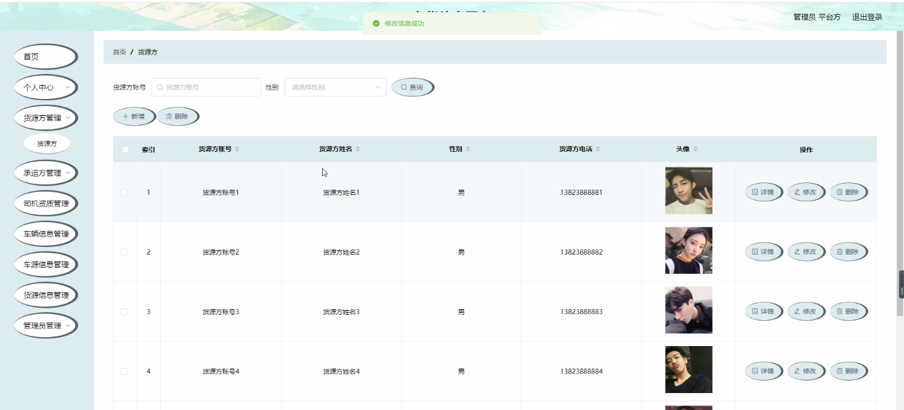

****本项目包含程序+源码+数据库+LW+调试部署环境，文末可获取一份本项目的java源码和数据库参考。****

## ******开题报告******

研究背景：
随着经济的快速发展和物流行业的蓬勃发展，货物运输需求日益增长。然而，在传统的货物运输过程中，信息不对称、信息不透明等问题导致了很多不便和低效。为了解决这些问题，车货信息平台应运而生。该平台旨在通过整合货源方、承运方、司机资质、车辆信息、车源信息、货源信息等系统功能，提供全面的信息服务，改善货物运输的效率和质量。

研究意义：
车货信息平台的建立对于推动物流行业的发展具有重要意义。首先，通过提供准确、实时的货源信息和车源信息，平台可以帮助货主和承运方快速匹配，提高货物运输的效率。其次，通过对司机资质和车辆信息进行审核和管理，平台可以提高货物运输的安全性和可靠性。此外，平台还可以促进物流资源的优化配置，降低运输成本，提升整体物流服务水平。

研究目的：
本研究旨在深入探讨车货信息平台的设计与实施，以及其在货物运输领域的应用。具体目的包括：1.分析当前货物运输过程中存在的问题和挑战，明确车货信息平台的需求；2.研究并设计车货信息平台的系统架构和功能模块，确保平台的稳定性和可扩展性；3.开发并实施车货信息平台的原型系统，验证其在实际应用中的效果；4.评估车货信息平台的使用效果和经济效益，为进一步推广和应用提供参考。

研究内容： 本研究将围绕车货信息平台的系统功能展开研究，主要包括以下几个方面：

  1. 货源方系统功能：研究如何收集、整理和发布货源信息，以及如何提高货源信息的准确性和实时性。

  2. 承运方系统功能：研究如何管理和审核承运方的资质信息，确保承运方的合法性和可靠性。

  3. 司机资质系统功能：研究如何对司机的资质进行认证和管理，以及如何提供司机的信用评价和排名。

  4. 车辆信息系统功能：研究如何收集和管理车辆的基本信息，包括车型、载重量等，以便进行匹配和调度。

  5. 车源信息系统功能：研究如何收集、整理和发布车源信息，以及如何提高车源信息的准确性和实时性。

  6. 货源信息系统功能：研究如何收集、整理和发布货物的基本信息，包括货物类型、数量等，以便进行匹配和调度。

拟解决的主要问题： 在研究过程中，我们将重点解决以下几个主要问题：

  1. 信息不对称问题：通过整合各方信息，解决货源方和承运方之间信息不对称的问题，提高信息的透明度和可获取性。

  2. 匹配效率低下问题：通过优化算法和技术手段，提高货源和车源的匹配效率，减少空载和半载现象，降低运输成本。

  3. 司机资质审核问题：建立完善的司机资质审核机制，确保司机的合法性和可靠性，提高货物运输的安全性。

  4. 车辆管理问题：通过车辆信息管理系统，对车辆进行实时监控和管理，提高车辆的利用率和运输效率。

  5. 信息安全问题：加强平台的信息安全防护措施，防止数据泄露和恶意攻击，保障用户信息的安全和隐私。

研究方案和预期成果：
本研究将采用实证研究方法，结合理论分析和实际案例，设计并实施车货信息平台的原型系统。通过数据收集、模型构建和实验验证，评估平台的使用效果和经济效益。预期成果包括：1.完善的车货信息平台系统架构和功能模块；2.高效的货源和车源匹配算法；3.可靠的司机资质审核机制；4.安全可靠的信息管理和交互界面；5.提高货物运输效率和质量的实际应用案例。

进度安排：

2022年9月至10月：需求分析和规划，进行用户需求调研和分析，确定系统功能和目标。

2022年11月至2023年1月：系统设计和开发，完成系统架构设计和技术选型，并开始编写代码。

2023年2月至3月：测试和优化，进行单元测试和集成测试，修复问题并优化系统性能。

2023年4月至5月：文档编写和培训，编写用户手册和系统文档，并进行相关人员的培训。

2023年5月：上线部署和维护，将系统部署到生产环境中，并定期进行维护和升级。

参考文献：

[1]王振华.SpringBoot在教学效果评估系统中的应用[J].电子技术,2023,(05):67-69.

[2]王明泉.基于SpringBoot远程热部署的探索和应用[J].信息与电脑(理论版),2023,(07):1-4.

[3]王亚东,李晓霞,陈强强,剡美娜.基于SpringBoot的需求发布平台设计[J].信息与电脑(理论版),2023,(01):105-107.

[4]陈新府豪.基于SpringBoot和Vue框架的创新方法推理系统的设计与实现[D].导师：黄静.浙江理工大学,2022.

[5]霍福华,韩慧.基于SpringBoot微服务架构下前后端分离的MVVM模型[J].电子技术与软件工程,2022,(01):73-76.

[6]韩策,张娜,王松亭,张凯,何方,袁峰.SpringBoot OPC客户端设计与研究[J].电子世界,2021,(19):25-26.

****以上是本项目程序开发之前开题报告内容，最终成品以下面界面为准，大家可以酌情参考使用。要源码参考请在文末进行获取！！****

## ******本项目的界面展示******

