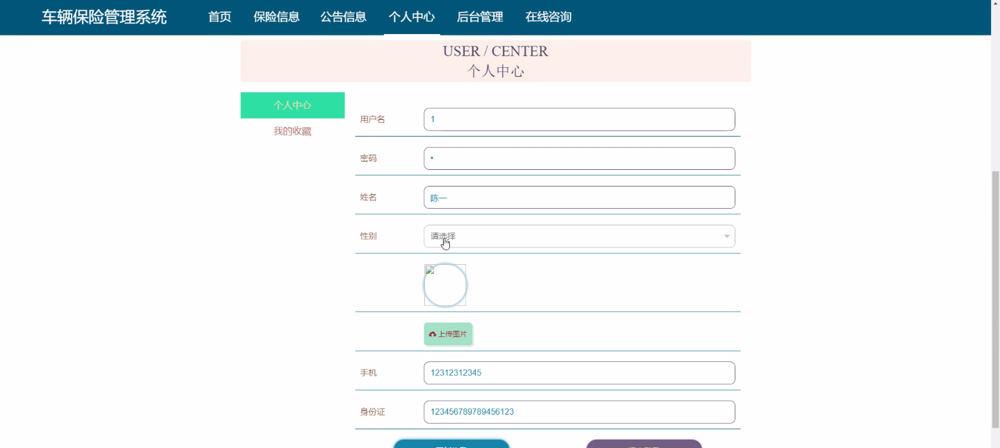

****本项目包含程序+源码+数据库+LW+调试部署环境，文末可获取一份本项目的java源码和数据库参考。****

## ******开题报告******

研究背景：
随着社会经济的发展和人们生活水平的提高，汽车已经成为现代社会中不可或缺的交通工具。然而，随之而来的是车辆事故和损失的增加，这给车主和保险公司带来了巨大的风险和负担。因此，建立一套高效的车辆保险管理系统变得尤为重要。

研究意义：
车辆保险管理系统的建立可以有效地解决车辆保险领域存在的问题和挑战。通过引入先进的信息技术和数据管理方法，可以提高保险公司的业务处理效率，减少人力资源的浪费，并提供更好的服务体验给车主。同时，该系统还能够提供全面的数据分析和风险评估，为保险公司制定更合理的保险政策和定价策略提供支持。

研究目的：
本研究旨在设计和开发一种车辆保险管理系统，以满足保险公司和车主的需求。通过该系统，保险公司可以实现对保险业务的全面管理和监控，包括车辆投保、保险信息管理、理赔申请和理赔结果等功能。同时，车主也可以通过该系统方便地进行保险购买和理赔申请，提高用户体验和满意度。

研究内容： 本研究的主要内容包括以下系统功能：

  1. 用户管理：实现用户注册、登录、信息修改等功能，确保系统安全可靠。
  2. 保险类别管理：对不同类型的保险进行分类和管理，包括车辆保险、人身保险等。
  3. 保险信息管理：对车辆保险信息进行录入、查询和统计分析，为保险公司提供决策支持。
  4. 车辆投保：车主可以通过系统进行保险购买和投保操作，简化流程并提高效率。
  5. 理赔申请：车主可以在线提交理赔申请，并上传相关证据材料，方便快捷。
  6. 理赔结果：保险公司对理赔申请进行审核和处理，并及时通知车主理赔结果。

拟解决的主要问题： 通过建立车辆保险管理系统，我们将解决以下问题：

  1. 传统保险业务处理效率低下，需要大量人力资源进行手工操作和数据录入。
  2. 车主购买保险和理赔申请流程繁琐，耗时长，用户体验差。
  3. 保险公司难以准确评估风险和制定合理的保险政策和定价策略。

研究方案和预期成果： 本研究将采用软件工程的方法，结合数据库技术和网络技术，设计和开发一套车辆保险管理系统。通过系统测试和优化，预期实现以下成果：

  1. 提高保险公司的业务处理效率，减少人力资源的浪费。
  2. 简化车主的保险购买和理赔申请流程，提高用户体验和满意度。
  3. 提供全面的数据分析和风险评估，为保险公司制定更合理的保险政策和定价策略提供支持。
  4. 实现保险信息的集中管理和统计分析，为保险公司提供决策支持。

进度安排：

2022年9月至10月：需求分析和规划，明确系统功能和目标，制定项目计划。

2022年11月至2023年1月：系统设计和编码，完成详细的系统设计并开始编写代码。

2023年2月至3月：用户界面开发和数据库开发，开发用户友好的界面和设计数据库结构。

2023年4月至5月：功能测试、文档编写和上线部署，对系统进行全面的功能测试并编写用户手册。

2023年5月：维护和升级，定期对系统进行维护和升级，修复bug和添加新功能。

参考文献：

[1]邱小群,邓丽艳,陈海潮.基于B/S的信息管理系统设计和实现[J].信息与电脑(理论版),2022,(20):146-148.

[2]谢霜.基于Java技术的网络管理体系结构的应用[J].网络安全技术与应用,2022,(10):14-15.

[3]宋锦华.高职院校Java程序设计课程改革研究[J].科技视界,2022,(20):133-135.

[4]曹嵩彭,王鹏宇.浅析Java语言在软件开发中的应用[J].信息记录材料,2022,(03):114-116.

[5]朱澈,余俊达.武汉东湖学院.基于Java的软硬件信息管理系统V1.0[Z].项目立项编号.鉴定单位.鉴定日期:

****以上是本项目程序开发之前开题报告内容，最终成品以下面界面为准，大家可以酌情参考使用。要源码参考请在文末进行获取！！****

## ******本项目的界面展示******

