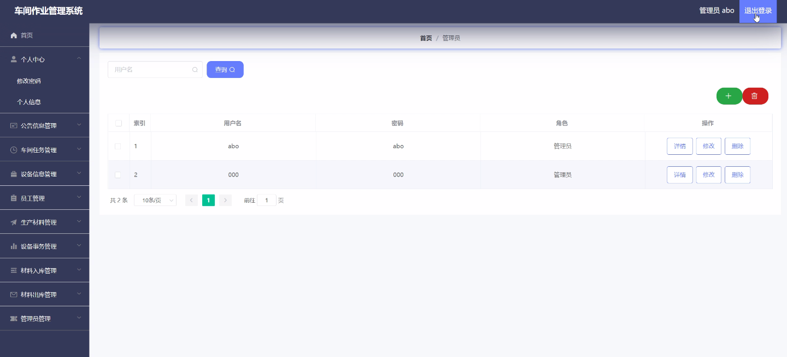

****本项目包含程序+源码+数据库+LW+调试部署环境，文末可获取一份本项目的java源码和数据库参考。****

## ******开题报告******

研究背景：
随着现代制造业的发展，车间作业管理系统在企业生产中扮演着重要的角色。传统的手工记录和管理方式已经无法满足企业对高效、精确和可追溯性的需求。因此，开发一种先进的车间作业管理系统具有重要的意义。

研究意义：
车间作业管理系统的引入可以提高生产效率、降低成本，并且能够更好地管理和控制生产过程。通过实时监控和数据分析，企业可以及时发现生产中的问题并采取相应的措施，从而提高产品质量和客户满意度。此外，车间作业管理系统还可以帮助企业优化资源配置，提高生产计划的准确性和灵活性。

研究目的：
本研究旨在设计和开发一种基于车间作业管理系统的解决方案，以满足企业对生产管理的需求。通过深入研究和分析现有的车间作业管理系统，我们将提出一种针对特定企业的定制化解决方案，以便更好地满足企业的实际需求。

研究内容：
本研究的主要内容包括以下系统功能：员工信息管理、设备信息管理、公告信息发布、生产材料管理、设备事务管理、材料入库管理、材料出库管理和车间任务管理。通过对这些功能的深入研究和分析，我们将设计和开发相应的模块和算法，以实现高效、精确和可追溯的车间作业管理。

拟解决的主要问题：
在车间作业管理中存在一些问题，如生产计划不准确、资源浪费、信息传递不及时等。本研究旨在通过引入先进的车间作业管理系统，解决这些问题。具体而言，我们将致力于提高生产计划的准确性和灵活性，优化资源配置，加强信息的实时传递和共享，以及提高生产过程的可追溯性。

研究方案和预期成果：
本研究将采用综合研究方法，包括文献调研、需求分析、系统设计和开发等。通过与企业紧密合作，我们将根据其实际需求定制化开发车间作业管理系统，并进行系统测试和优化。预期的成果包括一个功能完善、稳定可靠的车间作业管理系统，能够帮助企业提高生产效率、降低成本，并实现更好的生产管理和控制。

进度安排：

2022年9月至10月：开题报告编写和提交，完成开题报告的撰写并提交给指导教师进行审核。

2022年11月至2023年1月：系统设计和开发，根据开题报告的要求，进行系统设计和编码工作。

2023年2月至3月：论文撰写和初稿完成，开始撰写论文，并在这个阶段完成论文的初稿。

2023年4月至5月：论文修改和最终定稿，根据指导教师的意见对论文进行修改，并完成最终的定稿。

2023年5月：论文答辩和提交，参加论文答辩并根据答辩结果进行修改，最后将论文提交给学院或学校。

参考文献：

[1]喻佳,吴丹新.基于SpringBoot的Web快速开发框架[J].电脑编程技巧与维护,2021,(09):31-33.

[2]李鹏.基于SpringBoot快速开发平台的实现[J].电子技术与软件工程,2021,(12):36-37.

[3]叶开平,蔡维晟,陈家敏,邓斯妮.基于SpringBoot的综测可视化管理系统的研究与设计[J].电脑知识与技术,2021,(12):100-104.

[4]江健锋,徐振平.Springboot最小系统的设计与实现[J].电脑知识与技术,2021,(04):62-63.

[5]赵炯,司圣杰,周奇才,熊肖磊.通用信息获取系统设计与实现[J].起重运输机械,2020,(16):89-97.

[6]吴英宾.一种内外网数据交互系统的设计与实现[J].软件工程,2020,(08):25-27.

****以上是本项目程序开发之前开题报告内容，最终成品以下面界面为准，大家可以酌情参考使用。要源码参考请在文末进行获取！！****

## ******本项目的界面展示******

