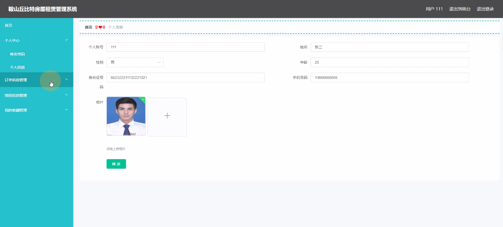
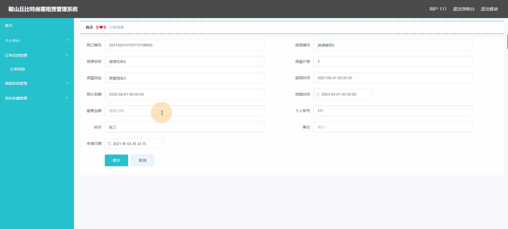
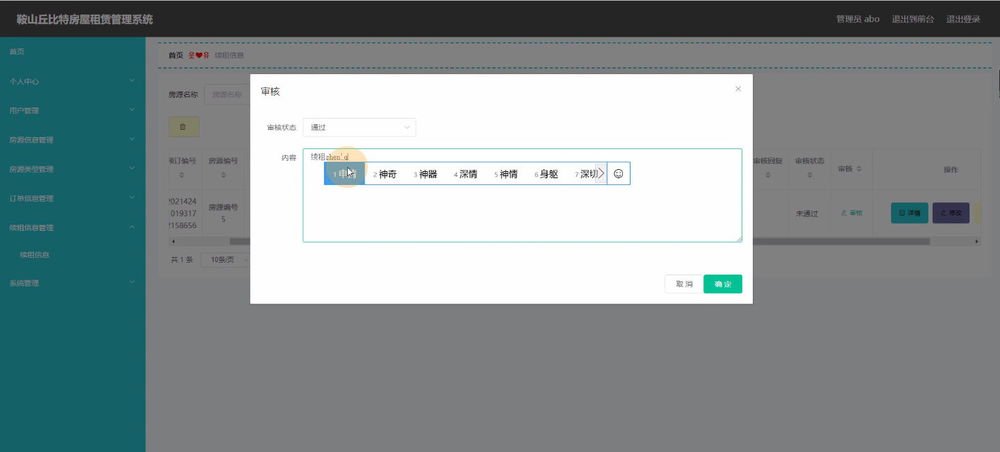
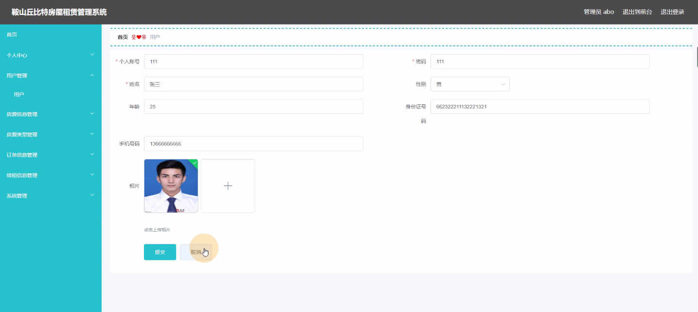
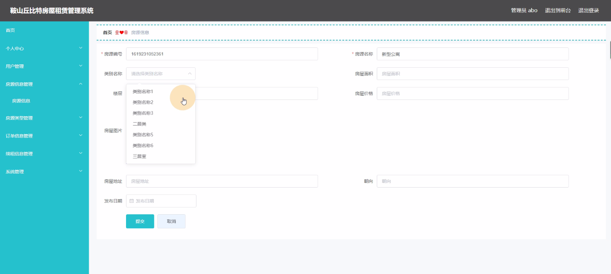
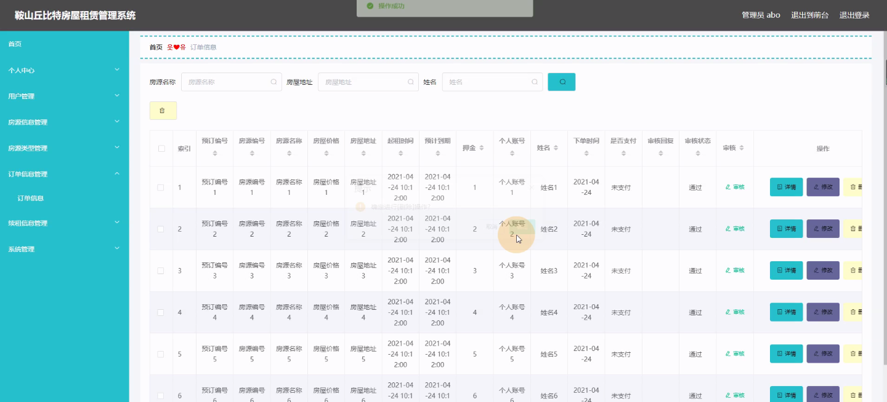

****本项目包含程序+源码+数据库+LW+调试部署环境，文末可获取一份本项目的java源码和数据库参考。****

## ******开题报告******

研究背景：
随着城市化进程的不断推进，人口流动和就业需求的增加，房屋租赁市场逐渐成为城市中不可或缺的一部分。然而，当前的房屋租赁管理系统存在一些问题，如信息不对称、租赁过程繁琐等，给用户和房东带来了不便。因此，开发一个高效、便捷的房屋租赁管理系统势在必行。

研究意义：
鞍山丘比特房屋租赁管理系统的研究具有重要的现实意义和社会价值。首先，通过建立一个完善的房屋租赁管理系统，可以提高房屋租赁市场的透明度和效率，促进市场的健康发展。其次，该系统可以为用户提供更加便捷的租房体验，提高用户满意度。同时，该系统还能够为房东提供全面的房屋租赁管理服务，提高租金回报率，实现双赢局面。

研究目的：
本研究旨在设计和开发鞍山丘比特房屋租赁管理系统，以解决当前房屋租赁市场存在的问题，提高租赁过程的便捷性和效率。具体目标包括：提供准确、全面的房源信息；简化租赁流程，提高用户体验；实现订单管理和续租管理的自动化等。

研究内容： 鞍山丘比特房屋租赁管理系统的研究内容主要包括以下几个方面：

  1. 用户管理：设计并实现用户注册、登录、个人信息管理等功能，为用户提供个性化的服务。

  2. 房源信息管理：建立房源信息数据库，包括房屋基本信息、房屋类型、位置、价格等，并提供查询和筛选功能，方便用户选择合适的房源。

  3. 订单信息管理：实现用户下单、支付、取消订单等功能，确保订单信息的准确性和及时性。

  4. 续租信息管理：为用户提供续租服务，包括提醒用户续租时间、协助用户完成续租手续等。

  5. 系统安全与数据保护：加强系统的安全性，保护用户隐私和交易数据的安全。

拟解决的主要问题： 通过鞍山丘比特房屋租赁管理系统的研究和开发，我们将解决以下主要问题：

  1. 信息不对称：提供准确、全面的房源信息，消除信息不对称问题，使用户能够更好地了解房屋情况。

  2. 租赁流程繁琐：简化租赁流程，提高用户体验，让用户能够快速、便捷地完成租赁操作。

  3. 订单管理不规范：建立订单管理系统，实现订单的自动化处理，确保订单信息的准确性和及时性。

  4. 续租管理不便利：为用户提供续租服务，方便用户完成续租手续，避免因续租问题带来的不便。

研究方案和预期成果：
本研究将采用软件开发的方法，结合数据库技术和网络技术，设计和开发鞍山丘比特房屋租赁管理系统。预期成果包括一个功能完善、界面友好的系统，能够提供准确、全面的房源信息，简化租赁流程，实现订单和续租管理的自动化，提高用户满意度和市场效率。

进度安排：

2022年9月至10月：需求分析和规划，明确系统功能和目标，制定项目计划。

2022年11月至2023年1月：系统设计和编码，完成详细的系统设计并开始编写代码。

2023年2月至3月：用户界面开发和数据库开发，开发用户友好的界面和设计数据库结构。

2023年4月至5月：功能测试、文档编写和上线部署，对系统进行全面的功能测试并编写用户手册。

2023年5月：维护和升级，定期对系统进行维护和升级，修复bug和添加新功能。

参考文献：

[1]邱小群,邓丽艳,陈海潮.基于B/S的信息管理系统设计和实现[J].信息与电脑(理论版),2022,(20):146-148.

[2]谢霜.基于Java技术的网络管理体系结构的应用[J].网络安全技术与应用,2022,(10):14-15.

[3]宋锦华.高职院校Java程序设计课程改革研究[J].科技视界,2022,(20):133-135.

[4]曹嵩彭,王鹏宇.浅析Java语言在软件开发中的应用[J].信息记录材料,2022,(03):114-116.

[5]朱澈,余俊达.武汉东湖学院.基于Java的软硬件信息管理系统V1.0[Z].项目立项编号.鉴定单位.鉴定日期:

****以上是本项目程序开发之前开题报告内容，最终成品以下面界面为准，大家可以酌情参考使用。要源码参考请在文末进行获取！！****

## ******本项目的界面展示******

