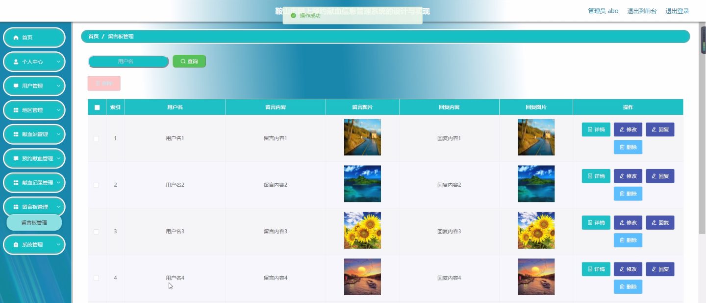
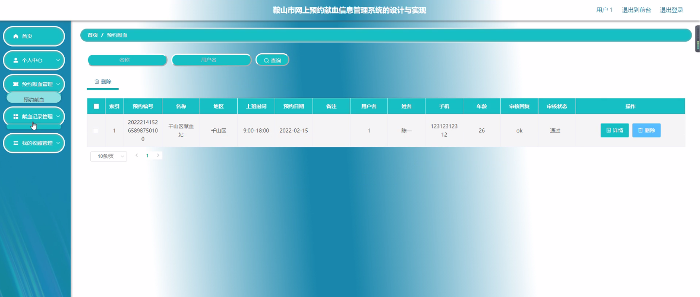

****本项目包含程序+源码+数据库+LW+调试部署环境，文末可获取一份本项目的java源码和数据库参考。****

## ******开题报告******

研究背景：
随着社会的发展和人们健康意识的提高，献血行为逐渐成为一种公益活动，并且在救助病患、救灾等方面起到了重要作用。然而，传统的献血方式存在一些问题，如信息不对称、资源分配不均等，这给献血工作带来了一定的困扰。

研究意义：
设计和实现鞍山市网上预约献血信息管理系统具有重要的现实意义。通过该系统，可以实现献血者与献血站之间的信息互通和资源共享，提高献血效率，减少资源浪费，更好地满足献血需求，推动献血事业的发展。

研究目的： 本研究旨在通过设计和实现鞍山市网上预约献血信息管理系统，解决传统献血方式存在的问题，提高献血效率和资源利用率，促进献血事业的发展。

研究内容： 本研究的主要内容包括以下几个方面：

  1. 用户管理：建立用户注册、登录、信息维护等功能，使献血者能够方便地进行预约和查询献血信息。

  2. 献血站管理：建立献血站的信息管理系统，包括献血站的注册、审核、信息发布等功能，提供给用户选择合适的献血站进行预约。

  3. 预约献血：实现在线预约献血功能，包括选择献血站、选择时间、填写个人信息等，方便用户进行预约操作。

  4. 献血记录管理：建立献血记录的管理系统，记录每次献血的相关信息，包括时间、地点、献血量等，方便用户查询自己的献血记录。

  5. 地区管理：建立地区管理系统，实现对不同地区的献血资源进行统一管理和调配，确保资源的合理分配和利用。

拟解决的主要问题： 通过设计和实现鞍山市网上预约献血信息管理系统，主要解决以下问题：

  1. 传统献血方式存在的信息不对称问题，通过系统实现献血者与献血站之间的信息互通，提高信息的透明度和准确性。

  2. 献血资源分配不均问题，通过系统实现对献血资源的统一管理和调配，确保资源的合理分配和利用。

  3. 传统献血方式存在的预约流程繁琐问题，通过系统实现在线预约功能，简化预约流程，提高献血效率。

研究方案和预期成果： 本研究将采用软件工程的方法，包括需求分析、系统设计、编码实现和测试等环节，逐步完成鞍山市网上预约献血信息管理系统的设计和实现。

预期成果包括一个完善的系统原型，并进行实际测试和应用。该系统能够有效解决传统献血方式存在的问题，提高献血效率和资源利用率，为献血者和献血站提供更好的服务体验，推动献血事业的发展。

进度安排：

2022年9月至10月：需求分析和规划，明确系统功能和目标，制定项目计划。

2022年11月至2023年1月：系统设计和编码，完成详细的系统设计并开始编写代码。

2023年2月至3月：用户界面开发和数据库开发，开发用户友好的界面和设计数据库结构。

2023年4月至5月：功能测试、文档编写和上线部署，对系统进行全面的功能测试并编写用户手册。

2023年5月：维护和升级，定期对系统进行维护和升级，修复bug和添加新功能。

参考文献：

[1]邱小群,邓丽艳,陈海潮.基于B/S的信息管理系统设计和实现[J].信息与电脑(理论版),2022,(20):146-148.

[2]谢霜.基于Java技术的网络管理体系结构的应用[J].网络安全技术与应用,2022,(10):14-15.

[3]宋锦华.高职院校Java程序设计课程改革研究[J].科技视界,2022,(20):133-135.

[4]曹嵩彭,王鹏宇.浅析Java语言在软件开发中的应用[J].信息记录材料,2022,(03):114-116.

[5]朱澈,余俊达.武汉东湖学院.基于Java的软硬件信息管理系统V1.0[Z].项目立项编号.鉴定单位.鉴定日期:

****以上是本项目程序开发之前开题报告内容，最终成品以下面界面为准，大家可以酌情参考使用。要源码参考请在文末进行获取！！****

## ******本项目的界面展示******

