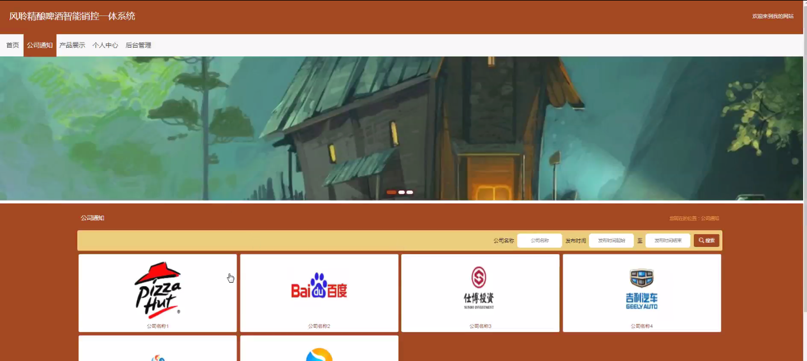
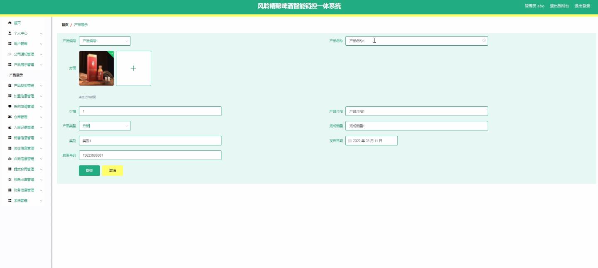
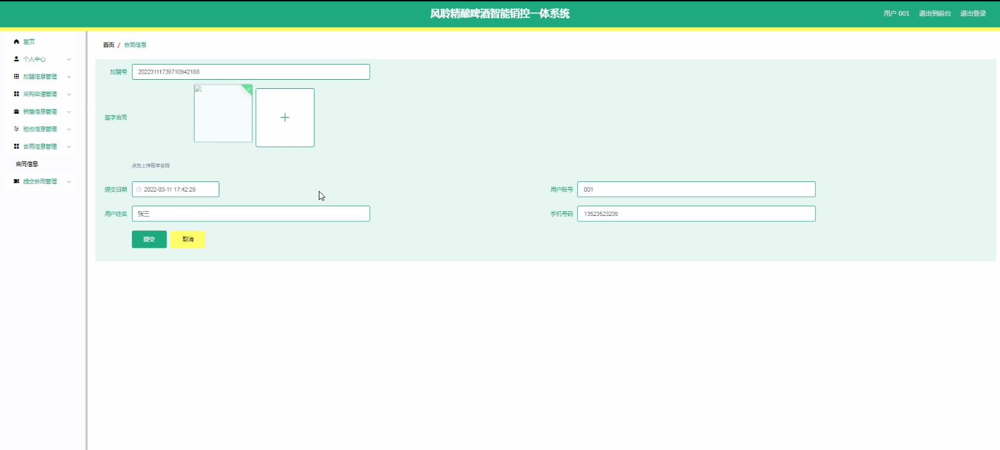
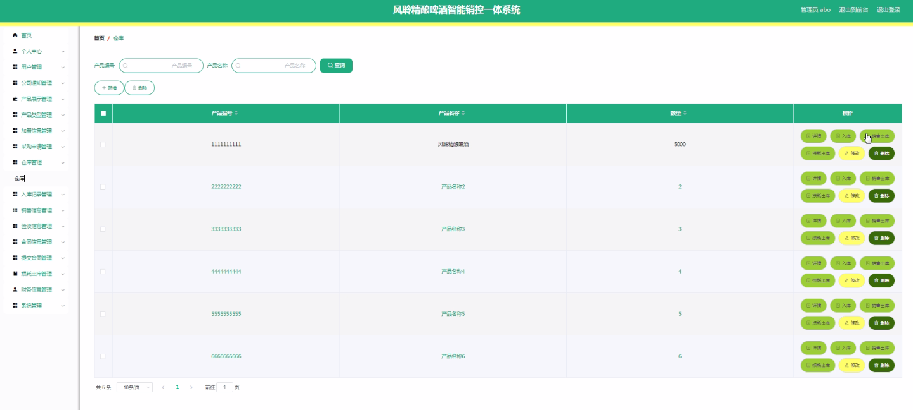
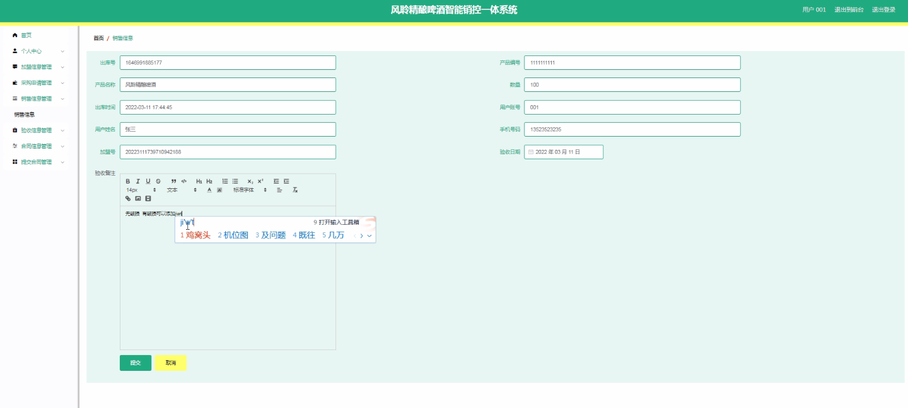
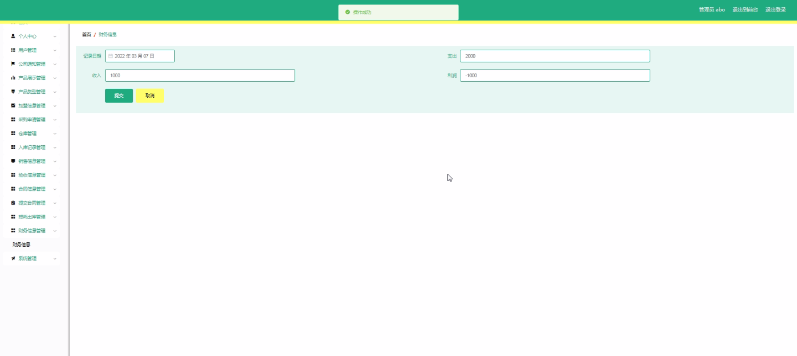
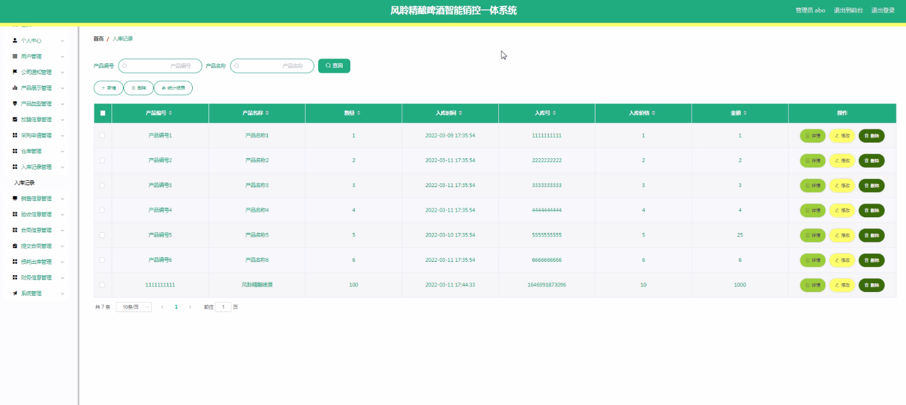
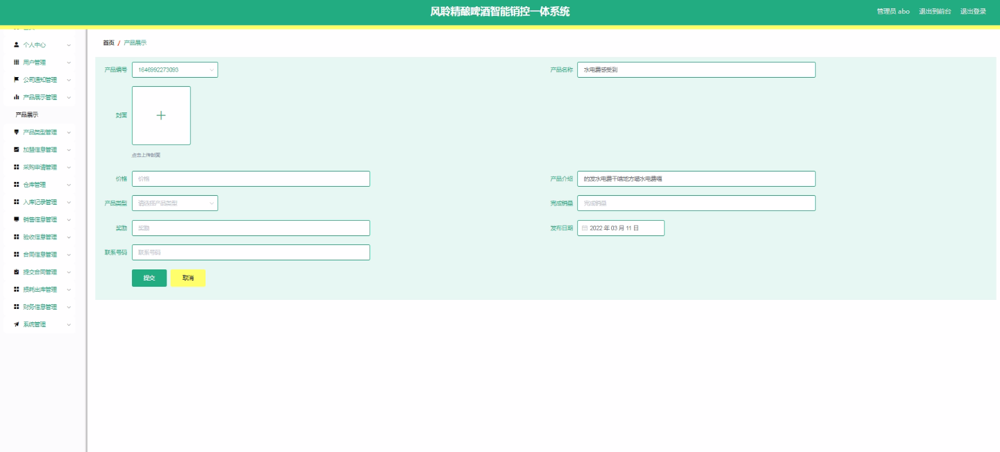

****本项目包含程序+源码+数据库+LW+调试部署环境，文末可获取一份本项目的java源码和数据库参考。****

## ******开题报告******

研究背景：
随着社会经济的快速发展和人们生活水平的提高，啤酒市场需求逐渐增长。然而，传统的销售管理方式已经无法满足市场的需求，存在诸多问题，如信息不对称、销售数据分散、仓库管理混乱等。因此，开发一种智能销控一体系统势在必行。

研究意义：
智能销控一体系统的开发与应用将对啤酒行业产生重要的推动作用。首先，该系统可以实现销售过程的全面监控和管理，提高销售效率和精准度。其次，通过数据的集中存储和分析，可以为企业决策提供科学依据，优化资源配置和市场策略。最后，该系统还可以提升用户体验，提供个性化的服务，增强客户黏性。

研究目的：
本研究旨在开发一款基于智能技术的销控一体系统，以解决传统销售管理方式存在的问题，并提升啤酒企业的销售管理水平和竞争力。通过系统的设计和实施，旨在提高销售效率、降低成本、优化资源配置，实现销售过程的全面监控和管理。

研究内容：
本研究的主要内容包括以下系统功能：用户管理、公司通知、产品展示、加盟信息、仓库管理、入库记录、销售信息、验收信息、采购申请、合同信息、提交合同、损耗出库、财务信息、产品类型等。通过对这些功能的综合应用，实现销售过程的全面管理和控制。

拟解决的主要问题：

  1. 信息不对称：传统销售管理方式中，信息流动不畅，导致信息不对称的问题。本系统将通过信息的集中存储和共享，解决信息不对称问题，提高沟通效率。
  2. 销售数据分散：传统销售管理方式中，销售数据分散在各个部门和人员之间，难以进行整合和分析。本系统将通过数据的集中存储和分析，实现销售数据的统一管理和分析，为企业决策提供科学依据。
  3. 仓库管理混乱：传统销售管理方式中，仓库管理存在混乱和漏洞，导致货物丢失和滞销的问题。本系统将通过仓库管理功能，实现货物的精确追踪和管理，提高仓库管理的效率和准确性。

研究方案：
本研究将采用软件开发的方法，结合智能技术和销售管理理论，设计并实现一款智能销控一体系统。通过需求分析、系统设计、编码实现和测试验证等步骤，逐步完善系统功能，并进行实际应用和评估。

预期成果：
预期成果包括：一款功能完善、稳定可靠的智能销控一体系统的开发与实施；提高销售效率和精准度，优化资源配置和市场策略；增强用户体验，提供个性化的服务，增强客户黏性；为企业决策提供科学依据，提升销售管理水平和竞争力。

进度安排：

2022年9月至10月：开题报告编写和提交，完成开题报告的撰写并提交给指导教师进行审核。

2022年11月至2023年1月：系统设计和开发，根据开题报告的要求，进行系统设计和编码工作。

2023年2月至3月：论文撰写和初稿完成，开始撰写论文，并在这个阶段完成论文的初稿。

2023年4月至5月：论文修改和最终定稿，根据指导教师的意见对论文进行修改，并完成最终的定稿。

2023年5月：论文答辩和提交，参加论文答辩并根据答辩结果进行修改，最后将论文提交给学院或学校。

参考文献：

[1]喻佳,吴丹新.基于SpringBoot的Web快速开发框架[J].电脑编程技巧与维护,2021,(09):31-33.

[2]李鹏.基于SpringBoot快速开发平台的实现[J].电子技术与软件工程,2021,(12):36-37.

[3]叶开平,蔡维晟,陈家敏,邓斯妮.基于SpringBoot的综测可视化管理系统的研究与设计[J].电脑知识与技术,2021,(12):100-104.

[4]江健锋,徐振平.Springboot最小系统的设计与实现[J].电脑知识与技术,2021,(04):62-63.

[5]赵炯,司圣杰,周奇才,熊肖磊.通用信息获取系统设计与实现[J].起重运输机械,2020,(16):89-97.

[6]吴英宾.一种内外网数据交互系统的设计与实现[J].软件工程,2020,(08):25-27.

****以上是本项目程序开发之前开题报告内容，最终成品以下面界面为准，大家可以酌情参考使用。要源码参考请在文末进行获取！！****

## ******本项目的界面展示******

