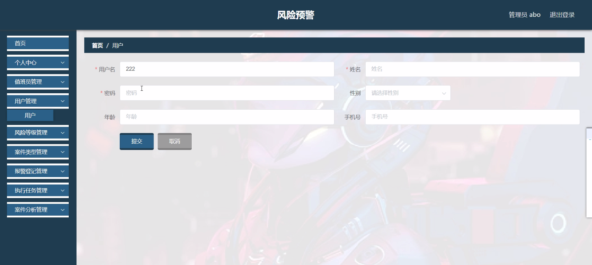
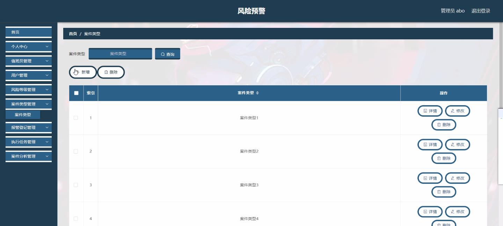
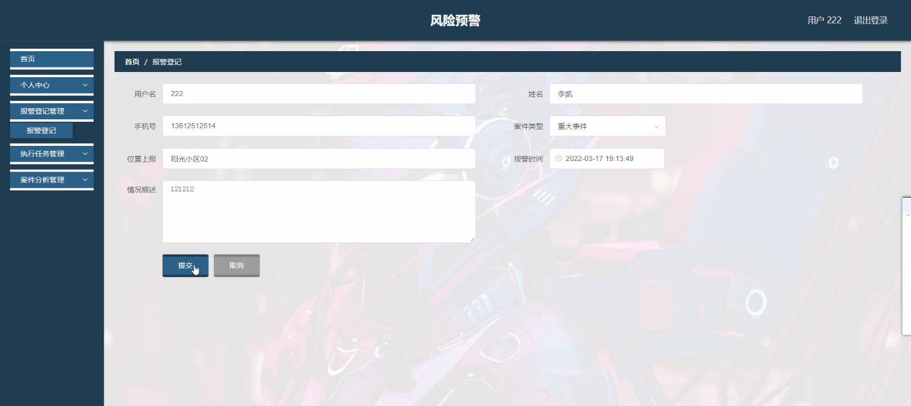
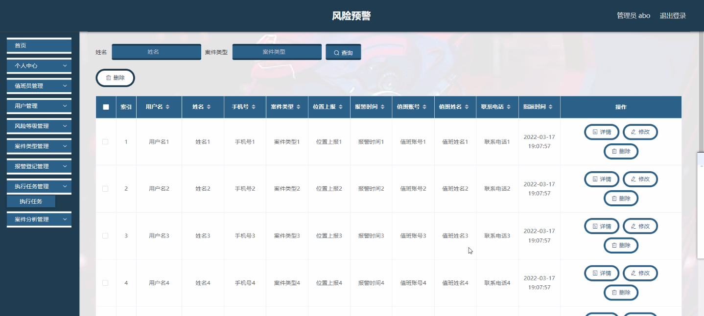
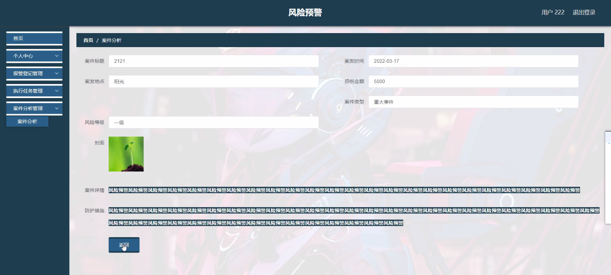

****本项目包含程序+源码+数据库+LW+调试部署环境，文末可获取一份本项目的java源码和数据库参考。****

## ******开题报告******

研究背景：
随着社会的不断发展和进步，各种风险与安全问题也日益突出。在日常生活和工作中，我们经常面临各种潜在的风险，如自然灾害、公共安全事件、金融风险等。这些风险对个人和社会的安全造成了威胁，因此，建立一个有效的风险预警系统变得尤为重要。

研究意义：
风险预警系统可以通过收集、分析和处理大量的风险信息，提前发现和预测潜在的风险事件，从而采取相应的防范措施，减少损失和危害。这对于保护人民的生命财产安全、维护社会稳定和促进可持续发展具有重要意义。

研究目的：
本研究旨在设计和开发一种基于系统功能的风险预警系统，以提高风险识别和预测的准确性和及时性。通过对用户、案件、报警登记、值班员、风险信息、防范措施等系统功能的深入研究和分析，我们将探索如何有效地整合这些功能，实现风险预警系统的高效运行。

研究内容： 本研究将围绕以下系统功能展开研究：

  1. 用户管理：设计用户信息管理模块，包括用户注册、登录、权限管理等功能，以确保系统的安全性和可靠性。

  2. 案件管理：建立案件信息数据库，记录和管理各类案件的相关信息，包括案件类型、案发地点、案发时间等，为风险预警提供基础数据支持。

  3. 报警登记：设计报警登记界面，使用户能够方便快捷地向系统报警，及时通知相关部门并采取相应措施。

  4. 值班员管理：制定值班员工作规范，培训值班员并提供必要的技术支持，确保值班员能够及时响应和处理风险预警信息。

  5. 风险信息分析：利用数据挖掘和机器学习等技术，对收集到的风险信息进行分析和处理，提取关键特征并预测潜在风险事件的发生概率。

  6. 防范措施制定：根据风险预警结果，制定相应的防范措施，包括加强巡逻、提高安全设施、加强宣传教育等，以减少风险事件的发生和危害。

预期成果：
通过本研究，我们预期能够设计和开发出一种功能完善、操作简便、高效可靠的风险预警系统。该系统将能够及时、准确地识别和预测潜在的风险事件，并提供相应的防范措施，从而有效保护人民的生命财产安全，维护社会稳定。此外，本研究还将为相关领域的学术研究和实践应用提供有益的参考和借鉴。

进度安排：

2022年9月至10月：开题报告编写和提交，完成开题报告的撰写并提交给指导教师进行审核。

2022年11月至2023年1月：系统设计和开发，根据开题报告的要求，进行系统设计和编码工作。

2023年2月至3月：论文撰写和初稿完成，开始撰写论文，并在这个阶段完成论文的初稿。

2023年4月至5月：论文修改和最终定稿，根据指导教师的意见对论文进行修改，并完成最终的定稿。

2023年5月：论文答辩和提交，参加论文答辩并根据答辩结果进行修改，最后将论文提交给学院或学校。

参考文献：

[1]喻佳,吴丹新.基于SpringBoot的Web快速开发框架[J].电脑编程技巧与维护,2021,(09):31-33.

[2]李鹏.基于SpringBoot快速开发平台的实现[J].电子技术与软件工程,2021,(12):36-37.

[3]叶开平,蔡维晟,陈家敏,邓斯妮.基于SpringBoot的综测可视化管理系统的研究与设计[J].电脑知识与技术,2021,(12):100-104.

[4]江健锋,徐振平.Springboot最小系统的设计与实现[J].电脑知识与技术,2021,(04):62-63.

[5]赵炯,司圣杰,周奇才,熊肖磊.通用信息获取系统设计与实现[J].起重运输机械,2020,(16):89-97.

[6]吴英宾.一种内外网数据交互系统的设计与实现[J].软件工程,2020,(08):25-27.

****以上是本项目程序开发之前开题报告内容，最终成品以下面界面为准，大家可以酌情参考使用。要源码参考请在文末进行获取！！****

## ******本项目的界面展示******

