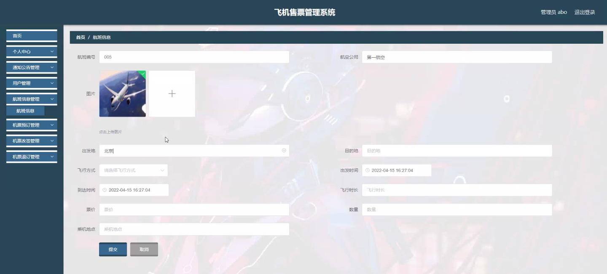

****本项目包含程序+源码+数据库+LW+调试部署环境，文末可获取一份本项目的java源码和数据库参考。****

## ******开题报告******

研究背景：
随着航空业的快速发展和人们对出行需求的增加，飞机售票管理系统成为了航空公司必备的重要工具。传统的售票方式已经无法满足大规模的航班运营需求，因此，开发一个高效、智能化的飞机售票管理系统势在必行。这样的系统可以提供便捷的航班查询、机票预订、改签和退订等功能，极大地提升了用户的购票体验，同时也提高了航空公司的运营效率。

研究意义：
飞机售票管理系统的研究具有重要的现实意义。首先，它可以为航空公司提供全面的数据支持，帮助他们更好地进行航班调度和资源分配，提高航班的准点率和运输效益。其次，通过智能化的预订和改签功能，系统可以减少人工操作的错误和繁琐流程，提高工作效率，降低人力成本。最后，对于旅客来说，飞机售票管理系统可以提供方便快捷的购票渠道，提供个性化的服务，提升用户体验。

研究目的：
本研究的目的是设计和开发一套完善的飞机售票管理系统，以满足航空公司和旅客的需求。通过引入先进的技术和算法，提高系统的性能和稳定性，实现用户友好的界面和操作流程，优化航班资源的分配和调度，提供准确、及时的航班信息，并且保障数据的安全性和可靠性。

研究内容：
本研究的主要内容包括以下系统功能：用户管理、航班信息管理、机票预订管理、机票改签管理、机票退订管理、通知公告管理等。其中，用户管理模块用于管理用户的注册、登录、个人信息修改等操作；航班信息管理模块用于维护航班的基本信息，包括航班号、起降时间、机型等；机票预订管理模块用于处理用户的机票预订请求，包括座位选择、支付等流程；机票改签管理模块用于处理用户的机票改签请求，包括查询可用航班、调整座位等操作；机票退订管理模块用于处理用户的机票退订请求，包括退款、取消座位等操作；通知公告管理模块用于向用户发布重要信息和公告。

拟解决的主要问题：
本研究旨在解决以下主要问题：如何设计一个用户友好、操作简便的界面，提高用户的购票体验；如何通过智能算法和优化策略，实现航班资源的合理分配和调度；如何确保系统的性能稳定、数据安全和可靠性。

研究方案和预期成果：
本研究将采用面向对象的软件开发方法，结合数据库技术和网络通信技术，设计和实现飞机售票管理系统。预期成果包括一个功能完善、性能稳定的系统原型，并进行实际测试和评估。通过用户反馈和系统性能指标的分析，验证系统的可行性和有效性，为航空公司和旅客提供更好的服务体验。

进度安排：

2022年9月至10月：需求分析和规划，明确系统功能和目标，制定项目计划。

2022年11月至2023年1月：系统设计和编码，完成详细的系统设计并开始编写代码。

2023年2月至3月：用户界面开发和数据库开发，开发用户友好的界面和设计数据库结构。

2023年4月至5月：功能测试、文档编写和上线部署，对系统进行全面的功能测试并编写用户手册。

2023年5月：维护和升级，定期对系统进行维护和升级，修复bug和添加新功能。

参考文献：

[1]邱小群,邓丽艳,陈海潮.基于B/S的信息管理系统设计和实现[J].信息与电脑(理论版),2022,(20):146-148.

[2]谢霜.基于Java技术的网络管理体系结构的应用[J].网络安全技术与应用,2022,(10):14-15.

[3]宋锦华.高职院校Java程序设计课程改革研究[J].科技视界,2022,(20):133-135.

[4]曹嵩彭,王鹏宇.浅析Java语言在软件开发中的应用[J].信息记录材料,2022,(03):114-116.

[5]朱澈,余俊达.武汉东湖学院.基于Java的软硬件信息管理系统V1.0[Z].项目立项编号.鉴定单位.鉴定日期:

****以上是本项目程序开发之前开题报告内容，最终成品以下面界面为准，大家可以酌情参考使用。要源码参考请在文末进行获取！！****

## ******本项目的界面展示******

