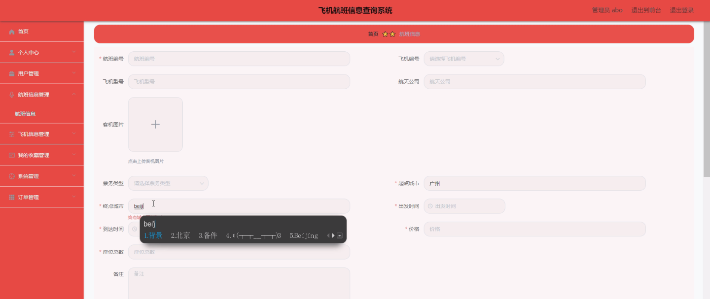
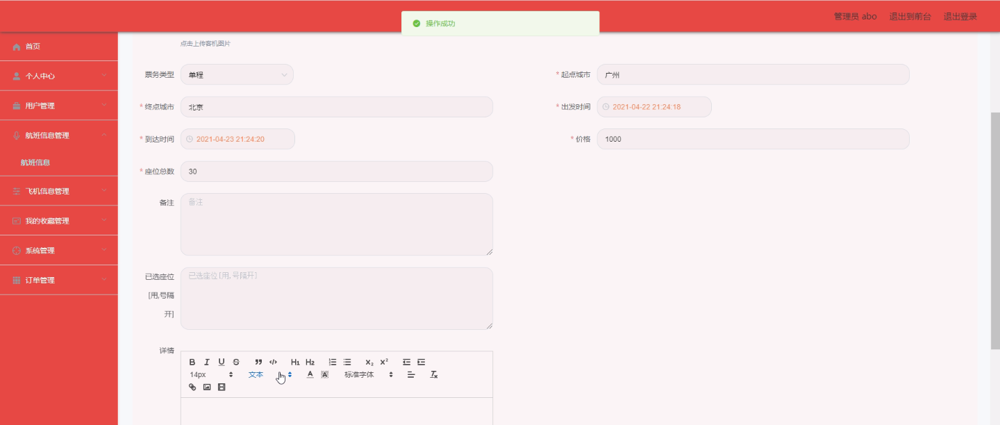
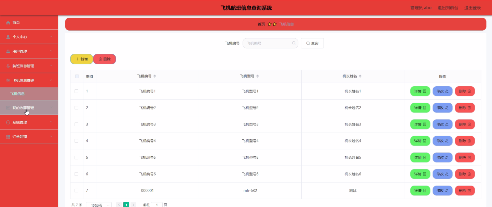
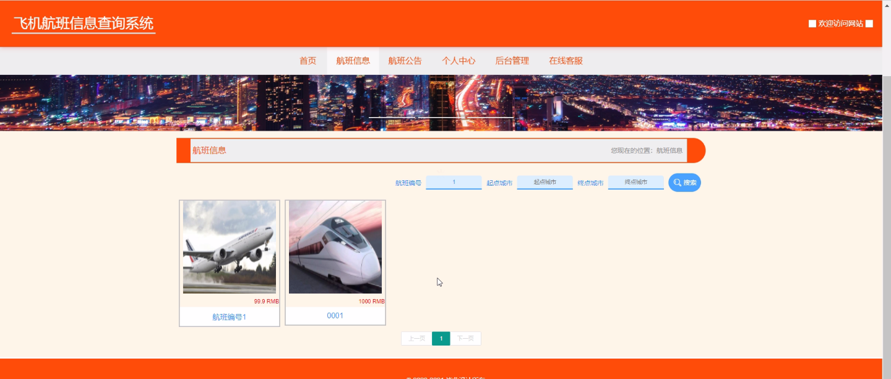
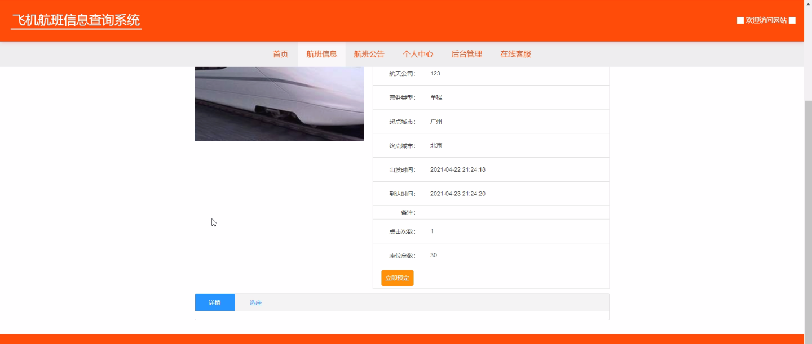
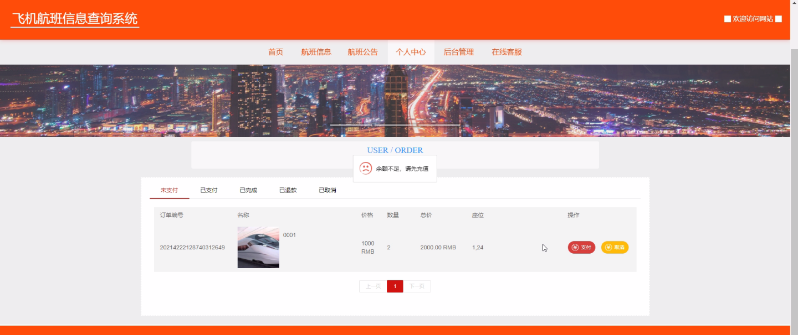
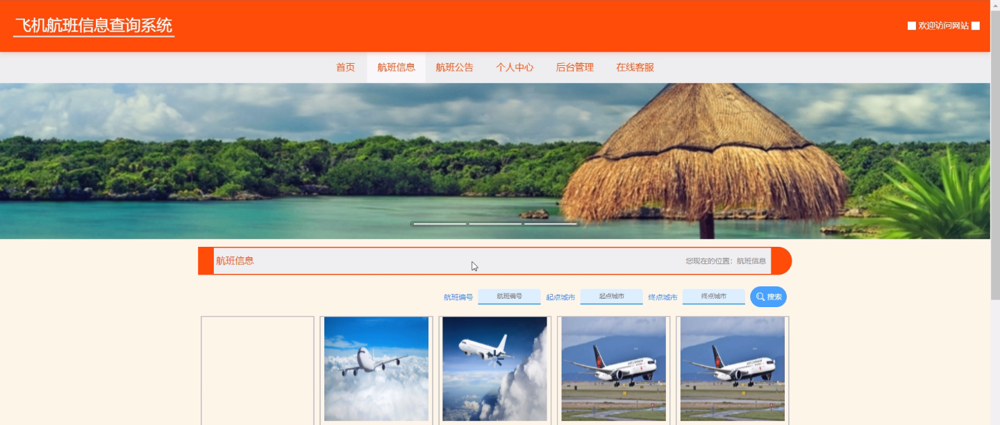

****本项目包含程序+源码+数据库+LW+调试部署环境，文末可获取一份本项目的java源码和数据库参考。****

## ******开题报告******

研究背景：
随着航空业的快速发展和人们对航空出行需求的增加，飞机航班信息查询系统成为了现代社会中不可或缺的一部分。这样的系统能够提供及时、准确的航班信息，方便旅客查询和安排行程。然而，在当前的航班信息查询系统中，仍存在一些问题，如信息更新不及时、查询流程复杂等，给用户带来了不便。因此，有必要进行研究和改进，以提高航班信息查询系统的效率和用户体验。

研究意义：
改进和优化飞机航班信息查询系统具有重要的实际意义。首先，这将提高旅客查询航班信息的效率，节省他们的时间和精力。其次，通过优化系统功能和界面设计，可以提升用户体验，使用户更加愿意使用该系统，从而促进航空公司的发展和运营。此外，研究还可以为相关领域的学术研究提供参考和借鉴，推动航空信息技术的进步。

研究目的：
本研究的目的是改进和优化飞机航班信息查询系统，提高系统的可用性和用户体验。通过对系统功能的分析和研究，探索新的技术手段和方法，以解决当前系统存在的问题，并提出相应的改进方案。同时，通过用户调研和需求分析，了解用户的实际需求和使用习惯，为系统的设计和开发提供指导。

研究内容：
本研究的主要内容包括以下几个方面：用户需求分析、航班信息管理、飞机信息管理等系统功能。首先，通过用户调研和需求分析，了解用户对航班信息查询系统的期望和需求，为系统的设计和开发提供参考。其次，对航班信息进行管理，包括数据采集、存储和更新等，确保航班信息的及时性和准确性。同时，对飞机信息进行管理，包括航空公司、飞机型号、座位分布等信息的录入和维护。最后，通过界面设计和交互优化，提高系统的易用性和用户体验。

拟解决的主要问题：
本研究拟解决的主要问题包括信息更新不及时、查询流程复杂、界面设计不友好等。针对这些问题，将通过改进数据采集和更新机制，简化查询流程，优化界面设计等方式进行解决。同时，还将考虑系统的稳定性和安全性，确保系统能够正常运行并保护用户信息的安全。

研究方案和预期成果：
本研究将采用综合研究方法，包括文献调研、用户调研、系统设计与开发等。通过对现有航班信息查询系统的分析和评估，结合用户需求和反馈，提出改进方案并进行系统设计与开发。预期成果包括优化的航班信息查询系统原型和相应的技术报告。该系统将具备更高的查询效率、更好的用户体验和更稳定的运行性能，为用户提供便捷、准确的航班信息查询服务。

进度安排：

2022年9月至10月：开题报告编写和提交，完成开题报告的撰写并提交给指导教师进行审核。

2022年11月至2023年1月：系统设计和开发，根据开题报告的要求，进行系统设计和编码工作。

2023年2月至3月：论文撰写和初稿完成，开始撰写论文，并在这个阶段完成论文的初稿。

2023年4月至5月：论文修改和最终定稿，根据指导教师的意见对论文进行修改，并完成最终的定稿。

2023年5月：论文答辩和提交，参加论文答辩并根据答辩结果进行修改，最后将论文提交给学院或学校。

参考文献：

[1]喻佳,吴丹新.基于SpringBoot的Web快速开发框架[J].电脑编程技巧与维护,2021,(09):31-33.

[2]李鹏.基于SpringBoot快速开发平台的实现[J].电子技术与软件工程,2021,(12):36-37.

[3]叶开平,蔡维晟,陈家敏,邓斯妮.基于SpringBoot的综测可视化管理系统的研究与设计[J].电脑知识与技术,2021,(12):100-104.

[4]江健锋,徐振平.Springboot最小系统的设计与实现[J].电脑知识与技术,2021,(04):62-63.

[5]赵炯,司圣杰,周奇才,熊肖磊.通用信息获取系统设计与实现[J].起重运输机械,2020,(16):89-97.

[6]吴英宾.一种内外网数据交互系统的设计与实现[J].软件工程,2020,(08):25-27.

****以上是本项目程序开发之前开题报告内容，最终成品以下面界面为准，大家可以酌情参考使用。要源码参考请在文末进行获取！！****

## ******本项目的界面展示******

