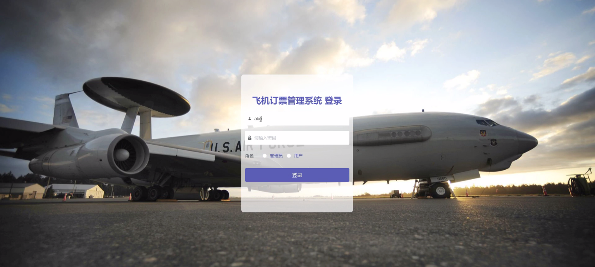
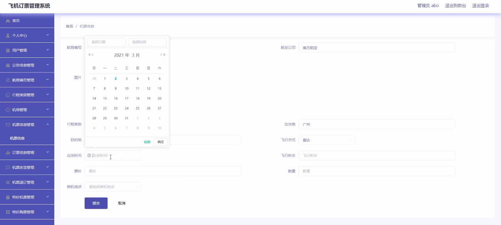
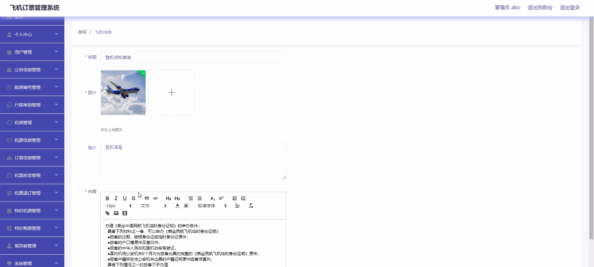
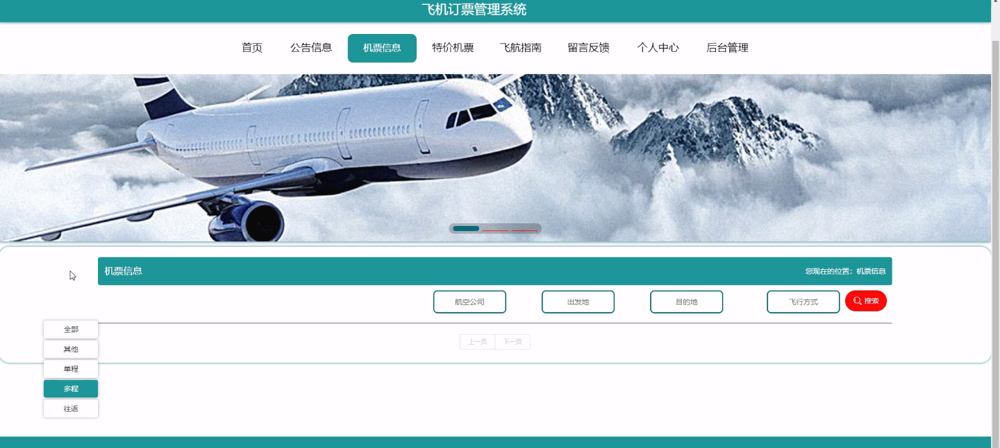
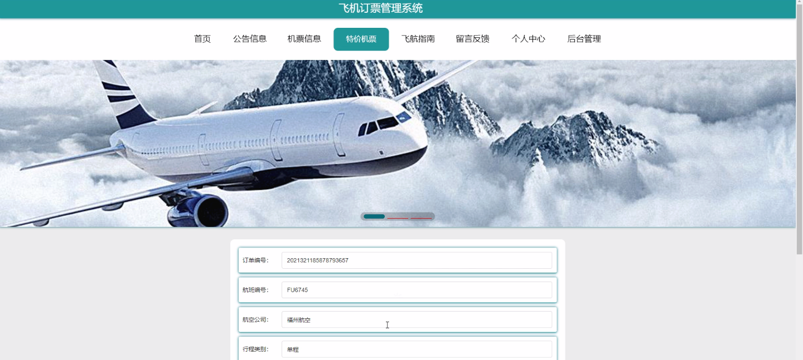
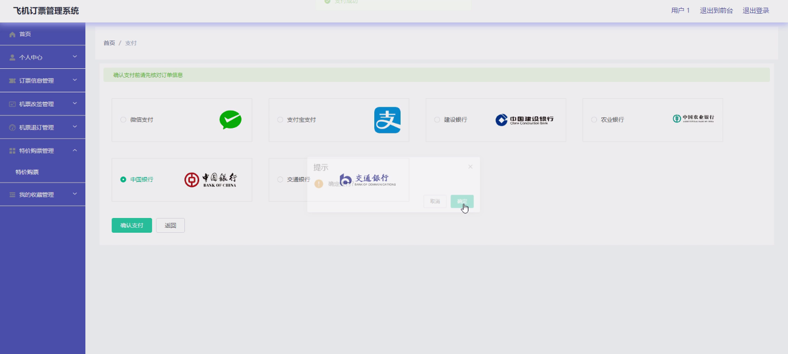
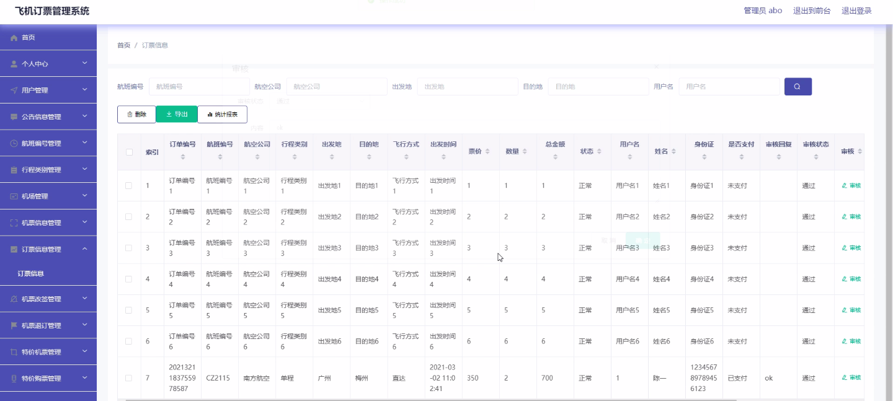

****本项目包含程序+源码+数据库+LW+调试部署环境，文末可获取一份本项目的java源码和数据库参考。****

## ******开题报告******

研究背景：
随着航空业的迅速发展，飞机订票管理系统在现代社会中扮演着重要的角色。传统的人工订票方式已经无法满足日益增长的航班需求和用户体验的提升要求。因此，开发一个高效、智能的飞机订票管理系统对于提升航空公司的运营效率和用户满意度具有重要意义。

研究意义： 飞机订票管理系统的研究意义主要体现在以下几个方面：

  1. 提升用户体验：通过引入智能化技术，用户可以更加便捷地查询航班信息、选择合适的机票，并且享受到更多的个性化服务，如特价机票、机票改签和退订等。

  2. 提高航空公司运营效率：飞机订票管理系统可以实现自动化的订票流程，减少人工操作的时间和错误率，提高航空公司的运营效率和服务质量。

  3. 数据分析与决策支持：通过对飞机订票数据的分析，可以为航空公司提供决策支持，例如航线规划、舱位优化和市场营销策略等，从而提升航空公司的竞争力。

研究目的：
本研究的目的是设计和开发一种高效、智能的飞机订票管理系统，旨在提升用户体验、提高航空公司运营效率，并为航空公司提供数据分析与决策支持。通过该系统的应用，可以实现航空业务的数字化转型和智能化升级。

研究内容： 根据题目所提及的系统功能，本研究的主要内容包括但不限于以下几个方面：

  1. 用户管理：设计用户注册、登录、个人信息管理等功能，确保用户身份的合法性和安全性。

  2. 航班管理：建立航班信息数据库，包括航班编号、起降时间、航线、舱位等信息，以便用户查询和选择。

  3. 订票管理：实现用户在线预订机票的功能，包括选择行程类别、查询机票信息、特价购票等。

  4. 改签和退订管理：提供用户机票改签和退订的服务，确保用户的权益。

  5. 机场管理：整合机场信息，包括机场位置、交通指引、停车场等，提供给用户参考。

  6. 公告信息管理：发布航空公司的公告信息，如航班延误、取消等，及时通知用户。

拟解决的主要问题： 在开发飞机订票管理系统的过程中，需要解决以下主要问题：

  1. 系统安全性：保障用户信息的安全和隐私，防止数据泄露和非法操作。

  2. 用户体验优化：设计简洁、直观的界面，提供个性化的服务，使用户能够快速、方便地完成订票流程。

  3. 数据准确性和实时性：确保航班信息、特价机票等数据的准确性和及时更新，避免给用户带来不便和误导。

  4. 系统稳定性和可扩展性：保证系统的稳定运行，并具备一定的扩展性，以适应未来航空业务的发展需求。

研究方案和预期成果：
本研究将采用软件工程的方法，包括需求分析、系统设计、编码实现、测试验证等环节，通过开发一个原型系统进行验证。预期成果包括一个高效、智能的飞机订票管理系统，能够满足用户的需求，提升航空公司的运营效率，并为决策者提供数据支持，从而推动航空业务的数字化转型和智能化升级。

进度安排：

2022年9月至10月：需求分析和规划，进行用户需求调研和分析，确定系统功能和目标。

2022年11月至2023年1月：系统设计和开发，完成系统架构设计和技术选型，并开始编写代码。

2023年2月至3月：测试和优化，进行单元测试和集成测试，修复问题并优化系统性能。

2023年4月至5月：文档编写和培训，编写用户手册和系统文档，并进行相关人员的培训。

2023年5月：上线部署和维护，将系统部署到生产环境中，并定期进行维护和升级。

参考文献：

[1]王振华.SpringBoot在教学效果评估系统中的应用[J].电子技术,2023,(05):67-69.

[2]王明泉.基于SpringBoot远程热部署的探索和应用[J].信息与电脑(理论版),2023,(07):1-4.

[3]王亚东,李晓霞,陈强强,剡美娜.基于SpringBoot的需求发布平台设计[J].信息与电脑(理论版),2023,(01):105-107.

[4]陈新府豪.基于SpringBoot和Vue框架的创新方法推理系统的设计与实现[D].导师：黄静.浙江理工大学,2022.

[5]霍福华,韩慧.基于SpringBoot微服务架构下前后端分离的MVVM模型[J].电子技术与软件工程,2022,(01):73-76.

[6]韩策,张娜,王松亭,张凯,何方,袁峰.SpringBoot OPC客户端设计与研究[J].电子世界,2021,(19):25-26.

****以上是本项目程序开发之前开题报告内容，最终成品以下面界面为准，大家可以酌情参考使用。要源码参考请在文末进行获取！！****

## ******本项目的界面展示******

