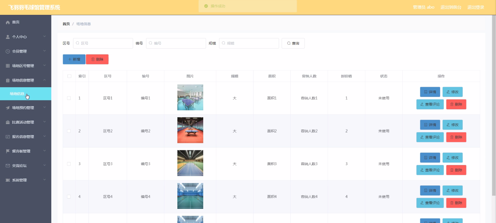
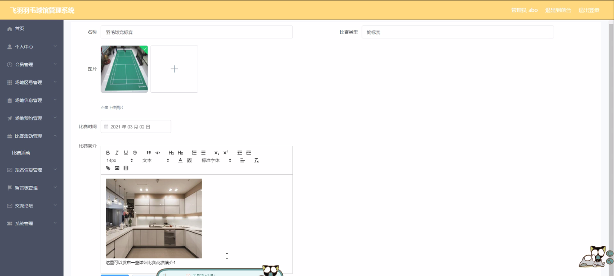
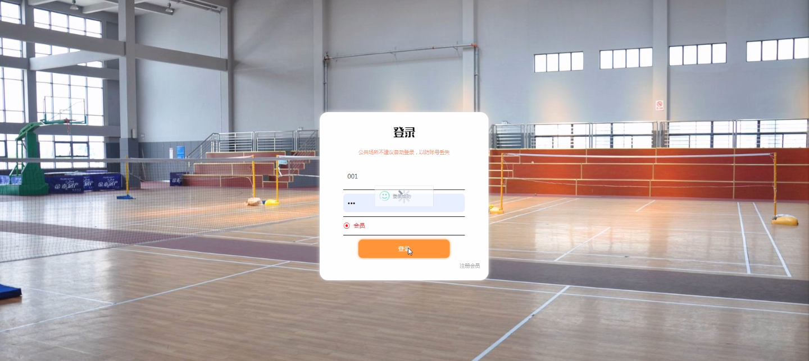
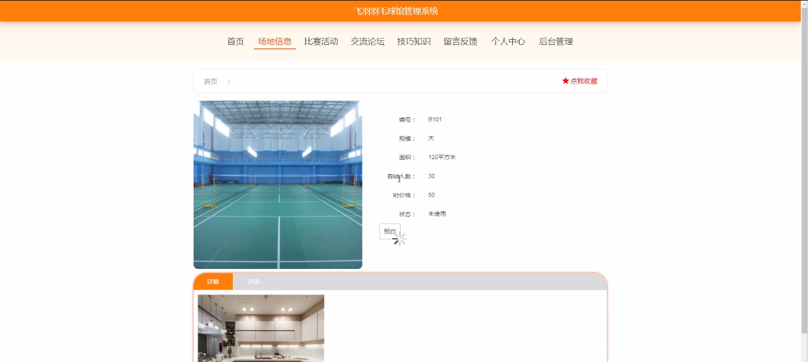
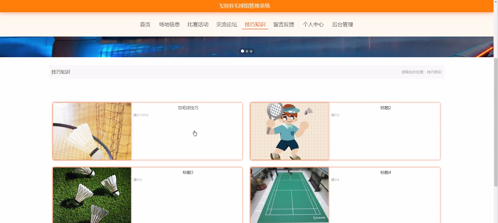
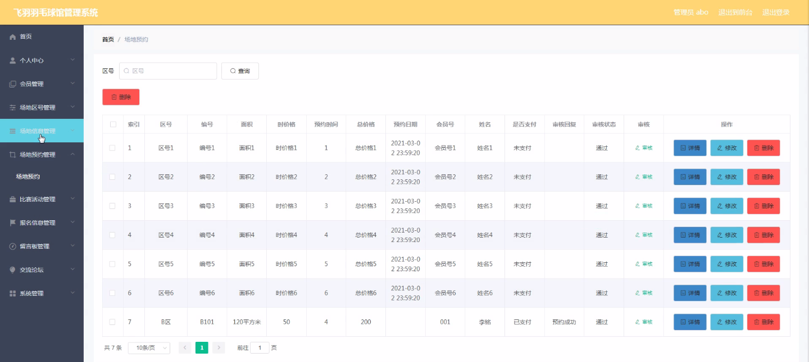
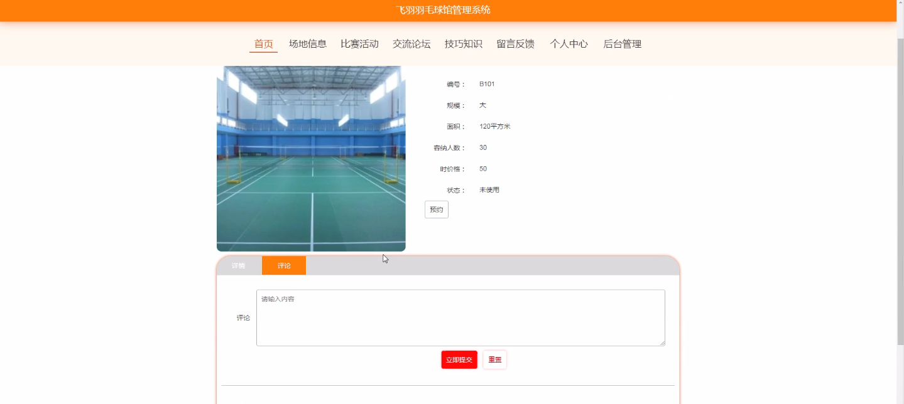

****本项目包含程序+源码+数据库+LW+调试部署环境，文末可获取一份本项目的java源码和数据库参考。****

## ******开题报告******

研究背景：
随着人们生活水平的提高和健康意识的增强，羽毛球运动逐渐成为一项受欢迎的体育活动。然而，传统的羽毛球馆管理方式存在一些问题，如手工记录会员信息、场地预约不便、比赛活动组织困难等。因此，开发一套高效的羽毛球馆管理系统具有重要的现实意义。

研究意义：
羽毛球馆管理系统的开发将极大地提高羽毛球馆的管理效率和服务质量。通过引入先进的信息技术，可以实现会员信息的自动化管理、场地预约的便捷化、比赛活动的智能化组织等功能，为羽毛球爱好者提供更好的使用体验，促进羽毛球运动的普及和发展。

研究目的：
本研究旨在设计和开发一套完善的飞羽羽毛球馆管理系统，以解决传统管理方式存在的问题。通过该系统，实现会员信息的集中管理和查询、场地预约的快捷方便、比赛活动的规范组织等功能，提升羽毛球馆的管理水平和服务质量，满足羽毛球爱好者的需求。

研究内容：
本研究的主要内容包括以下系统功能：会员管理、场地区号管理、场地信息管理、场地预约管理、比赛活动管理、报名信息管理、预约时间管理等。通过对这些功能的设计和实现，实现羽毛球馆管理的全面自动化和智能化。

拟解决的主要问题：

  1. 传统羽毛球馆管理方式存在的手工记录问题，通过会员管理功能实现会员信息的自动化管理，提高管理效率。
  2. 场地预约不便的问题，通过场地预约管理功能实现在线预约和快捷方便的预约流程，提升用户体验。
  3. 比赛活动组织困难的问题，通过比赛活动管理功能实现比赛信息的集中管理和智能化组织，提高比赛效果。

研究方案：
本研究将采用软件开发的方法，结合数据库技术和网络技术，设计和开发一套飞羽羽毛球馆管理系统。在需求分析的基础上，进行系统设计、编码实现和测试验证等工作，最终完成一个功能完备、稳定可靠的管理系统。

预期成果：
通过本研究，预期可以开发出一套功能完善、操作简便的飞羽羽毛球馆管理系统。该系统能够实现会员信息的自动化管理、场地预约的便捷化、比赛活动的智能化组织等功能，提高羽毛球馆的管理效率和服务质量，满足用户的需求，促进羽毛球运动的发展。

进度安排：

2022年9月至10月：需求分析和规划，进行用户需求调研和分析，确定系统功能和目标。

2022年11月至2023年1月：系统设计和开发，完成系统架构设计和技术选型，并开始编写代码。

2023年2月至3月：测试和优化，进行单元测试和集成测试，修复问题并优化系统性能。

2023年4月至5月：文档编写和培训，编写用户手册和系统文档，并进行相关人员的培训。

2023年5月：上线部署和维护，将系统部署到生产环境中，并定期进行维护和升级。

参考文献：

[1]王振华.SpringBoot在教学效果评估系统中的应用[J].电子技术,2023,(05):67-69.

[2]王明泉.基于SpringBoot远程热部署的探索和应用[J].信息与电脑(理论版),2023,(07):1-4.

[3]王亚东,李晓霞,陈强强,剡美娜.基于SpringBoot的需求发布平台设计[J].信息与电脑(理论版),2023,(01):105-107.

[4]陈新府豪.基于SpringBoot和Vue框架的创新方法推理系统的设计与实现[D].导师：黄静.浙江理工大学,2022.

[5]霍福华,韩慧.基于SpringBoot微服务架构下前后端分离的MVVM模型[J].电子技术与软件工程,2022,(01):73-76.

[6]韩策,张娜,王松亭,张凯,何方,袁峰.SpringBoot OPC客户端设计与研究[J].电子世界,2021,(19):25-26.

****以上是本项目程序开发之前开题报告内容，最终成品以下面界面为准，大家可以酌情参考使用。要源码参考请在文末进行获取！！****

## ******本项目的界面展示******

