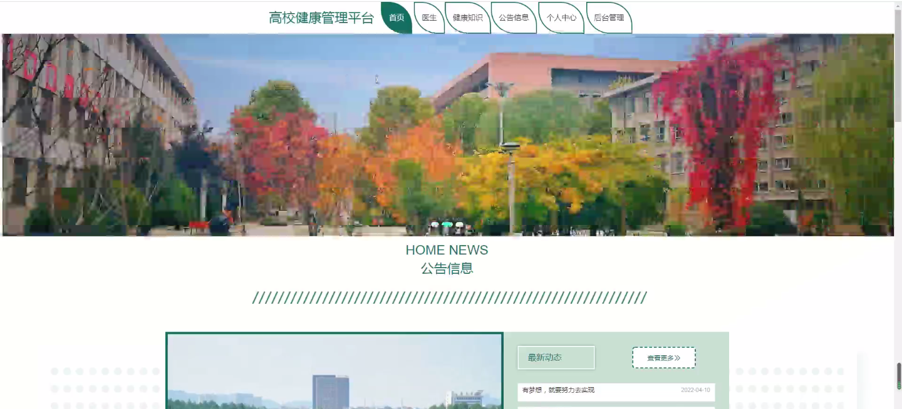
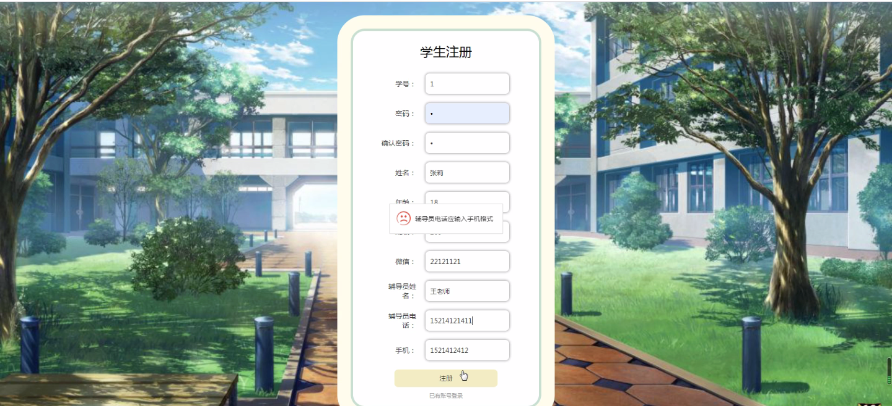
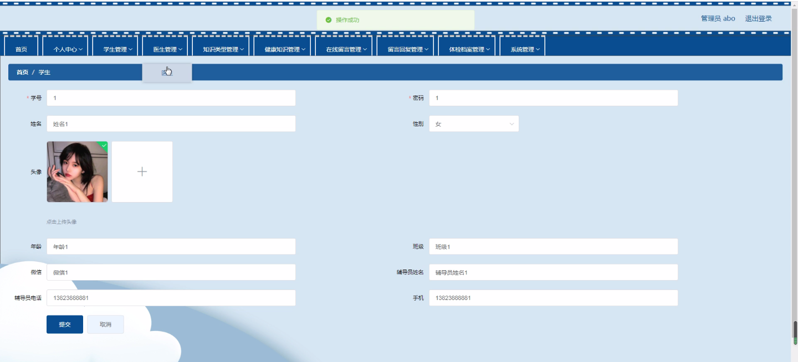
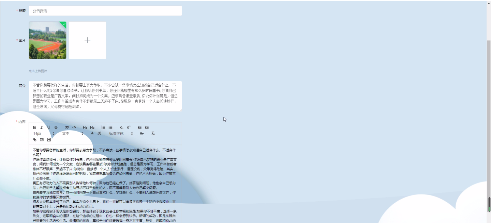
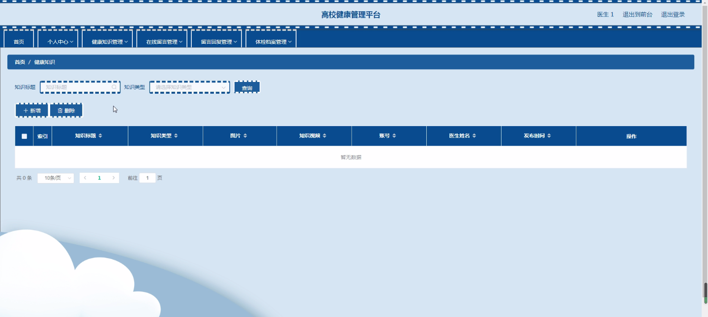
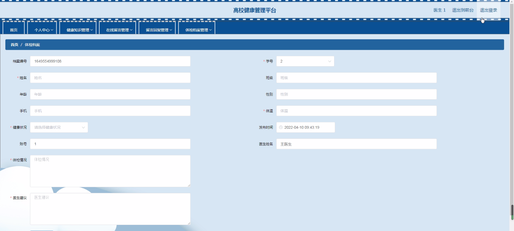
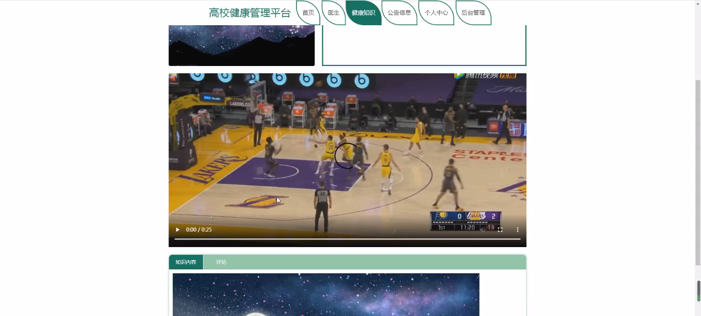
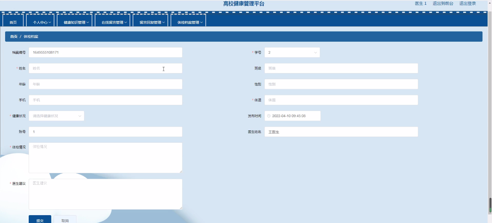

****本项目包含程序+源码+数据库+LW+调试部署环境，文末可获取一份本项目的java源码和数据库参考。****

## ******开题报告******

研究背景：
随着社会的发展和人们生活水平的提高，大学生群体逐渐增多，并且面临着各种身心健康问题。然而，传统的健康管理方式存在诸多不足，无法满足大学生个性化、全方位的健康需求。因此，建立一种高校健康管理平台成为当务之急。

研究意义：
高校健康管理平台的建立对于促进大学生的身心健康具有重要意义。首先，通过平台可以及时获取健康知识，提高大学生的健康素养和自我保健能力。其次，平台可以提供在线留言和留言回复功能，使学生与医生之间实现便捷沟通，解决健康问题。最后，通过搭建学生的体检档案，可以实现健康数据的集中管理和分析，为学校制定健康干预措施提供科学依据。

研究目的：
本研究旨在构建一种高校健康管理平台，以满足大学生个性化、全方位的健康需求。通过整合学生、医生、知识类型、健康知识、在线留言、留言回复、体检档案等系统功能，实现学生健康管理的全过程和全方位服务。

研究内容： 本研究的主要内容包括以下系统功能：

  1. 学生功能：学生可以通过平台进行个人信息注册和登录，查看个人健康数据和健康建议，参与健康评估和问卷调查等活动。

  2. 医生功能：医生可以通过平台进行个人信息注册和登录，查看学生的健康档案和健康问题，提供在线咨询和指导，开展健康干预措施。

  3. 知识类型功能：平台提供多种健康知识类型，如营养、运动、心理等，学生可以根据自身需求选择相应的知识类型进行学习。

  4. 健康知识功能：平台提供丰富的健康知识内容，包括文章、视频、课程等形式，帮助学生获取科学、实用的健康知识。

  5. 在线留言功能：学生可以通过平台进行在线留言，将自己的健康问题提交给医生，寻求专业的建议和解决方案。

  6. 留言回复功能：医生可以通过平台对学生的留言进行及时回复，提供专业的健康指导和建议。

  7. 体检档案功能：平台可以记录学生的体检数据，并生成个人健康档案，方便医生进行健康评估和干预措施制定。

拟解决的主要问题：
本研究旨在解决传统高校健康管理方式存在的以下问题：信息不对称、沟通不便捷、数据分散、个性化服务不足等。通过构建高校健康管理平台，实现信息共享、沟通便捷、数据集中管理和个性化服务，提升大学生的身心健康水平。

研究方案和预期成果：
本研究将采用需求调研、系统设计和开发、测试与评估等方法，构建高校健康管理平台。预期成果包括平台的设计与开发、用户满意度评估和推广应用等方面。通过该平台的实际应用，预计能够提高大学生的健康素养和自我保健能力，促进大学生群体的身心健康发展。

进度安排：

2022年9月至10月：需求分析和规划，明确系统功能和目标，制定项目计划。

2022年11月至2023年1月：系统设计和编码，完成详细的系统设计并开始编写代码。

2023年2月至3月：用户界面开发和数据库开发，开发用户友好的界面和设计数据库结构。

2023年4月至5月：功能测试、文档编写和上线部署，对系统进行全面的功能测试并编写用户手册。

2023年5月：维护和升级，定期对系统进行维护和升级，修复bug和添加新功能。

参考文献：

[1]邱小群,邓丽艳,陈海潮.基于B/S的信息管理系统设计和实现[J].信息与电脑(理论版),2022,(20):146-148.

[2]谢霜.基于Java技术的网络管理体系结构的应用[J].网络安全技术与应用,2022,(10):14-15.

[3]宋锦华.高职院校Java程序设计课程改革研究[J].科技视界,2022,(20):133-135.

[4]曹嵩彭,王鹏宇.浅析Java语言在软件开发中的应用[J].信息记录材料,2022,(03):114-116.

[5]朱澈,余俊达.武汉东湖学院.基于Java的软硬件信息管理系统V1.0[Z].项目立项编号.鉴定单位.鉴定日期:

****以上是本项目程序开发之前开题报告内容，最终成品以下面界面为准，大家可以酌情参考使用。要源码参考请在文末进行获取！！****

## ******本项目的界面展示******

