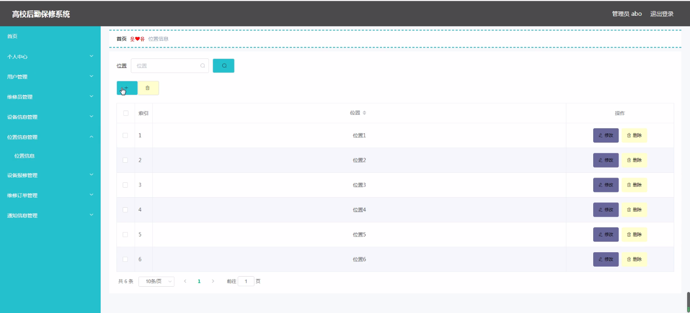

****本项目包含程序+源码+数据库+LW+调试部署环境，文末可获取一份本项目的java源码和数据库参考。****

## ******开题报告******

研究背景：
随着高校规模的不断扩大和设备设施的日益复杂化，高校后勤保修工作面临着越来越大的挑战。传统的人工报修方式存在着信息传递不及时、流程繁琐、效率低下等问题，无法满足日益增长的维修需求。因此，开发一套高校后勤保修系统成为了当务之急。

研究意义：
高校后勤保修系统的开发与应用，将极大地提升高校后勤保修工作的效率和质量，为师生提供更加便捷、快速的维修服务。同时，该系统还能够实现对设备的全面管理和维护，提前预防设备故障，减少维修成本，提高设备的使用寿命。

研究目的：
本研究旨在设计和开发一套高校后勤保修系统，通过引入信息技术手段，优化后勤保修流程，提高维修效率，提供更好的用户体验。具体目标包括但不限于：提供方便快捷的设备报修通道，实现用户在线提交报修申请；建立维修员信息管理系统，实现维修人员的分配和调度；建立设备信息数据库，实现对设备的全面管理和维护；提供通知信息功能，及时将维修进展情况反馈给用户。

研究内容：
本研究的主要内容包括以下系统功能：用户管理模块、维修员管理模块、位置信息管理模块、设备报修模块、维修订单管理模块、设备信息管理模块、通知信息管理模块等。通过对这些功能模块的设计和开发，实现高校后勤保修系统的全面应用。

拟解决的主要问题：

  1. 传统的人工报修方式存在信息传递不及时、流程繁琐、效率低下等问题，如何通过引入信息技术手段来优化后勤保修流程，提高维修效率？
  2. 如何建立一套完善的设备信息管理系统，实现对设备的全面管理和维护，提前预防设备故障，减少维修成本？
  3. 如何实现用户在线提交报修申请，并能够方便快捷地查询维修进展情况？
  4. 如何建立维修员信息管理系统，实现维修人员的分配和调度，提高维修响应速度和效率？
  5. 如何通过通知信息功能，及时将维修进展情况反馈给用户，提供更好的用户体验？

研究方案：
本研究将采用软件工程的方法，结合需求分析、系统设计、编码实现和测试等步骤，逐步完成高校后勤保修系统的开发。在系统设计阶段，将充分考虑用户需求和操作习惯，设计简洁、易用的界面；在编码实现阶段，将采用先进的开发技术和框架，确保系统的稳定性和安全性；在测试阶段，将进行全面的功能测试和性能测试，确保系统的质量和可靠性。

预期成果：
通过本研究的开展，预期可以开发出一套功能完善、操作便捷的高校后勤保修系统，实现用户在线提交报修申请、维修人员的分配和调度、设备信息的全面管理和维护、通知信息的及时反馈等功能。该系统的应用将大大提高高校后勤保修工作的效率和质量，为师生提供更好的维修服务体验，并有望成为其他高校后勤保修工作的参考模型。

进度安排：

2022年9月至10月：需求分析和规划，进行用户需求调研和分析，确定系统功能和目标。

2022年11月至2023年1月：系统设计和开发，完成系统架构设计和技术选型，并开始编写代码。

2023年2月至3月：测试和优化，进行单元测试和集成测试，修复问题并优化系统性能。

2023年4月至5月：文档编写和培训，编写用户手册和系统文档，并进行相关人员的培训。

2023年5月：上线部署和维护，将系统部署到生产环境中，并定期进行维护和升级。

参考文献：

[1]王振华.SpringBoot在教学效果评估系统中的应用[J].电子技术,2023,(05):67-69.

[2]王明泉.基于SpringBoot远程热部署的探索和应用[J].信息与电脑(理论版),2023,(07):1-4.

[3]王亚东,李晓霞,陈强强,剡美娜.基于SpringBoot的需求发布平台设计[J].信息与电脑(理论版),2023,(01):105-107.

[4]陈新府豪.基于SpringBoot和Vue框架的创新方法推理系统的设计与实现[D].导师：黄静.浙江理工大学,2022.

[5]霍福华,韩慧.基于SpringBoot微服务架构下前后端分离的MVVM模型[J].电子技术与软件工程,2022,(01):73-76.

[6]韩策,张娜,王松亭,张凯,何方,袁峰.SpringBoot OPC客户端设计与研究[J].电子世界,2021,(19):25-26.

****以上是本项目程序开发之前开题报告内容，最终成品以下面界面为准，大家可以酌情参考使用。要源码参考请在文末进行获取！！****

## ******本项目的界面展示******

