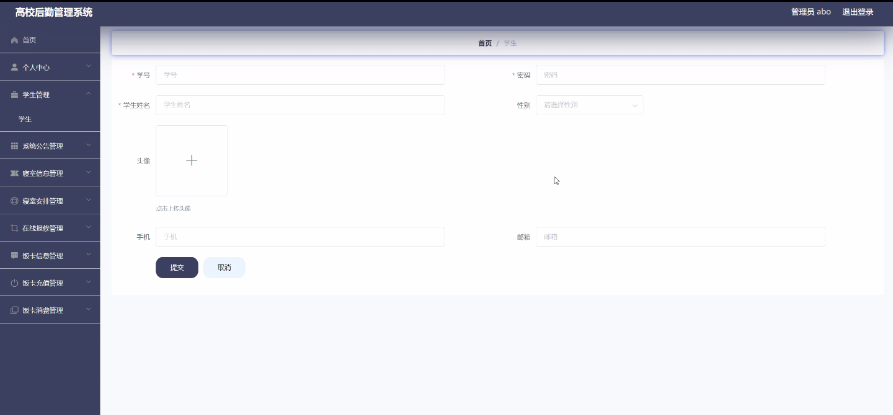
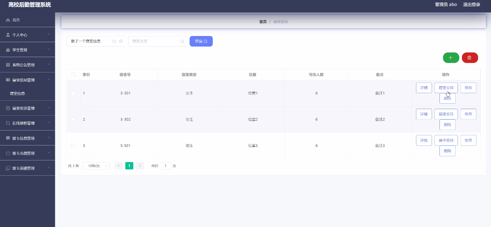
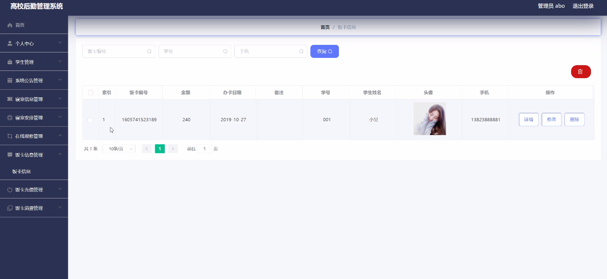
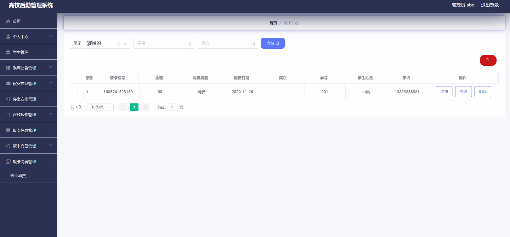
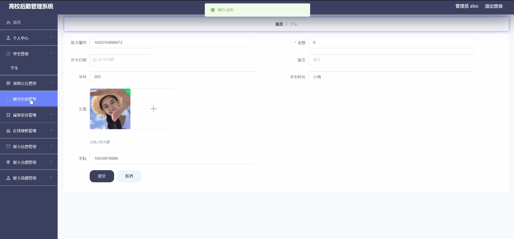
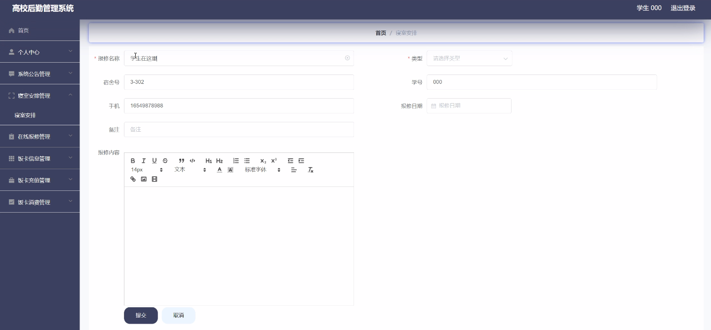

****本项目包含程序+源码+数据库+LW+调试部署环境，文末可获取一份本项目的java源码和数据库参考。****

## ******开题报告******

研究背景：
随着高校规模的不断扩大和学生数量的增加，高校后勤管理面临着日益复杂的挑战。传统的人工管理方式已经无法满足高效、便捷、精确的需求，因此，开发一套高校后勤管理系统成为迫切的需求。

研究意义：
高校后勤管理系统的开发和应用具有重要的现实意义和社会价值。首先，该系统能够提高高校后勤管理的效率和质量，减少人力资源的浪费，提升服务水平。其次，通过系统化的数据管理和分析，可以更好地了解学生的需求和行为，为学校决策提供科学依据。最后，该系统的推广应用还能够促进高校信息化建设，推动高校管理模式的转型升级。

研究目的：
本研究旨在设计和开发一套高校后勤管理系统，以解决传统管理方式存在的问题和不足之处。通过引入先进的信息技术和管理方法，提高高校后勤管理的效率和质量，为学生提供更加便捷、舒适的生活环境，为学校提供科学决策的支持。

研究内容：
本研究的主要内容包括以下系统功能：学生信息管理、系统公告发布、寝室信息管理、寝室安排调整、在线报修服务、饭卡信息查询、饭卡充值和消费记录等。通过对这些功能的设计和实现，可以实现高校后勤管理的全面数字化、网络化和智能化。

拟解决的主要问题：
在传统的高校后勤管理中，存在着信息不对称、流程繁琐、效率低下等问题。本研究旨在通过开发高校后勤管理系统，解决以下主要问题：一是提高信息共享和沟通效率，减少信息不对称；二是简化管理流程，提高工作效率；三是引入智能算法和数据分析，提供个性化的服务和决策支持。

研究方案：
本研究将采用软件工程的方法，包括需求分析、系统设计、编码实现和测试验证等步骤。在需求分析阶段，将深入了解高校后勤管理的具体需求和问题，并制定相应的功能模块和系统架构。在系统设计和编码实现阶段，将结合最新的技术手段和工具，开发出高效、稳定、易用的高校后勤管理系统。最后，在测试验证阶段，将对系统进行全面的功能测试和性能评估，确保系统的稳定性和可靠性。

预期成果：
通过本研究，预期可以设计和开发一套完善的高校后勤管理系统，实现高校后勤管理的数字化、网络化和智能化。该系统将提供学生信息管理、公告发布、寝室信息管理、在线报修服务、饭卡管理等功能，为高校后勤管理提供全方位的支持和服务。同时，该系统的应用将提高高校后勤管理的效率和质量，提升学生的生活品质，推动高校管理模式的转型升级。

进度安排：

2022年9月至10月：开题报告编写和提交，完成开题报告的撰写并提交给指导教师进行审核。

2022年11月至2023年1月：系统设计和开发，根据开题报告的要求，进行系统设计和编码工作。

2023年2月至3月：论文撰写和初稿完成，开始撰写论文，并在这个阶段完成论文的初稿。

2023年4月至5月：论文修改和最终定稿，根据指导教师的意见对论文进行修改，并完成最终的定稿。

2023年5月：论文答辩和提交，参加论文答辩并根据答辩结果进行修改，最后将论文提交给学院或学校。

参考文献：

[1]喻佳,吴丹新.基于SpringBoot的Web快速开发框架[J].电脑编程技巧与维护,2021,(09):31-33.

[2]李鹏.基于SpringBoot快速开发平台的实现[J].电子技术与软件工程,2021,(12):36-37.

[3]叶开平,蔡维晟,陈家敏,邓斯妮.基于SpringBoot的综测可视化管理系统的研究与设计[J].电脑知识与技术,2021,(12):100-104.

[4]江健锋,徐振平.Springboot最小系统的设计与实现[J].电脑知识与技术,2021,(04):62-63.

[5]赵炯,司圣杰,周奇才,熊肖磊.通用信息获取系统设计与实现[J].起重运输机械,2020,(16):89-97.

[6]吴英宾.一种内外网数据交互系统的设计与实现[J].软件工程,2020,(08):25-27.

****以上是本项目程序开发之前开题报告内容，最终成品以下面界面为准，大家可以酌情参考使用。要源码参考请在文末进行获取！！****

## ******本项目的界面展示******

