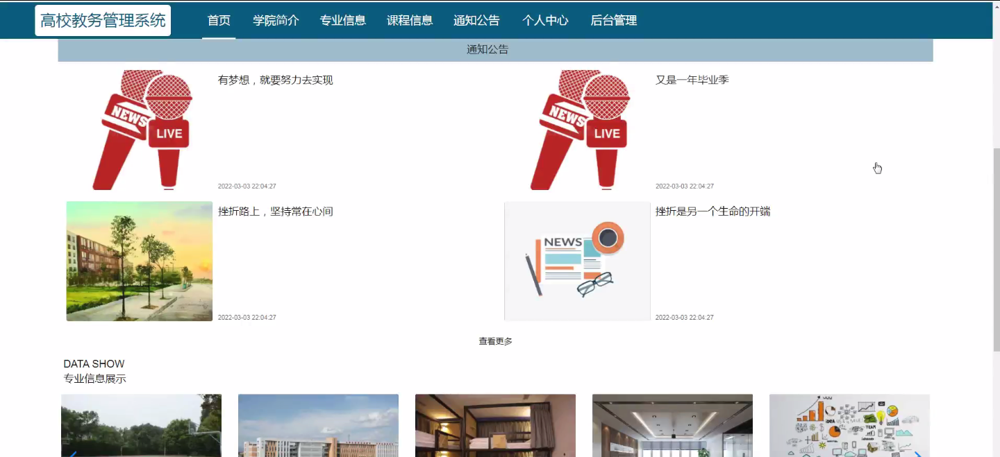
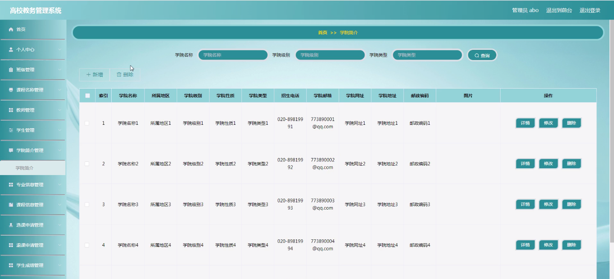
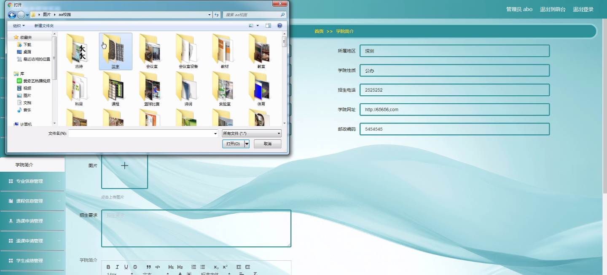
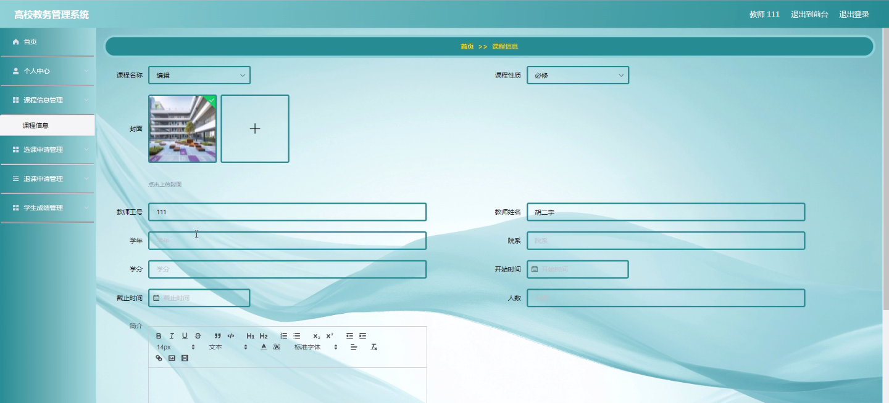
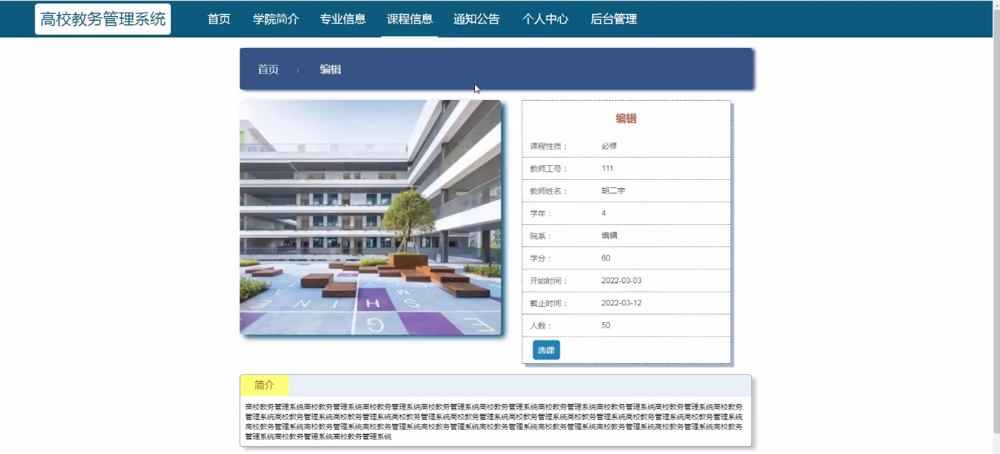
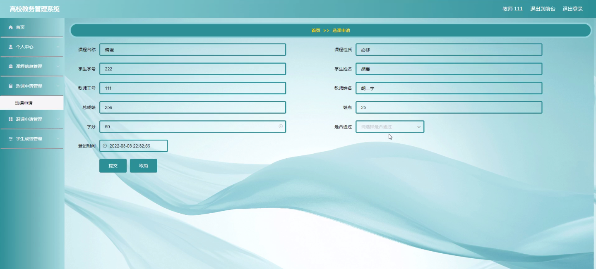

****本项目包含程序+源码+数据库+LW+调试部署环境，文末可获取一份本项目的java源码和数据库参考。****

## ******开题报告******

研究背景：
随着高校规模的不断扩大和教育信息化的快速发展，高校教务管理系统已成为高校管理的重要组成部分。传统的手工操作已经无法满足日益增长的教务管理需求，因此，建立一套高效、智能的教务管理系统势在必行。这样的系统将能够提高教务管理的效率和质量，促进学校教学工作的科学化、规范化和信息化。

研究意义：
高校教务管理系统的建立对于提升高校教务管理水平具有重要意义。首先，它可以实现教务管理的数字化和网络化，方便教务人员进行各项管理工作，减少人力资源的浪费。其次，它可以提供全面的教务信息，方便学生、教师和管理者查询和使用，提高信息共享和交流的效率。最后，它可以为高校教务管理的决策提供数据支持，使决策更加科学、准确。

研究目的：
本研究旨在设计和开发一套高校教务管理系统，以满足高校教务管理的需求。通过对系统功能的分析和研究，建立一个功能完善、操作简便、安全可靠的教务管理系统，提高高校教务管理的效率和质量，为学校的教学工作提供良好的支持。

研究内容： 本研究将主要围绕以下系统功能展开研究：

  1. 学院简介：提供学院的基本信息、发展历程等内容，方便用户了解学院的背景和特色。

  2. 专业信息：包括各个专业的设置、培养目标、课程设置等内容，帮助学生选择适合自己的专业。

  3. 班级管理：包括班级的创建、学生名单的管理、班级活动的组织等，方便教务人员对班级进行管理。

  4. 课程名称：提供各门课程的基本信息、教学大纲、授课教师等内容，方便学生选课和教师备课。

  5. 教师管理：包括教师的基本信息、任课情况、教学评价等内容，方便教务人员对教师进行管理和评估。

  6. 学生管理：包括学生的基本信息、选课情况、成绩记录等内容，方便教务人员对学生进行管理和评估。

  7. 选课申请：提供学生选课的流程和规定，方便学生进行选课操作。

  8. 课程信息：提供课程的详细信息、上课时间地点等内容，方便学生查询和安排自己的课程表。

  9. 退课申请：提供学生退课的流程和规定，方便学生进行退课操作。

  10. 学生成绩：记录学生的考试成绩和平时成绩，方便学生和教师查询和分析学生成绩情况。

拟解决的主要问题：
本研究旨在解决传统高校教务管理方式存在的效率低下、信息不准确、数据不共享等问题。通过设计和开发一套高效、智能的教务管理系统，实现教务管理的数字化和网络化，提高教务管理的效率和质量，为学校的教学工作提供良好的支持。

研究方案和预期成果：
本研究将采用软件工程的方法，包括需求分析、系统设计、编码实现、系统测试等步骤，设计和开发一套高校教务管理系统。预期成果包括一个功能完善、操作简便、安全可靠的教务管理系统，并对该系统进行测试和评估，验证其在提高教务管理效率和质量方面的有效性。同时，本研究还将总结出一套适用于高校教务管理系统开发的方法和经验，为类似项目的开展提供参考和借鉴。

进度安排：

2022年9月至10月：开题报告编写和提交，完成开题报告的撰写并提交给指导教师进行审核。

2022年11月至2023年1月：系统设计和开发，根据开题报告的要求，进行系统设计和编码工作。

2023年2月至3月：论文撰写和初稿完成，开始撰写论文，并在这个阶段完成论文的初稿。

2023年4月至5月：论文修改和最终定稿，根据指导教师的意见对论文进行修改，并完成最终的定稿。

2023年5月：论文答辩和提交，参加论文答辩并根据答辩结果进行修改，最后将论文提交给学院或学校。

参考文献：

[1]喻佳,吴丹新.基于SpringBoot的Web快速开发框架[J].电脑编程技巧与维护,2021,(09):31-33.

[2]李鹏.基于SpringBoot快速开发平台的实现[J].电子技术与软件工程,2021,(12):36-37.

[3]叶开平,蔡维晟,陈家敏,邓斯妮.基于SpringBoot的综测可视化管理系统的研究与设计[J].电脑知识与技术,2021,(12):100-104.

[4]江健锋,徐振平.Springboot最小系统的设计与实现[J].电脑知识与技术,2021,(04):62-63.

[5]赵炯,司圣杰,周奇才,熊肖磊.通用信息获取系统设计与实现[J].起重运输机械,2020,(16):89-97.

[6]吴英宾.一种内外网数据交互系统的设计与实现[J].软件工程,2020,(08):25-27.

****以上是本项目程序开发之前开题报告内容，最终成品以下面界面为准，大家可以酌情参考使用。要源码参考请在文末进行获取！！****

## ******本项目的界面展示******

