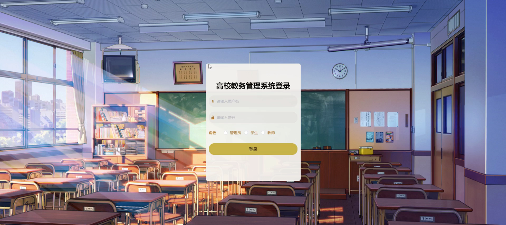
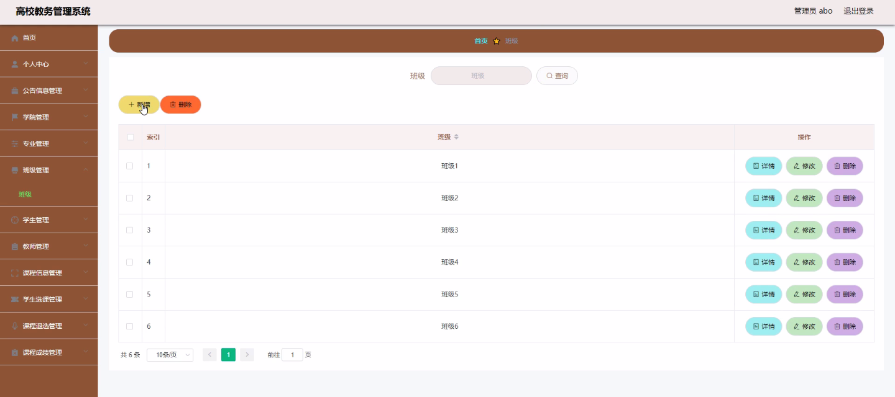
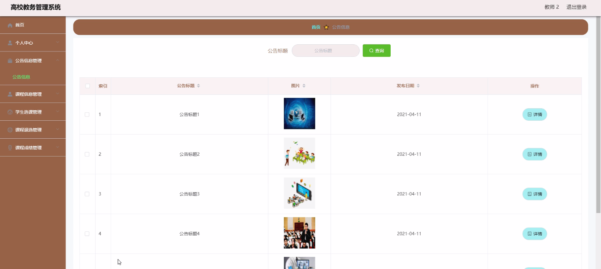
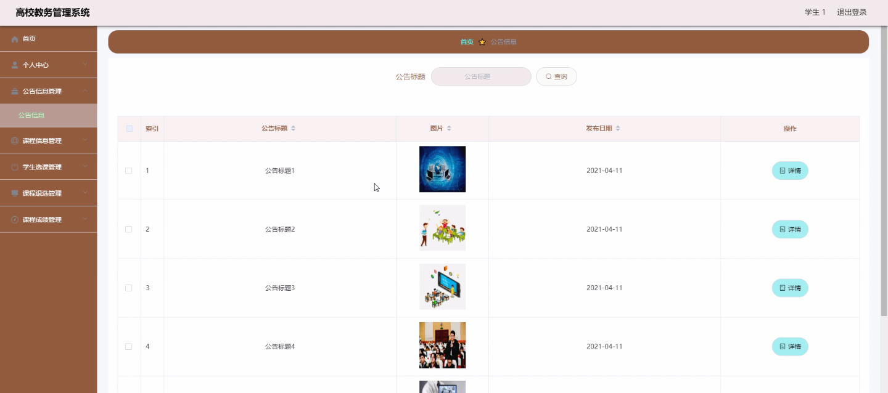
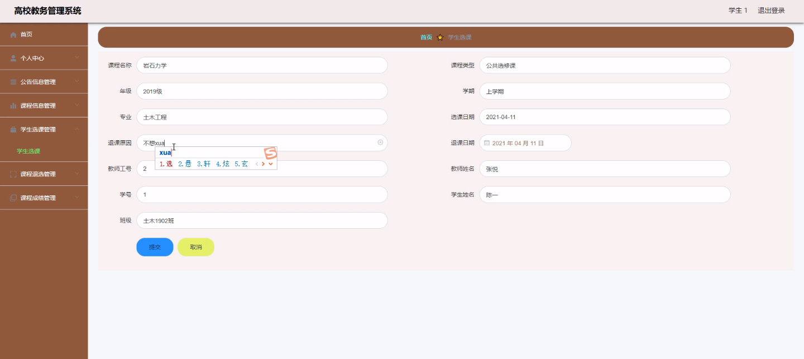
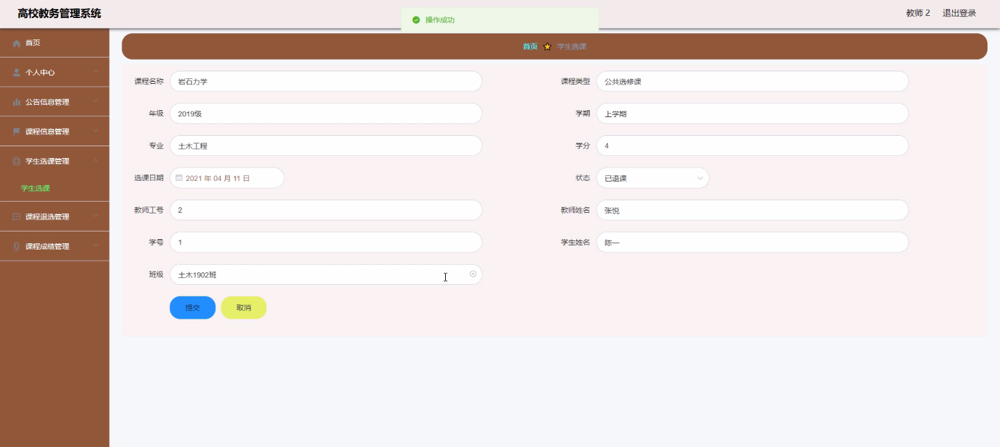
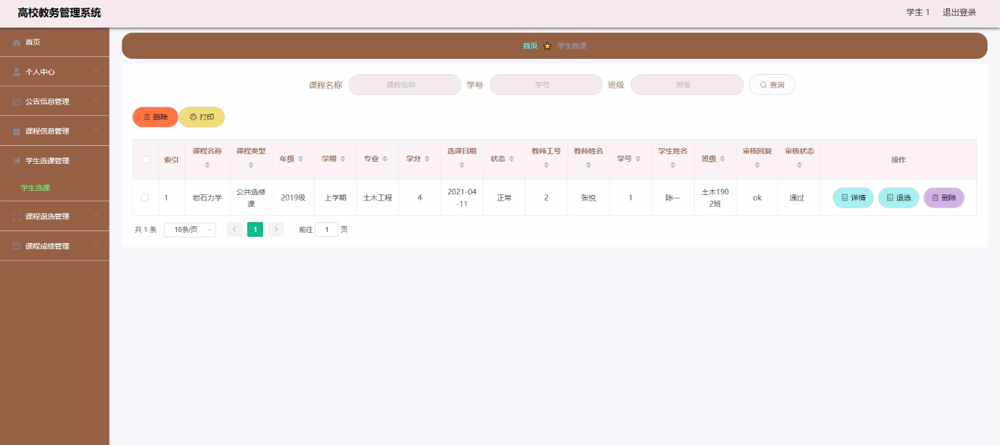

****本项目包含程序+源码+数据库+LW+调试部署环境，文末可获取一份本项目的java源码和数据库参考。****

## ******开题报告******

研究背景：
高校教务管理系统是现代高等教育中不可或缺的重要工具，它通过信息化技术手段，实现了学生、教师、班级、课程等多方面的管理和协调。随着高校规模的扩大和教学任务的增加，传统的手工管理已经无法满足日益复杂的教务管理需求。因此，开发一个功能完善、操作便捷、高效稳定的高校教务管理系统具有重要的现实意义。

研究意义：
高校教务管理系统的建设与完善对于提高教学质量、提升学生学习体验、优化教学资源配置具有重要意义。通过该系统，可以实现学生选课、退课、查看成绩等教务事务的自助处理，减轻教务人员的工作压力，提高工作效率。同时，教师可以通过系统及时发布教学信息、评价学生表现，促进教学过程的透明化和互动性。此外，高校教务管理系统还可以为学校领导提供决策支持，为教学改革和教学质量监控提供数据支撑。

研究目的：
本研究旨在开发一种高校教务管理系统，通过对学生、教师、班级、课程等多方面的信息进行集中管理和协调，提高教务工作效率，优化教学资源配置，提升教学质量和学生学习体验。同时，通过研究探索高校教务管理系统的设计与实施过程，为其他高校的教务管理工作提供借鉴和参考。

研究内容：
本研究的主要内容包括学生、教师、班级、课程信息的管理，教学信息的发布与查看，课程名称的维护，选课信息的录入与查询，退课信息的处理，课程评价的收集与分析，学生奖惩的记录与管理，学生成绩的统计与查询，公告信息的发布与阅读，院系管理等系统功能的开发与实现。通过对这些功能的研究与实践，旨在构建一个全面、高效、便捷的高校教务管理系统。

拟解决的主要问题：

  1. 如何实现学生、教师、班级、课程等多方面信息的集中管理和协调？
  2. 如何确保教务工作的高效稳定运行，提高工作效率？
  3. 如何优化教学资源的配置，提升教学质量和学生学习体验？
  4. 如何保障系统的安全性和数据的完整性？
  5. 如何通过教务管理系统为学校领导提供决策支持和数据分析？

研究方案：
本研究将采用软件开发的方法，结合需求分析、系统设计、编码实现和测试验证等步骤，逐步构建高校教务管理系统。首先，进行需求调研和分析，明确系统功能和用户需求；然后，进行系统设计，包括数据库设计、界面设计和系统架构设计；接着，进行编码实现，采用合适的编程语言和开发工具进行系统开发；最后，进行系统测试和验证，确保系统的稳定性和可靠性。

预期成果：
通过本研究，预期可以开发出一个功能完善、操作便捷、高效稳定的高校教务管理系统。该系统能够满足学生、教师、班级、课程等多方面的信息管理和协调需求，提高教务工作效率，优化教学资源配置，提升教学质量和学生学习体验。同时，研究过程中积累的经验和方法也可以为其他高校的教务管理工作提供借鉴和参考。

进度安排：

2022年9月至10月：需求分析和规划，明确系统功能和目标，制定项目计划。

2022年11月至2023年1月：系统设计和编码，完成详细的系统设计并开始编写代码。

2023年2月至3月：用户界面开发和数据库开发，开发用户友好的界面和设计数据库结构。

2023年4月至5月：功能测试、文档编写和上线部署，对系统进行全面的功能测试并编写用户手册。

2023年5月：维护和升级，定期对系统进行维护和升级，修复bug和添加新功能。

参考文献：

[1]邱小群,邓丽艳,陈海潮.基于B/S的信息管理系统设计和实现[J].信息与电脑(理论版),2022,(20):146-148.

[2]谢霜.基于Java技术的网络管理体系结构的应用[J].网络安全技术与应用,2022,(10):14-15.

[3]宋锦华.高职院校Java程序设计课程改革研究[J].科技视界,2022,(20):133-135.

[4]曹嵩彭,王鹏宇.浅析Java语言在软件开发中的应用[J].信息记录材料,2022,(03):114-116.

[5]朱澈,余俊达.武汉东湖学院.基于Java的软硬件信息管理系统V1.0[Z].项目立项编号.鉴定单位.鉴定日期:

****以上是本项目程序开发之前开题报告内容，最终成品以下面界面为准，大家可以酌情参考使用。要源码参考请在文末进行获取！！****

## ******本项目的界面展示******

