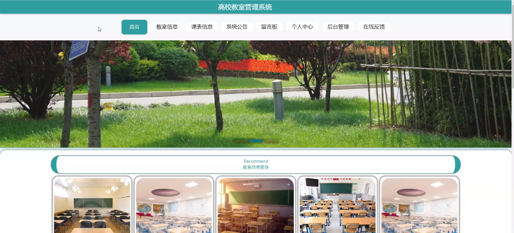
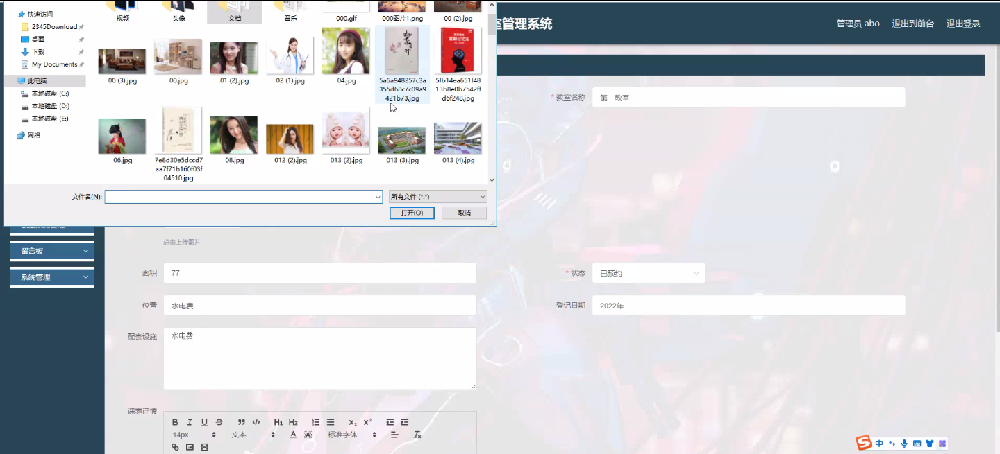

****本项目包含程序+源码+数据库+LW+调试部署环境，文末可获取一份本项目的java源码和数据库参考。****

## ******开题报告******

研究背景：
随着高校教育的普及和发展，教室管理成为一项重要的任务。传统的手工管理方式已经无法满足日益增长的需求，因此需要建立一个高效、便捷的高校教室管理系统。该系统将通过信息化技术的应用，实现对教室资源的合理调配和有效利用，提高教学效率，提供更好的教学环境。

研究意义：
高校教室管理系统的建立具有重要的现实意义和社会影响。首先，该系统可以提高教室资源的利用率，减少教室闲置时间，优化教学资源配置，从而提高教学效果。其次，该系统可以方便学生和教师进行教室预约，减少了人力物力的浪费，提高了办公效率。最后，该系统还可以提供数据支持，为高校教室管理决策提供科学依据。

研究目的：
本研究旨在设计和开发一套高校教室管理系统，通过信息化技术的应用，实现对教室资源的合理调配和有效利用。具体目标包括：提高教室资源利用率，优化教学资源配置，提高教学效果；方便学生和教师进行教室预约，减少人力物力的浪费，提高办公效率；为高校教室管理决策提供科学依据。

研究内容：
本研究的主要内容包括以下几个方面：用户管理模块、教室信息管理模块、课表信息管理模块、教室预约管理模块以及教室分类管理模块。用户管理模块用于管理系统的用户信息，包括学生、教师和管理员等角色的注册、登录和权限管理。教室信息管理模块用于管理教室的基本信息，包括教室编号、容纳人数、设备设施等。课表信息管理模块用于管理课程的安排和调整，包括课程名称、上课时间、授课教师等。教室预约管理模块用于学生和教师进行教室的预约和取消操作。教室分类管理模块用于对教室进行分类管理，方便用户查找和选择合适的教室。

拟解决的主要问题：
在设计和开发高校教室管理系统的过程中，需要解决以下主要问题：如何实现教室资源的合理调配和有效利用；如何方便学生和教师进行教室预约，减少人力物力的浪费；如何提供科学依据，支持高校教室管理决策；如何确保系统的安全性和稳定性。

研究方案和预期成果：
本研究将采用软件工程的方法，结合信息化技术，设计和开发一套高校教室管理系统。通过需求分析、系统设计、编码实现和测试验证等步骤，最终完成一个功能完善、易于使用的系统。预期成果包括：高校教室管理系统的设计和实现；教室资源的合理调配和有效利用；学生和教师教室预约的便捷性和高效性；为高校教室管理决策提供科学依据的数据支持；系统的安全性和稳定性得到保障。

进度安排：

2022年9月至10月：需求分析和规划，明确系统功能和目标，制定项目计划。

2022年11月至2023年1月：系统设计和编码，完成详细的系统设计并开始编写代码。

2023年2月至3月：用户界面开发和数据库开发，开发用户友好的界面和设计数据库结构。

2023年4月至5月：功能测试、文档编写和上线部署，对系统进行全面的功能测试并编写用户手册。

2023年5月：维护和升级，定期对系统进行维护和升级，修复bug和添加新功能。

参考文献：

[1]邱小群,邓丽艳,陈海潮.基于B/S的信息管理系统设计和实现[J].信息与电脑(理论版),2022,(20):146-148.

[2]谢霜.基于Java技术的网络管理体系结构的应用[J].网络安全技术与应用,2022,(10):14-15.

[3]宋锦华.高职院校Java程序设计课程改革研究[J].科技视界,2022,(20):133-135.

[4]曹嵩彭,王鹏宇.浅析Java语言在软件开发中的应用[J].信息记录材料,2022,(03):114-116.

[5]朱澈,余俊达.武汉东湖学院.基于Java的软硬件信息管理系统V1.0[Z].项目立项编号.鉴定单位.鉴定日期:

****以上是本项目程序开发之前开题报告内容，最终成品以下面界面为准，大家可以酌情参考使用。要源码参考请在文末进行获取！！****

## ******本项目的界面展示******

