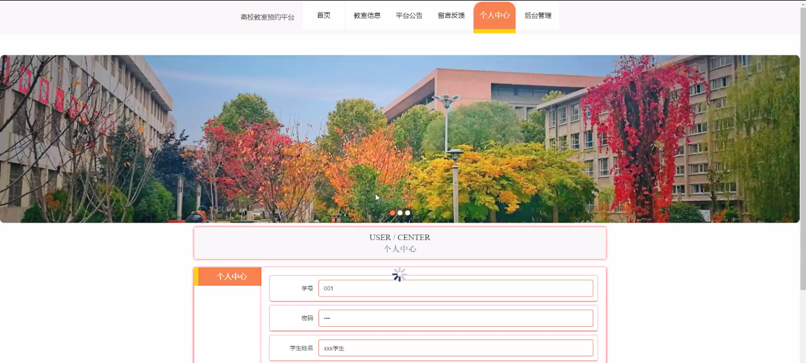
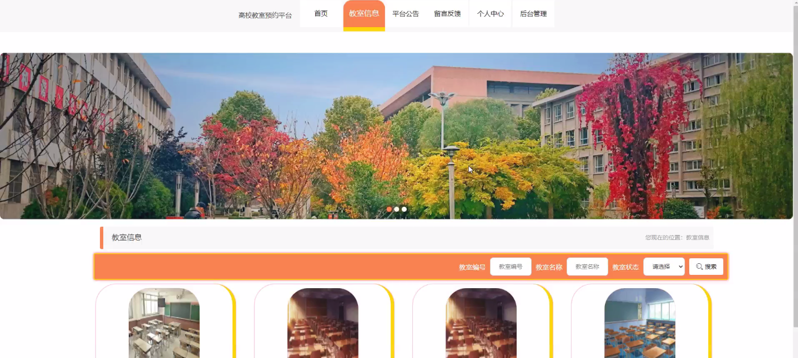
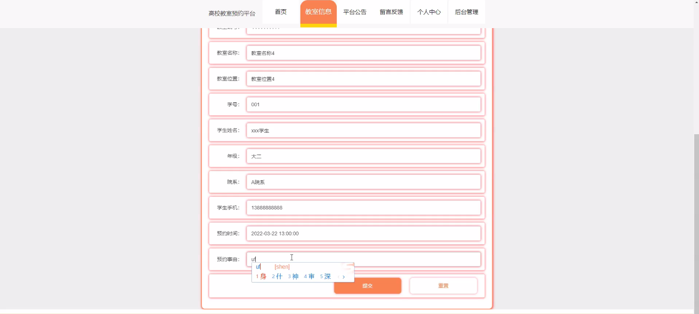
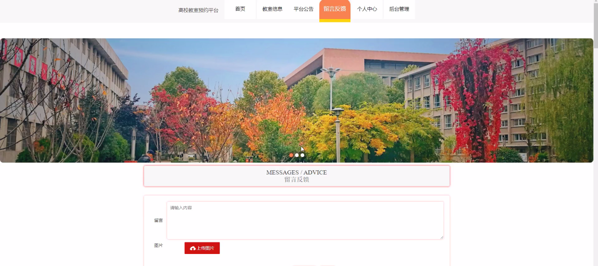
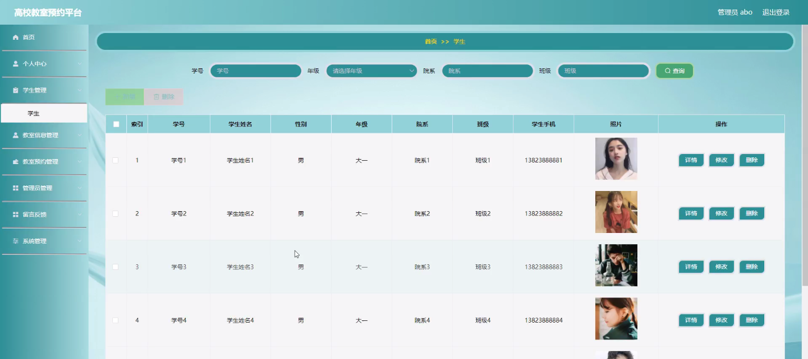

****本项目包含程序+源码+数据库+LW+调试部署环境，文末可获取一份本项目的java源码和数据库参考。****

## ******开题报告******

研究背景：
随着高校规模的不断扩大和教学资源的日益紧张，高校教室的管理和利用成为了一个亟待解决的问题。传统的教室预约方式存在着效率低下、信息不透明等问题，无法满足高校师生对教室资源合理利用的需求。因此，开发一种高校教室预约平台具有重要的现实意义。

研究意义：
高校教室预约平台的建立可以提高教室资源的利用效率，减少教室空置率，优化教学安排，提升教学质量。同时，通过该平台可以实现教室使用情况的数据化管理，为高校领导决策提供科学依据。此外，该平台还可以提供便捷的教室预约服务，方便师生进行教学和学习活动的安排。

研究目的：
本研究旨在设计和开发一种高校教室预约平台，通过整合教室信息、教室预约和教师等系统功能，实现高效、便捷的教室资源管理和利用。通过该平台，希望能够解决传统教室预约方式存在的问题，提高高校教学资源的利用效率，满足师生对教室资源合理利用的需求。

研究内容：
本研究的主要内容包括教室信息管理、教室预约系统和教师管理等系统功能。首先，需要建立一个教室信息管理系统，包括教室基本信息、容量、设备设施等相关信息的录入和维护。其次，设计并实现一个教室预约系统，包括预约申请、审核、预约查询等功能，以及与其他系统的数据交互。最后，需要开发一个教师管理系统，包括教师信息录入、权限管理等功能，以便教师能够进行教室预约操作。

拟解决的主要问题：

  1. 教室资源利用效率低下的问题；
  2. 传统教室预约方式效率低下、信息不透明的问题；
  3. 教室使用情况无法进行科学化管理的问题；
  4. 教师预约教室操作不便捷的问题。

研究方案：
本研究将采用软件工程的方法，结合需求分析、系统设计和编码实现等技术手段，开发一套高校教室预约平台。首先，进行需求调研和分析，明确系统功能和性能要求。然后，进行系统设计，包括数据库设计、界面设计和模块划分等。最后，进行编码实现和系统测试，确保系统的稳定性和可靠性。

预期成果：
通过本研究，预期可以开发出一套高校教室预约平台，实现教室资源的合理利用和管理。该平台将提供便捷的教室预约服务，优化教学安排，提升教学质量。同时，通过数据化管理，为高校领导决策提供科学依据。预计该平台能够满足师生对教室资源利用的需求，提高教室资源利用效率，促进高校教育教学的发展。

进度安排：

2022年9月至10月：需求分析和规划，进行用户需求调研和分析，确定系统功能和目标。

2022年11月至2023年1月：系统设计和开发，完成系统架构设计和技术选型，并开始编写代码。

2023年2月至3月：测试和优化，进行单元测试和集成测试，修复问题并优化系统性能。

2023年4月至5月：文档编写和培训，编写用户手册和系统文档，并进行相关人员的培训。

2023年5月：上线部署和维护，将系统部署到生产环境中，并定期进行维护和升级。

参考文献：

[1]王振华.SpringBoot在教学效果评估系统中的应用[J].电子技术,2023,(05):67-69.

[2]王明泉.基于SpringBoot远程热部署的探索和应用[J].信息与电脑(理论版),2023,(07):1-4.

[3]王亚东,李晓霞,陈强强,剡美娜.基于SpringBoot的需求发布平台设计[J].信息与电脑(理论版),2023,(01):105-107.

[4]陈新府豪.基于SpringBoot和Vue框架的创新方法推理系统的设计与实现[D].导师：黄静.浙江理工大学,2022.

[5]霍福华,韩慧.基于SpringBoot微服务架构下前后端分离的MVVM模型[J].电子技术与软件工程,2022,(01):73-76.

[6]韩策,张娜,王松亭,张凯,何方,袁峰.SpringBoot OPC客户端设计与研究[J].电子世界,2021,(19):25-26.

****以上是本项目程序开发之前开题报告内容，最终成品以下面界面为准，大家可以酌情参考使用。要源码参考请在文末进行获取！！****

## ******本项目的界面展示******

