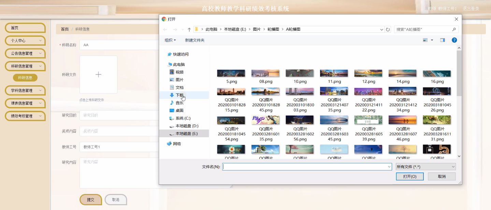
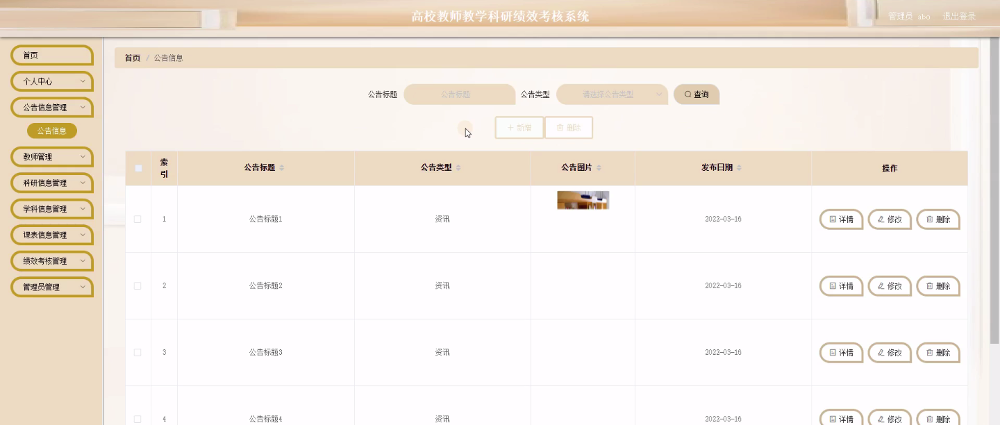
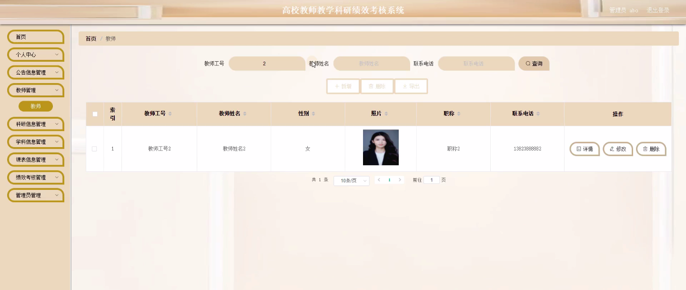
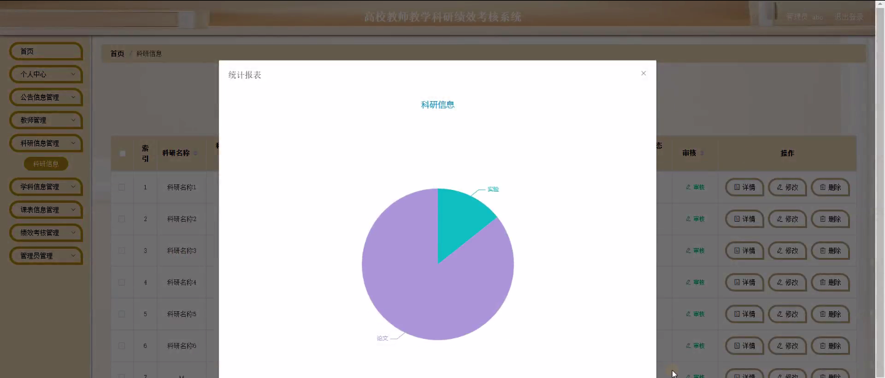
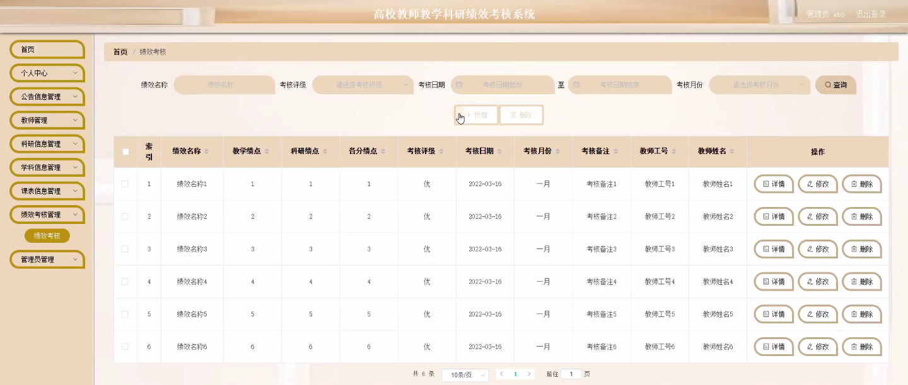
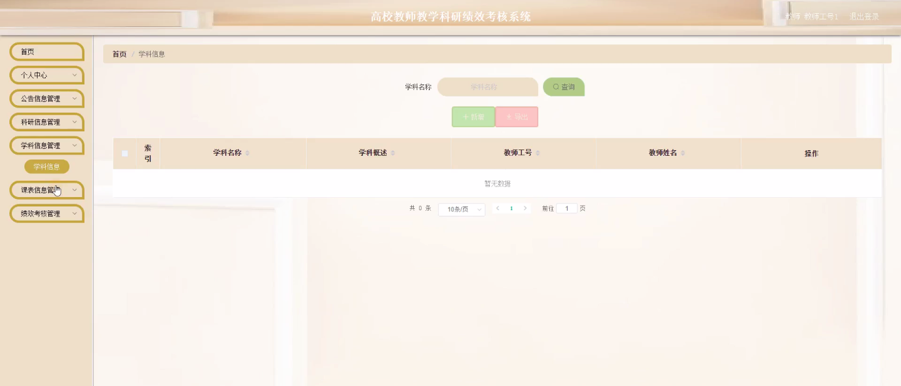

****本项目包含程序+源码+数据库+LW+调试部署环境，文末可获取一份本项目的java源码和数据库参考。****

## ******开题报告******

研究背景：
高校教师教学科研绩效考核系统作为一种评估教师绩效的工具，在高校教育管理中扮演着重要的角色。随着高等教育的快速发展和竞争的加剧，对于高校教师的教学和科研绩效要求也越来越高。传统的人工评估方式存在主观性强、评价标准不明确、工作量大等问题，难以准确客观地评估教师的绩效水平。因此，建立一个科学合理的高校教师教学科研绩效考核系统具有重要的现实意义。

研究意义：
通过建立高校教师教学科研绩效考核系统，可以提高教师绩效评估的科学性和客观性，促进教师个人发展和学校整体教育质量的提升。该系统可以为学校领导提供科学决策依据，为教师提供明确的工作目标和改进方向，为教育管理部门提供数据支持，推动高校教育的发展和进步。

研究目的：
本研究旨在构建一套高校教师教学科研绩效考核系统，通过对教师的教学和科研工作进行全面、客观、科学的评估，提高教师的教学和科研水平，促进高校教育的质量和效益。

研究内容：
本研究将基于高校教师教学科研绩效考核的需求，设计和开发一个包含教师、公告信息、科研信息、学科信息、课表信息、绩效考核等系统功能的综合性考核系统。具体内容包括但不限于：建立教师档案管理系统，收集和整理教师的个人信息、教学成果和科研成果；设计教学评价指标体系，制定科学合理的评价标准；开发绩效考核模块，实现对教师绩效的定量化评估；构建数据分析和报表生成功能，为决策者提供科学的数据支持。

拟解决的主要问题： 1.如何确定教师教学和科研绩效的评价指标体系？ 2.如何确保教师绩效评估的客观性和科学性？
3.如何设计一个用户友好、易于操作的考核系统？ 4.如何利用数据分析和报表生成功能提供决策支持？ 5.如何确保教师个人信息的安全性和隐私保护？

研究方案和预期成果：
本研究将采用文献研究、问卷调查、实地访谈等方法，结合信息技术手段，设计和开发高校教师教学科研绩效考核系统。预期成果包括建立完善的评价指标体系，开发出稳定可靠的考核系统，并通过实际应用验证其有效性和可行性。该系统的推广应用将为高校教师的绩效评估提供科学依据，促进高校教育质量的提升。

进度安排：

2022年9月至10月：需求分析和规划，明确系统功能和目标，制定项目计划。

2022年11月至2023年1月：系统设计和编码，完成详细的系统设计并开始编写代码。

2023年2月至3月：用户界面开发和数据库开发，开发用户友好的界面和设计数据库结构。

2023年4月至5月：功能测试、文档编写和上线部署，对系统进行全面的功能测试并编写用户手册。

2023年5月：维护和升级，定期对系统进行维护和升级，修复bug和添加新功能。

参考文献：

[1]邱小群,邓丽艳,陈海潮.基于B/S的信息管理系统设计和实现[J].信息与电脑(理论版),2022,(20):146-148.

[2]谢霜.基于Java技术的网络管理体系结构的应用[J].网络安全技术与应用,2022,(10):14-15.

[3]宋锦华.高职院校Java程序设计课程改革研究[J].科技视界,2022,(20):133-135.

[4]曹嵩彭,王鹏宇.浅析Java语言在软件开发中的应用[J].信息记录材料,2022,(03):114-116.

[5]朱澈,余俊达.武汉东湖学院.基于Java的软硬件信息管理系统V1.0[Z].项目立项编号.鉴定单位.鉴定日期:

****以上是本项目程序开发之前开题报告内容，最终成品以下面界面为准，大家可以酌情参考使用。要源码参考请在文末进行获取！！****

## ******本项目的界面展示******

