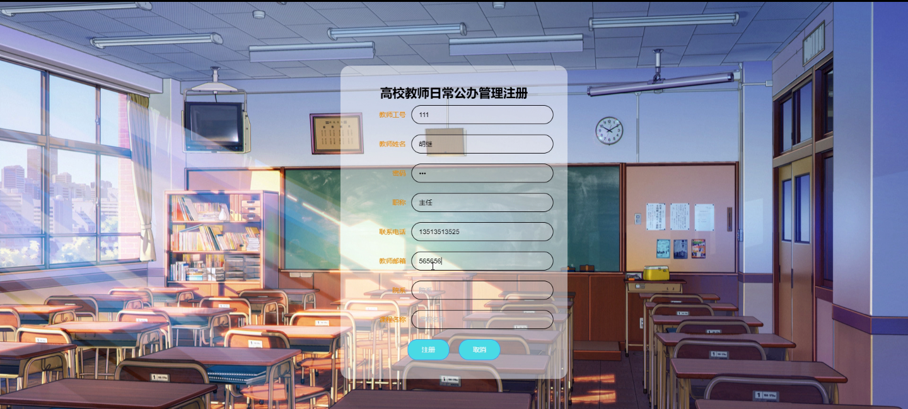
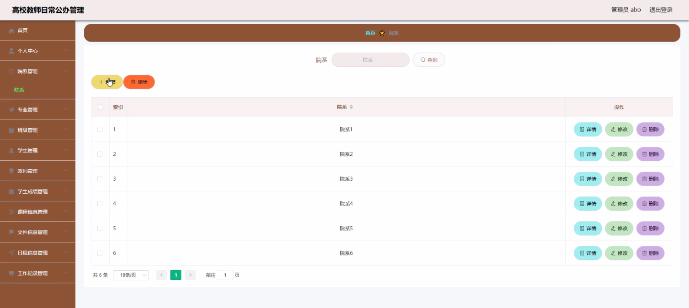
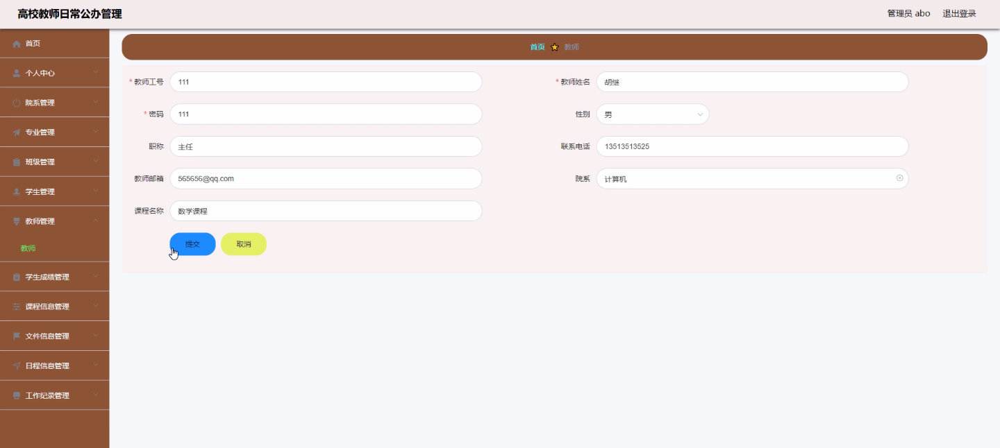
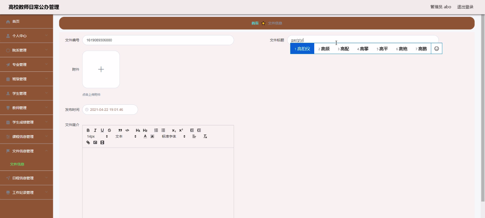
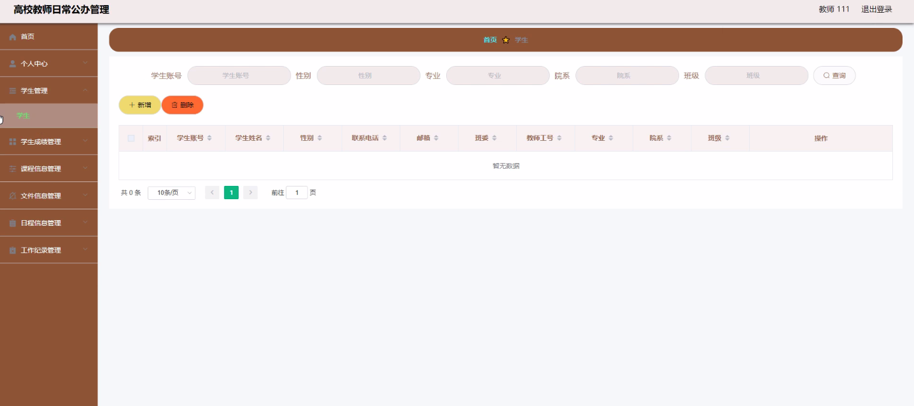
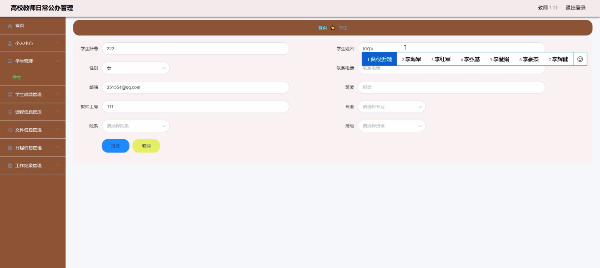
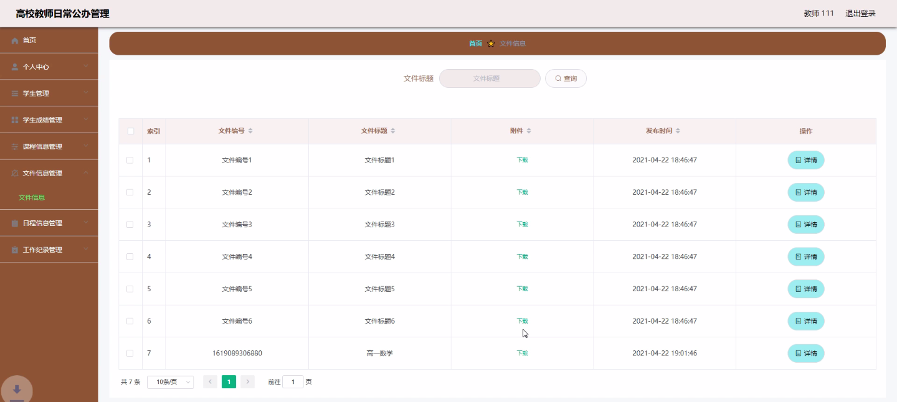

****本项目包含程序+源码+数据库+LW+调试部署环境，文末可获取一份本项目的java源码和数据库参考。****

## ******开题报告******

研究背景、意义和目的：

在高校教师日常公办管理中，信息化技术的应用已经成为一种趋势。随着高校规模的不断扩大和信息化水平的提升，传统的手工管理方式已经无法满足日益增长的管理需求。因此，建立一个高效、准确、便捷的管理系统对于提高教师日常公办管理的效率和质量具有重要意义。

首先，研究背景是指当前高校教师日常公办管理存在的问题和挑战。传统的手工管理方式容易出现信息不准确、处理效率低下、数据存储困难等问题，给教师和管理者带来了很大的困扰。同时，高校管理者需要及时获取各项管理指标和数据，以便进行科学决策和合理安排资源。因此，开展相关研究具有迫切的现实意义。

其次，研究意义在于探索和应用信息化技术，改进高校教师日常公办管理方式。通过引入先进的管理系统，可以实现教师、学生、院系等多方面信息的集中管理和共享，提高管理效率和准确性。同时，还可以为高校管理者提供科学的数据支持，辅助他们进行决策和资源分配。

最后，研究目的是为了构建一个全面、系统、高效的高校教师日常公办管理系统。通过对系统功能的深入研究和需求分析，可以确定系统的基本框架和核心功能，并设计相应的算法和模型。同时，还需要考虑系统的安全性、稳定性和易用性等方面，以满足实际应用的需求。

进度安排：

2022年9月至10月：开题报告编写和提交，完成开题报告的撰写并提交给指导教师进行审核。

2022年11月至2023年1月：系统设计和开发，根据开题报告的要求，进行系统设计和编码工作。

2023年2月至3月：论文撰写和初稿完成，开始撰写论文，并在这个阶段完成论文的初稿。

2023年4月至5月：论文修改和最终定稿，根据指导教师的意见对论文进行修改，并完成最终的定稿。

2023年5月：论文答辩和提交，参加论文答辩并根据答辩结果进行修改，最后将论文提交给学院或学校。

参考文献：

[1]喻佳,吴丹新.基于SpringBoot的Web快速开发框架[J].电脑编程技巧与维护,2021,(09):31-33.

[2]李鹏.基于SpringBoot快速开发平台的实现[J].电子技术与软件工程,2021,(12):36-37.

[3]叶开平,蔡维晟,陈家敏,邓斯妮.基于SpringBoot的综测可视化管理系统的研究与设计[J].电脑知识与技术,2021,(12):100-104.

[4]江健锋,徐振平.Springboot最小系统的设计与实现[J].电脑知识与技术,2021,(04):62-63.

[5]赵炯,司圣杰,周奇才,熊肖磊.通用信息获取系统设计与实现[J].起重运输机械,2020,(16):89-97.

[6]吴英宾.一种内外网数据交互系统的设计与实现[J].软件工程,2020,(08):25-27.

****以上是本项目程序开发之前开题报告内容，最终成品以下面界面为准，大家可以酌情参考使用。要源码参考请在文末进行获取！！****

## ******本项目的界面展示******

