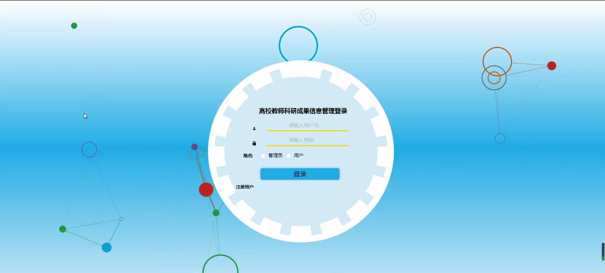
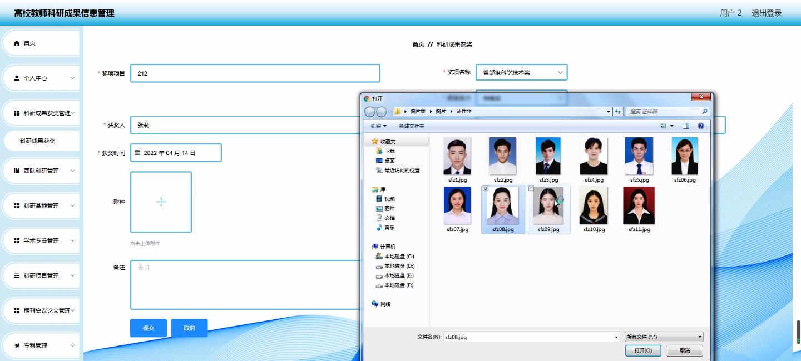
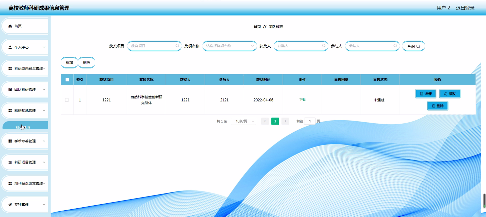
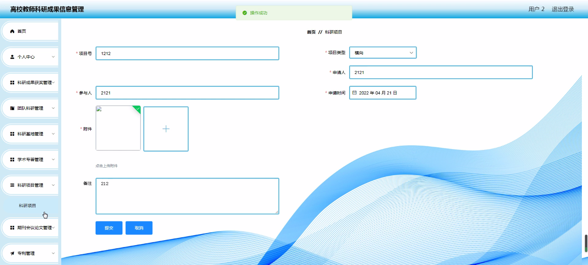
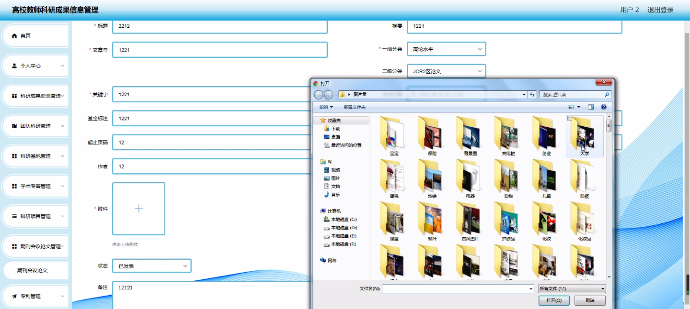
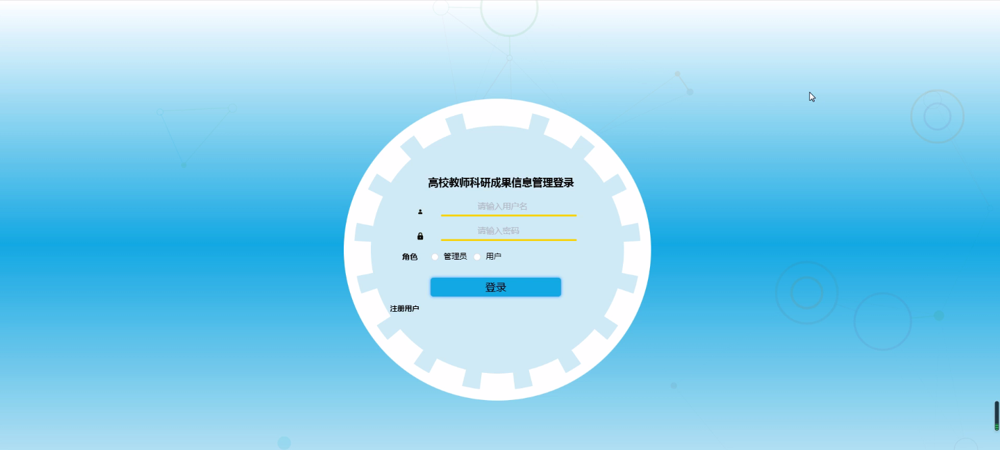
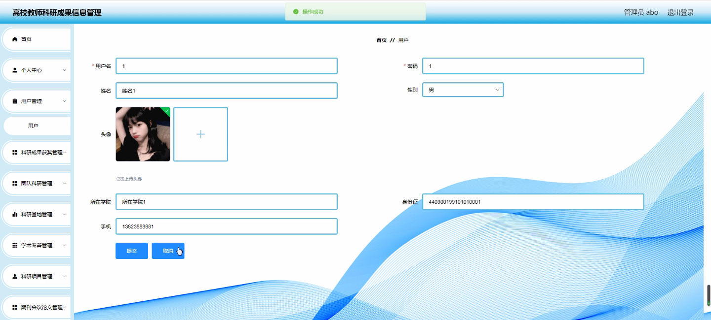
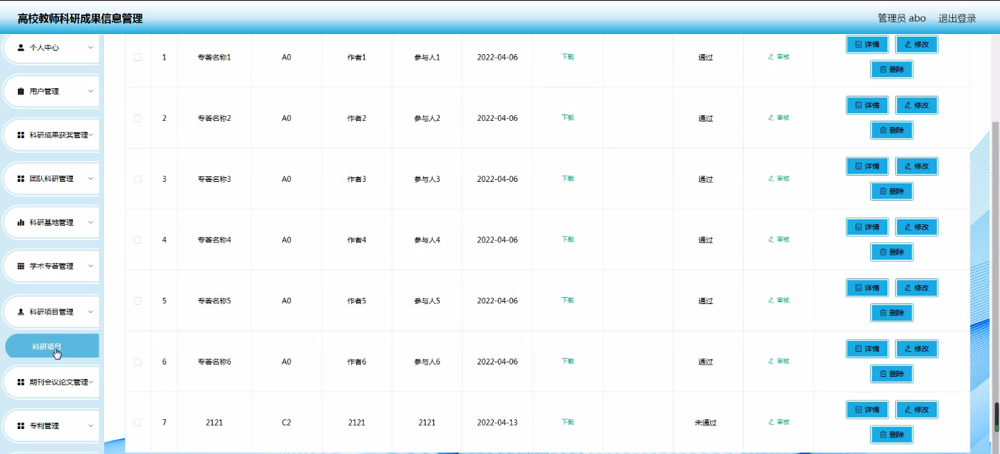

****本项目包含程序+源码+数据库+LW+调试部署环境，文末可获取一份本项目的java源码和数据库参考。****

## ******开题报告******

研究背景：
随着高校教师科研工作的不断发展和深化，科研成果的数量和质量也在逐年提升。然而，由于信息管理体系的滞后和不完善，科研成果的管理仍存在一些问题。传统的手工记录和纸质档案管理方式已经无法满足大规模、高效率的科研成果管理需求。因此，建立一套高校教师科研成果信息管理系统势在必行。

研究意义：
科研成果是高校教师的核心竞争力和学术声誉的重要体现，对于推动学术进步、提升高校教育质量、促进社会经济发展具有重要意义。通过建立科研成果信息管理系统，可以更好地整合和利用科研成果资源，提高科研成果的可见性和影响力，促进学术交流与合作，为高校教师的科研工作提供有效支持。

研究目的：
本研究旨在设计和开发一套高校教师科研成果信息管理系统，实现对科研成果的全生命周期管理，包括科研成果的录入、存储、检索、评价和展示等功能。通过该系统，高校教师可以方便地管理自己的科研成果，并与他人分享和交流，提高科研工作的效率和质量。

研究内容： 本研究的主要内容包括以下几个方面：

  1. 用户管理：设计和实现用户注册、登录、权限管理等功能，确保科研成果信息的安全性和可信度。

  2. 科研成果获奖管理：建立科研成果获奖的数据库，记录和管理科研成果的获奖情况，为高校教师的评优晋级提供参考依据。

  3. 团队科研管理：支持团队科研成果的协同管理，包括团队成员的科研成果共享、合作研究项目的管理等。

  4. 科研基地管理：建立科研基地的档案库，记录和管理科研基地的相关信息，为科研资源的整合和利用提供支持。

  5. 学术专著管理：建立学术专著的数据库，记录和管理高校教师出版的学术专著，提高学术影响力和知名度。

  6. 科研项目管理：支持科研项目的申报、执行和结题管理，提高科研项目的管理效率和质量。

  7. 期刊会议论文管理：建立期刊会议论文的数据库，记录和管理高校教师发表的期刊会议论文，提高学术交流与合作的机会。

  8. 专利管理：建立专利的数据库，记录和管理高校教师申请和获得的专利，促进科技成果的转化和应用。

  9. 其他信息管理：支持其他与科研成果相关的信息管理，如科研经费管理、科研仪器设备管理等。

拟解决的主要问题： 通过建立高校教师科研成果信息管理系统，旨在解决以下问题：

  1. 科研成果信息分散、难以查找的问题；
  2. 科研成果管理效率低下的问题；
  3. 科研成果共享和交流不便的问题；
  4. 科研成果评价和展示不全面的问题；
  5. 科研成果资源利用不充分的问题。

研究方案和预期成果：
本研究将采用软件工程的方法，设计和开发一套高校教师科研成果信息管理系统。通过需求分析、系统设计、编码实现和系统测试等步骤，最终完成一个功能完善、易于使用的科研成果信息管理系统。预期成果包括系统的正常运行和科研成果信息的高效管理，为高校教师的科研工作提供有效支持。

进度安排：

2022年9月至10月：需求分析和规划，明确系统功能和目标，制定项目计划。

2022年11月至2023年1月：系统设计和编码，完成详细的系统设计并开始编写代码。

2023年2月至3月：用户界面开发和数据库开发，开发用户友好的界面和设计数据库结构。

2023年4月至5月：功能测试、文档编写和上线部署，对系统进行全面的功能测试并编写用户手册。

2023年5月：维护和升级，定期对系统进行维护和升级，修复bug和添加新功能。

参考文献：

[1]邱小群,邓丽艳,陈海潮.基于B/S的信息管理系统设计和实现[J].信息与电脑(理论版),2022,(20):146-148.

[2]谢霜.基于Java技术的网络管理体系结构的应用[J].网络安全技术与应用,2022,(10):14-15.

[3]宋锦华.高职院校Java程序设计课程改革研究[J].科技视界,2022,(20):133-135.

[4]曹嵩彭,王鹏宇.浅析Java语言在软件开发中的应用[J].信息记录材料,2022,(03):114-116.

[5]朱澈,余俊达.武汉东湖学院.基于Java的软硬件信息管理系统V1.0[Z].项目立项编号.鉴定单位.鉴定日期:

****以上是本项目程序开发之前开题报告内容，最终成品以下面界面为准，大家可以酌情参考使用。要源码参考请在文末进行获取！！****

## ******本项目的界面展示******

