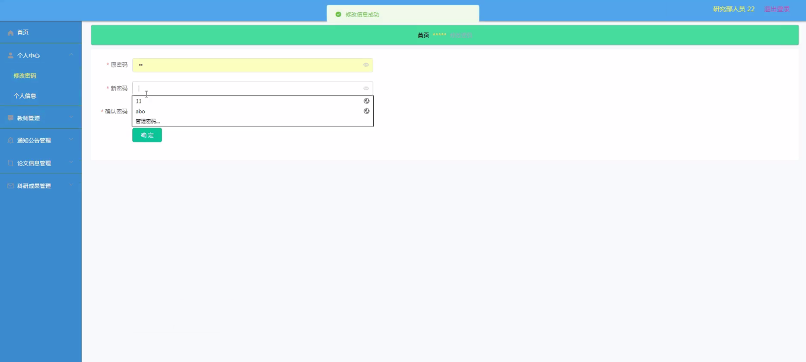
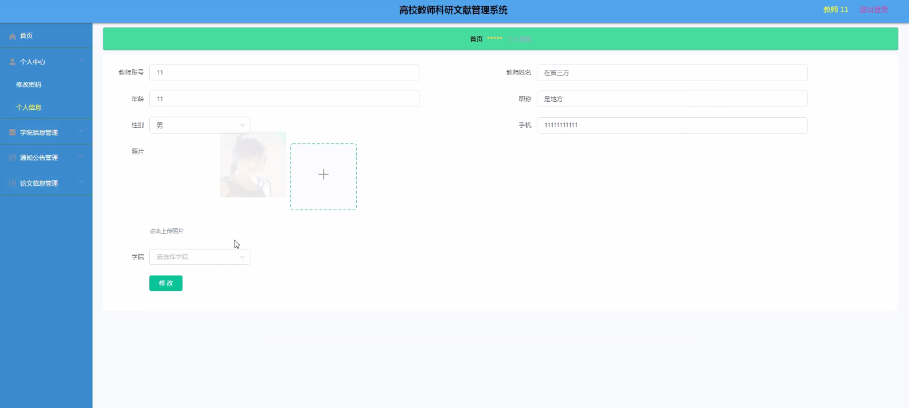
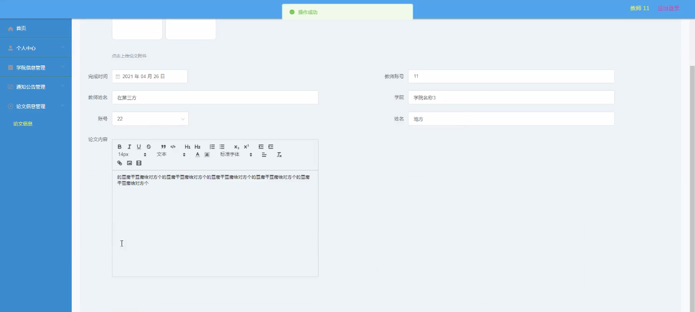
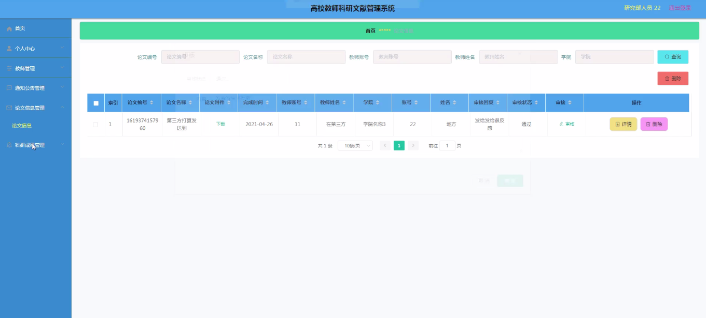
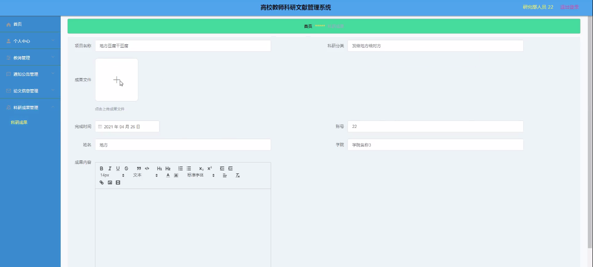
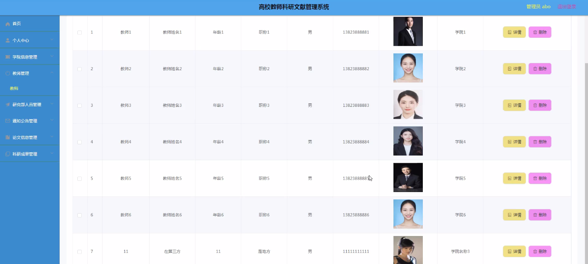
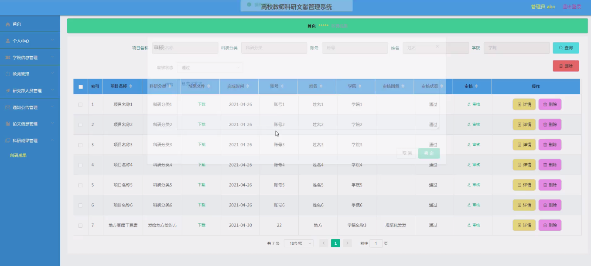

****本项目包含程序+源码+数据库+LW+调试部署环境，文末可获取一份本项目的java源码和数据库参考。****

## ******开题报告******

研究背景：
随着高校教师科研工作的不断深入和发展，科研文献管理成为了一个重要的问题。传统的文献管理方式存在诸多问题，如信息获取困难、文献整理繁琐、查找效率低下等。因此，建立一套高校教师科研文献管理系统具有重要的现实意义。

研究意义：
该系统的建立将有效提升高校教师的科研工作效率和质量，促进学术交流与合作，推动科研成果的转化与应用。同时，该系统还可以为高校管理部门提供科研数据支持，有助于科研资源的合理配置和决策制定。

研究目的：
本研究旨在设计和开发一种高校教师科研文献管理系统，通过利用现代信息技术手段，解决传统文献管理方式存在的问题，提高高校教师的科研工作效率和质量，推动科研成果的创新与应用。

研究内容：
本研究将围绕教师科研文献管理系统的功能展开，包括教师、研究部人员、通知公告、论文信息、科研成果、学院信息等系统功能。具体内容包括但不限于以下几个方面：

  1. 设计和实现教师科研文献管理模块，提供文献的录入、查找、整理等功能。
  2. 开发研究部人员管理模块，支持对科研项目、经费、成果等信息的管理与统计。
  3. 构建通知公告发布模块，方便高校教师及时获取科研相关信息。
  4. 建立论文信息管理模块，提供论文投稿、审稿、发表等全流程管理服务。
  5. 实现科研成果管理模块，支持对科研成果的登记、评价、推广等操作。
  6. 构建学院信息管理模块，提供学院科研资源的共享和查询。

拟解决的主要问题：
通过该系统的设计和开发，将解决传统文献管理方式存在的信息获取困难、文献整理繁琐、查找效率低下等问题。同时，该系统还将提供一站式的科研管理服务，方便教师进行科研工作的规范化和系统化管理。

研究方案和预期成果：
本研究将采用软件工程的方法，包括需求分析、系统设计、编码实现和测试等环节，逐步完成高校教师科研文献管理系统的开发。预期成果包括一个功能完善、界面友好、易于使用的系统原型，并通过实际应用验证系统的可行性和效果。

进度安排：

2022年9月至10月：开题报告编写和提交，完成开题报告的撰写并提交给指导教师进行审核。

2022年11月至2023年1月：系统设计和开发，根据开题报告的要求，进行系统设计和编码工作。

2023年2月至3月：论文撰写和初稿完成，开始撰写论文，并在这个阶段完成论文的初稿。

2023年4月至5月：论文修改和最终定稿，根据指导教师的意见对论文进行修改，并完成最终的定稿。

2023年5月：论文答辩和提交，参加论文答辩并根据答辩结果进行修改，最后将论文提交给学院或学校。

参考文献：

[1]喻佳,吴丹新.基于SpringBoot的Web快速开发框架[J].电脑编程技巧与维护,2021,(09):31-33.

[2]李鹏.基于SpringBoot快速开发平台的实现[J].电子技术与软件工程,2021,(12):36-37.

[3]叶开平,蔡维晟,陈家敏,邓斯妮.基于SpringBoot的综测可视化管理系统的研究与设计[J].电脑知识与技术,2021,(12):100-104.

[4]江健锋,徐振平.Springboot最小系统的设计与实现[J].电脑知识与技术,2021,(04):62-63.

[5]赵炯,司圣杰,周奇才,熊肖磊.通用信息获取系统设计与实现[J].起重运输机械,2020,(16):89-97.

[6]吴英宾.一种内外网数据交互系统的设计与实现[J].软件工程,2020,(08):25-27.

****以上是本项目程序开发之前开题报告内容，最终成品以下面界面为准，大家可以酌情参考使用。要源码参考请在文末进行获取！！****

## ******本项目的界面展示******

