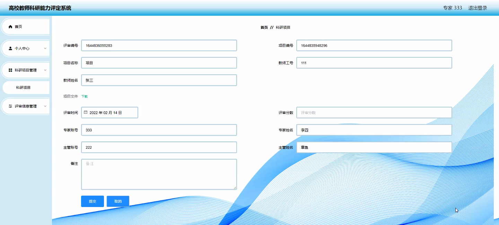
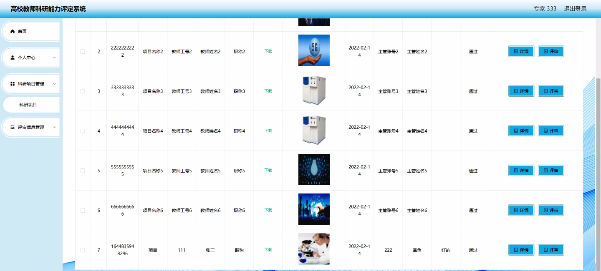
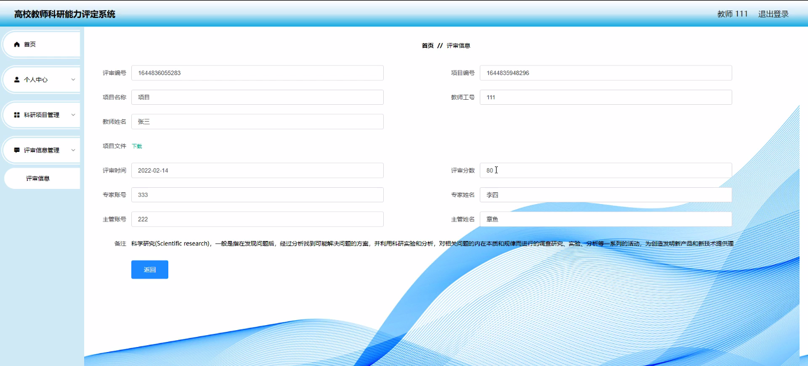

****本项目包含程序+源码+数据库+LW+调试部署环境，文末可获取一份本项目的java源码和数据库参考。****

## ******开题报告******

研究背景：
随着高校教师科研工作的日益重要和科研经费的不断增加，对于评估教师科研能力的需求也越来越迫切。然而，目前大部分高校在教师科研能力评定方面仍存在一些问题，如评价标准不统一、评估方法不科学等。因此，建立一个科学、全面、客观的高校教师科研能力评定系统具有重要意义。

研究意义：
该评定系统的建立将为高校提供一个科学、公正、可操作的教师科研能力评估工具，有助于促进教师的科研积极性和创新能力的提升。同时，通过对教师科研能力的准确评估，可以更好地发现和培养优秀的科研人才，提高高校科研水平和竞争力。

研究目的：
本研究旨在构建一套高校教师科研能力评定系统，通过对教师的科研项目、评审信息、科研统计分析等多个维度的综合评估，全面了解教师的科研能力，并提供科学的评价结果。通过该系统，可以为高校提供科学决策依据，促进科研工作的规范化和提升。

研究内容： 本研究将从以下几个方面展开：

  1. 教师信息管理：建立一个完善的教师信息数据库，包括教师个人基本信息、科研项目情况、科研成果等，以便对教师进行全面的评估。

  2. 科研项目管理：设计科研项目管理模块，包括项目申报、项目审核、项目执行等功能，以确保科研项目的规范进行。

  3. 评审信息管理：建立评审信息管理模块，记录评审专家的评审意见和评分情况，为教师科研能力评定提供参考。

  4. 科研统计分析：利用系统中的科研统计分析功能，对教师的科研成果、科研经费使用情况等进行数据分析，为评定教师科研能力提供依据。

  5. 部门类别、科研类别管理：建立部门类别和科研类别管理模块，对不同部门和科研类别的教师进行分类管理，以便更好地进行科研能力评定。

拟解决的主要问题：
本研究旨在解决高校教师科研能力评定中存在的标准不统一、评估方法不科学等问题。通过建立科学、全面、客观的评定系统，实现对教师科研能力的准确评估，为高校提供科学决策依据。

研究方案和预期成果：
本研究将采用综合研究方法，包括文献调研、专家访谈、数据分析等，构建高校教师科研能力评定系统。预期成果包括建立完善的教师信息管理系统、科研项目管理模块、评审信息管理模块、科研统计分析功能等，为高校教师科研能力评定提供科学、全面的支持。

进度安排：

2022年9月至10月：需求分析和规划，进行用户需求调研和分析，确定系统功能和目标。

2022年11月至2023年1月：系统设计和开发，完成系统架构设计和技术选型，并开始编写代码。

2023年2月至3月：测试和优化，进行单元测试和集成测试，修复问题并优化系统性能。

2023年4月至5月：文档编写和培训，编写用户手册和系统文档，并进行相关人员的培训。

2023年5月：上线部署和维护，将系统部署到生产环境中，并定期进行维护和升级。

参考文献：

[1]王振华.SpringBoot在教学效果评估系统中的应用[J].电子技术,2023,(05):67-69.

[2]王明泉.基于SpringBoot远程热部署的探索和应用[J].信息与电脑(理论版),2023,(07):1-4.

[3]王亚东,李晓霞,陈强强,剡美娜.基于SpringBoot的需求发布平台设计[J].信息与电脑(理论版),2023,(01):105-107.

[4]陈新府豪.基于SpringBoot和Vue框架的创新方法推理系统的设计与实现[D].导师：黄静.浙江理工大学,2022.

[5]霍福华,韩慧.基于SpringBoot微服务架构下前后端分离的MVVM模型[J].电子技术与软件工程,2022,(01):73-76.

[6]韩策,张娜,王松亭,张凯,何方,袁峰.SpringBoot OPC客户端设计与研究[J].电子世界,2021,(19):25-26.

****以上是本项目程序开发之前开题报告内容，最终成品以下面界面为准，大家可以酌情参考使用。要源码参考请在文末进行获取！！****

## ******本项目的界面展示******

