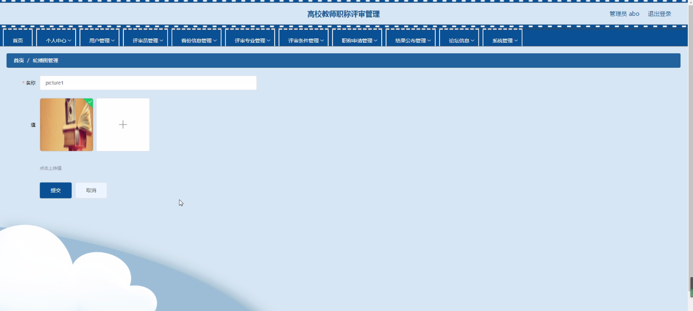

****本项目包含程序+源码+数据库+LW+调试部署环境，文末可获取一份本项目的java源码和数据库参考。****

## ******开题报告******

研究背景：
高校教师职称评审管理是高等教育领域中一项重要的制度，它对于促进教师专业发展、提高教学质量和推动学术研究具有重要意义。随着高校教育的不断发展和改革，职称评审管理也面临着新的挑战和需求。因此，深入研究高校教师职称评审管理的背景、意义和目的，对于优化评审管理制度、提升教师队伍素质具有重要意义。

研究意义：
研究高校教师职称评审管理的意义在于探索如何建立科学、公正、有效的评审体系，以确保教师职称评审工作的公平性和准确性。通过研究，可以为高校教师职称评审管理的改革提供理论支持和实践指导，进一步提高教师职称评审的科学性和规范性，推动高校教师队伍的专业发展和学术水平的提升。

研究目的：
本研究旨在深入分析高校教师职称评审管理的现状和存在的问题，探索有效的改进措施，提出科学、公正、可行的评审管理方案，以促进高校教师职称评审工作的规范化和专业化。通过研究，旨在为高校教师职称评审管理的改革和完善提供参考和借鉴，推动高等教育质量的提升。

研究内容： 本研究将围绕高校教师职称评审管理展开深入研究，主要包括以下内容：

  1. 用户：分析不同用户（如教师、评审员、职称申请者等）在职称评审管理中的角色和需求，探讨如何满足不同用户的需求，提高用户体验。

  2. 评审专业：研究不同学科领域的评审标准和要求，探索建立科学、全面的评审专业体系，确保评审工作的科学性和准确性。

  3. 评审条件：分析评审条件的设置和应用情况，探讨如何合理确定评审条件，提高评审的公正性和透明度。

  4. 职称申请：研究职称申请的流程和要求，探索如何简化申请流程、提高申请效率，为教师职称评审提供便利。

  5. 评审员：研究评审员的选拔、培训和管理机制，探讨如何确保评审员的专业素质和公正性，提高评审工作的质量和效果。

  6. 省份信息：分析不同省份的职称评审管理情况，比较各地的经验和做法，为跨地区的评审管理提供参考和借鉴。

  7. 结果公布：研究评审结果的公布方式和机制，探讨如何及时、准确地公布评审结果，增强评审的公信力和权威性。

拟解决的主要问题：

  1. 如何建立科学、公正、有效的高校教师职称评审体系？
  2. 如何满足不同用户的需求，提高评审管理的用户体验？
  3. 如何确定评审条件，提高评审的公正性和透明度？
  4. 如何简化职称申请流程，提高申请效率？
  5. 如何确保评审员的专业素质和公正性，提高评审工作的质量和效果？

研究方案和预期成果将在后续的研究中进行详细探讨和阐述。

进度安排：

2022年9月至10月：需求分析和规划，明确系统功能和目标，制定项目计划。

2022年11月至2023年1月：系统设计和编码，完成详细的系统设计并开始编写代码。

2023年2月至3月：用户界面开发和数据库开发，开发用户友好的界面和设计数据库结构。

2023年4月至5月：功能测试、文档编写和上线部署，对系统进行全面的功能测试并编写用户手册。

2023年5月：维护和升级，定期对系统进行维护和升级，修复bug和添加新功能。

参考文献：

[1]邱小群,邓丽艳,陈海潮.基于B/S的信息管理系统设计和实现[J].信息与电脑(理论版),2022,(20):146-148.

[2]谢霜.基于Java技术的网络管理体系结构的应用[J].网络安全技术与应用,2022,(10):14-15.

[3]宋锦华.高职院校Java程序设计课程改革研究[J].科技视界,2022,(20):133-135.

[4]曹嵩彭,王鹏宇.浅析Java语言在软件开发中的应用[J].信息记录材料,2022,(03):114-116.

[5]朱澈,余俊达.武汉东湖学院.基于Java的软硬件信息管理系统V1.0[Z].项目立项编号.鉴定单位.鉴定日期:

****以上是本项目程序开发之前开题报告内容，最终成品以下面界面为准，大家可以酌情参考使用。要源码参考请在文末进行获取！！****

## ******本项目的界面展示******

