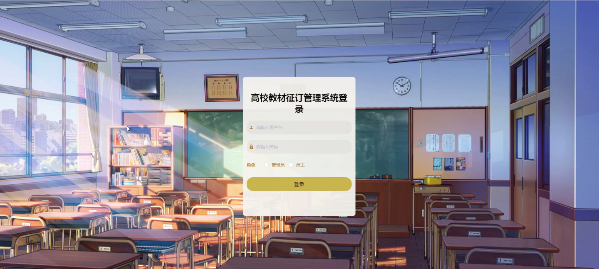
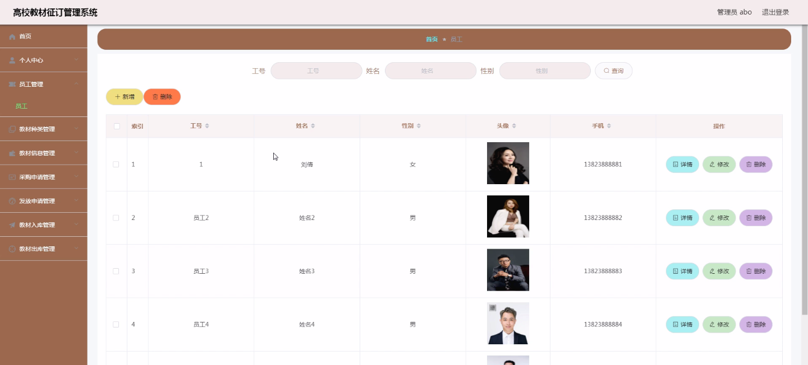
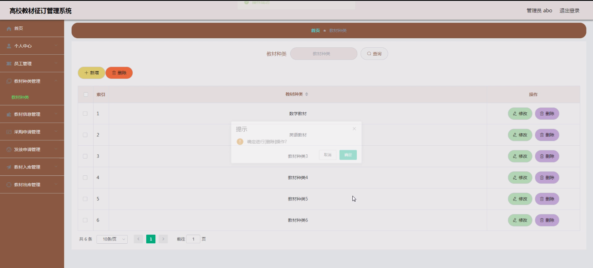
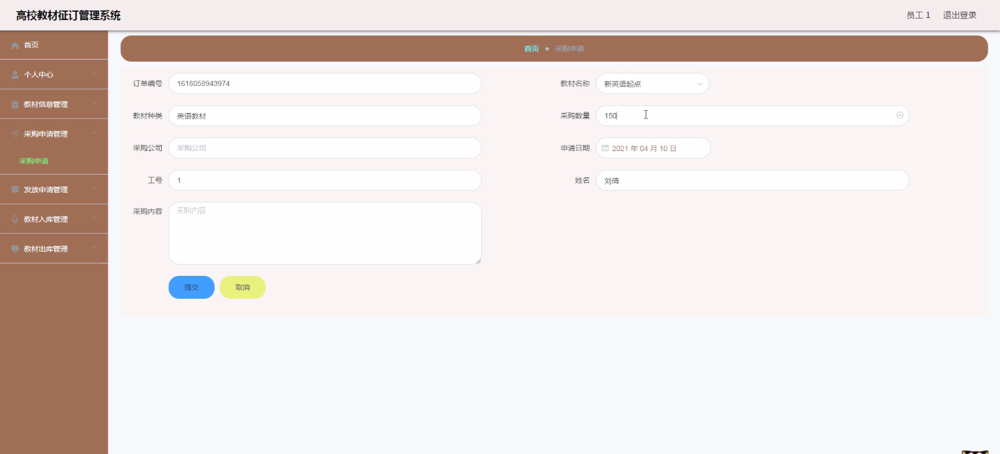
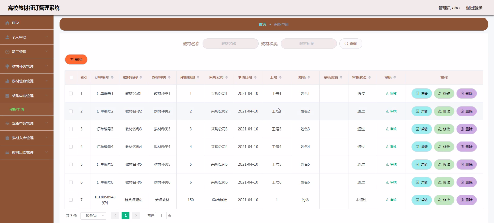
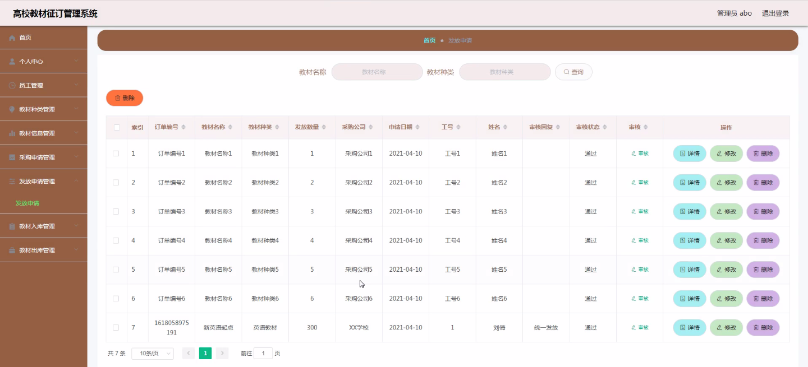
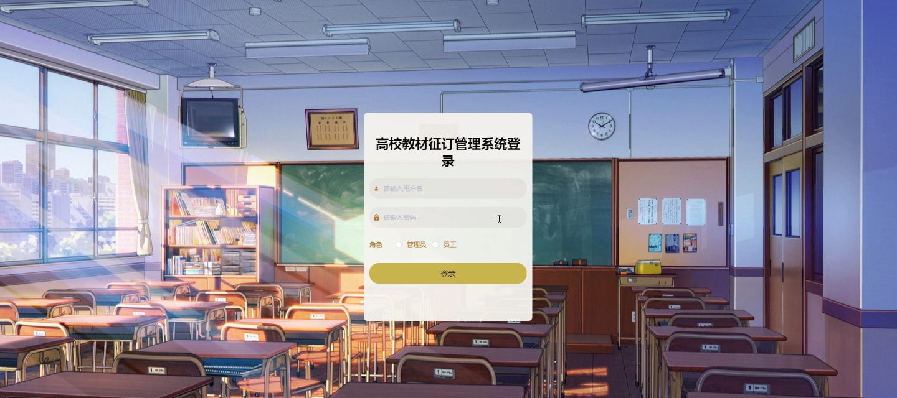

****本项目包含程序+源码+数据库+LW+调试部署环境，文末可获取一份本项目的java源码和数据库参考。****

## ******开题报告******

研究背景：
随着高校教育的普及和发展，高校教材的征订工作变得越来越重要。传统的手工管理方式已经无法满足大规模高校的需求，因此需要建立一个高效、便捷的高校教材征订管理系统。该系统将通过信息化技术手段，实现对教材征订过程中的各个环节进行全面管理和监控，提高教材征订的效率和准确性。

研究意义：
建立高校教材征订管理系统具有重要的实践意义和推广价值。首先，该系统可以有效地解决传统手工管理方式中存在的问题，如流程繁琐、易出错等，提高工作效率和准确性。其次，该系统可以为高校提供准确的教材征订数据，为教学改革和课程建设提供参考依据。最后，该系统的建立还可以促进高校教材征订工作的规范化和标准化，提升高校的管理水平和服务质量。

研究目的：
本研究旨在设计和开发一套高校教材征订管理系统，以满足高校教材征订工作的需求。通过该系统，可以实现对教材征订过程中的各个环节进行全面管理和监控，提高教材征订的效率和准确性。同时，通过对系统功能的优化和改进，提供更好的用户体验和服务质量。

研究内容： 本研究将围绕高校教材征订管理系统展开，主要包括以下内容：

  1. 员工管理：设计员工信息录入、权限管理等功能，确保系统的安全性和可靠性。
  2. 教材种类管理：建立教材种类的分类体系，方便教材的管理和查询。
  3. 教材信息管理：包括教材的基本信息、库存信息、价格信息等，为教材征订提供准确的数据支持。
  4. 采购申请管理：设计采购申请流程，实现对教材采购过程的监控和管理。
  5. 发放申请管理：建立发放申请流程，确保教材的及时发放和追踪。
  6. 教材入库管理：实现教材入库的登记和管理，确保教材库存的准确性和及时性。
  7. 教材出库管理：设计教材出库流程，确保教材的安全和有效使用。

拟解决的主要问题：
通过建立高校教材征订管理系统，将解决传统手工管理方式中存在的流程繁琐、易出错等问题。同时，该系统还可以提供准确的教材征订数据，为教学改革和课程建设提供参考依据。通过优化和改进系统功能，提供更好的用户体验和服务质量。

研究方案和预期成果：
本研究将采用软件开发的方法，设计和开发一套高校教材征订管理系统。通过需求分析、系统设计、编码实现和测试验证等步骤，最终完成系统的开发和部署。预期成果包括一个功能完善、操作简便的高校教材征订管理系统，并在实际应用中取得良好的效果。该系统将提高教材征订的效率和准确性，为高校教育的发展提供有力支持。

进度安排：

2022年9月至10月：开题报告编写和提交，完成开题报告的撰写并提交给指导教师进行审核。

2022年11月至2023年1月：系统设计和开发，根据开题报告的要求，进行系统设计和编码工作。

2023年2月至3月：论文撰写和初稿完成，开始撰写论文，并在这个阶段完成论文的初稿。

2023年4月至5月：论文修改和最终定稿，根据指导教师的意见对论文进行修改，并完成最终的定稿。

2023年5月：论文答辩和提交，参加论文答辩并根据答辩结果进行修改，最后将论文提交给学院或学校。

参考文献：

[1]喻佳,吴丹新.基于SpringBoot的Web快速开发框架[J].电脑编程技巧与维护,2021,(09):31-33.

[2]李鹏.基于SpringBoot快速开发平台的实现[J].电子技术与软件工程,2021,(12):36-37.

[3]叶开平,蔡维晟,陈家敏,邓斯妮.基于SpringBoot的综测可视化管理系统的研究与设计[J].电脑知识与技术,2021,(12):100-104.

[4]江健锋,徐振平.Springboot最小系统的设计与实现[J].电脑知识与技术,2021,(04):62-63.

[5]赵炯,司圣杰,周奇才,熊肖磊.通用信息获取系统设计与实现[J].起重运输机械,2020,(16):89-97.

[6]吴英宾.一种内外网数据交互系统的设计与实现[J].软件工程,2020,(08):25-27.

****以上是本项目程序开发之前开题报告内容，最终成品以下面界面为准，大家可以酌情参考使用。要源码参考请在文末进行获取！！****

## ******本项目的界面展示******

