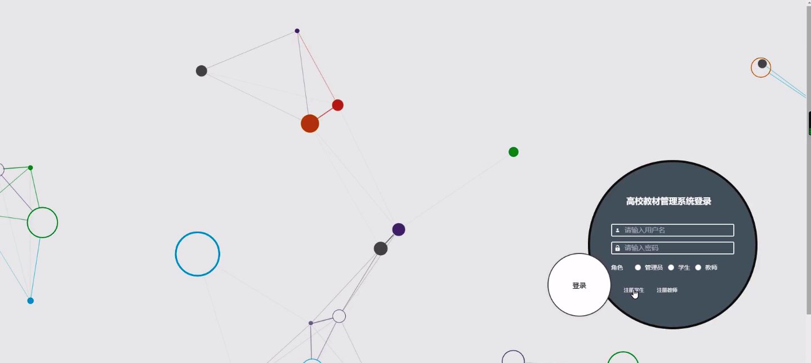
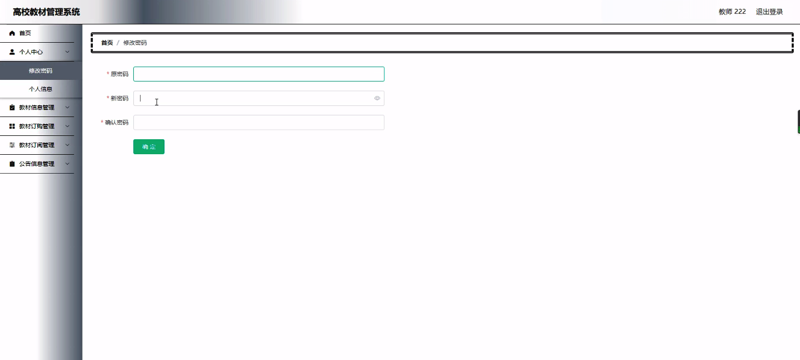
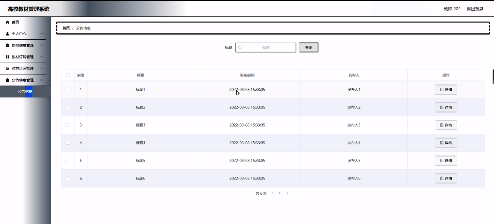
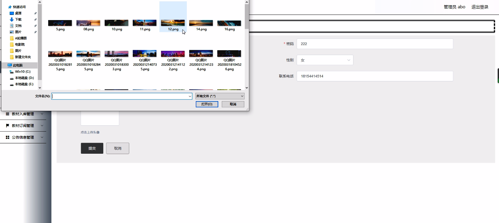
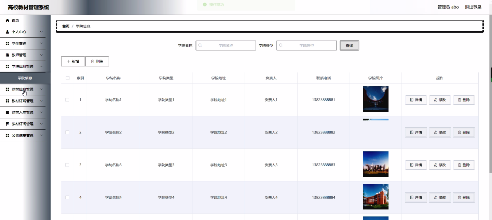
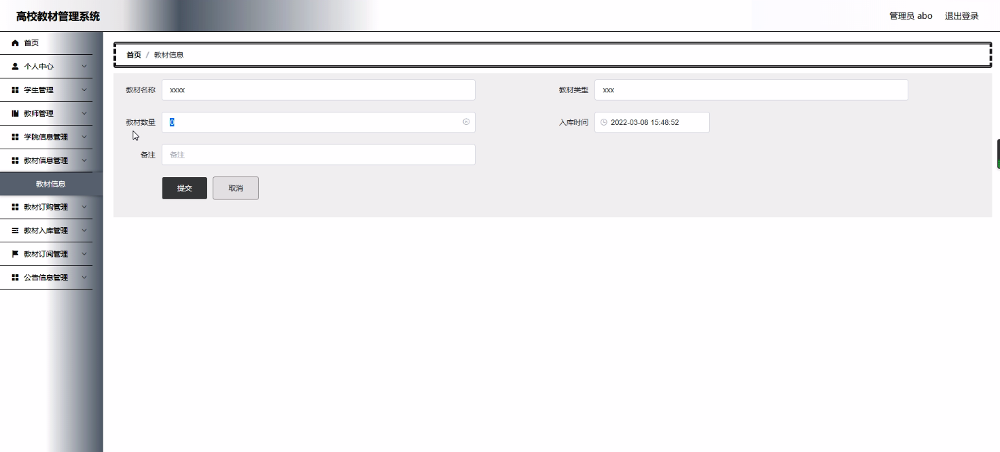
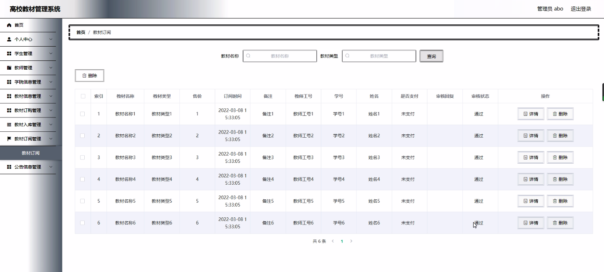
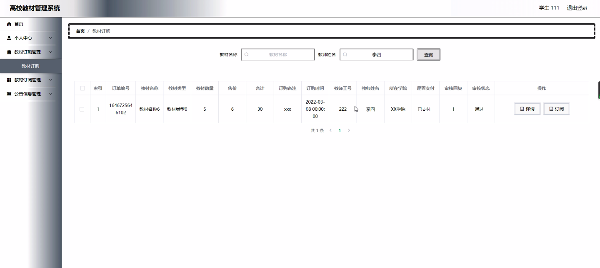

****本项目包含程序+源码+数据库+LW+调试部署环境，文末可获取一份本项目的java源码和数据库参考。****

## ******开题报告******

研究背景：
随着高校教育的发展和信息化技术的广泛应用，高校教材管理面临着越来越多的挑战。传统的教材管理方式存在着许多问题，如信息不透明、流程繁琐、效率低下等。为了提高教材管理的效率和质量，建立一套科学合理的高校教材管理系统势在必行。

研究意义：
高校教材管理系统的建立对于高校教育具有重要的意义。首先，它可以提高教材管理的效率，减少人力资源的浪费，实现教材的精确配送和管理。其次，它可以提供准确的教材信息，方便学生和教师进行查询和订购，避免了传统方式中可能出现的信息不准确和错漏的情况。此外，通过高校教材管理系统，还可以促进教材资源的共享和交流，提高教学质量和教学效果。

研究目的：
本研究旨在设计和开发一套高校教材管理系统，以解决传统教材管理方式存在的问题，并提高教材管理的效率和质量。通过系统功能的设计和实现，实现教材信息的准确记录、学生订购和教材配送的自动化处理，以及教材资源的共享和交流，从而提高高校教育的教材管理水平。

研究内容：
本研究的主要内容包括以下系统功能：学生信息管理、教师信息管理、学院信息管理、教材信息管理、教材入库管理、课程计划管理、学生订购管理、取消班级订购管理、取消学生订购管理、班级订购管理、教材出库管理、申请购买管理等。通过对这些功能的设计和实现，可以实现教材信息的准确记录和查询、学生和教师的订购和取消订购、教材的配送和出库等操作。

拟解决的主要问题：
本研究旨在解决传统高校教材管理方式存在的信息不透明、流程繁琐、效率低下等问题。通过建立高校教材管理系统，可以实现教材信息的准确记录和查询，学生和教师的方便订购和取消订购，教材的自动化配送和出库等功能，从而提高教材管理的效率和质量。

研究方案和预期成果：
本研究将采用系统开发的方法，包括需求分析、系统设计、编码实现和测试等步骤。通过对高校教材管理系统各功能模块的详细设计和实现，预计可以实现教材信息的准确记录和查询，学生和教师的方便订购和取消订购，教材的自动化配送和出库等功能。预期成果是建立一套科学合理、功能完善的高校教材管理系统，提高教材管理的效率和质量，促进教育教学的发展。

进度安排：

2022年9月至10月：开题报告编写和提交，完成开题报告的撰写并提交给指导教师进行审核。

2022年11月至2023年1月：系统设计和开发，根据开题报告的要求，进行系统设计和编码工作。

2023年2月至3月：论文撰写和初稿完成，开始撰写论文，并在这个阶段完成论文的初稿。

2023年4月至5月：论文修改和最终定稿，根据指导教师的意见对论文进行修改，并完成最终的定稿。

2023年5月：论文答辩和提交，参加论文答辩并根据答辩结果进行修改，最后将论文提交给学院或学校。

参考文献：

[1]喻佳,吴丹新.基于SpringBoot的Web快速开发框架[J].电脑编程技巧与维护,2021,(09):31-33.

[2]李鹏.基于SpringBoot快速开发平台的实现[J].电子技术与软件工程,2021,(12):36-37.

[3]叶开平,蔡维晟,陈家敏,邓斯妮.基于SpringBoot的综测可视化管理系统的研究与设计[J].电脑知识与技术,2021,(12):100-104.

[4]江健锋,徐振平.Springboot最小系统的设计与实现[J].电脑知识与技术,2021,(04):62-63.

[5]赵炯,司圣杰,周奇才,熊肖磊.通用信息获取系统设计与实现[J].起重运输机械,2020,(16):89-97.

[6]吴英宾.一种内外网数据交互系统的设计与实现[J].软件工程,2020,(08):25-27.

****以上是本项目程序开发之前开题报告内容，最终成品以下面界面为准，大家可以酌情参考使用。要源码参考请在文末进行获取！！****

## ******本项目的界面展示******

