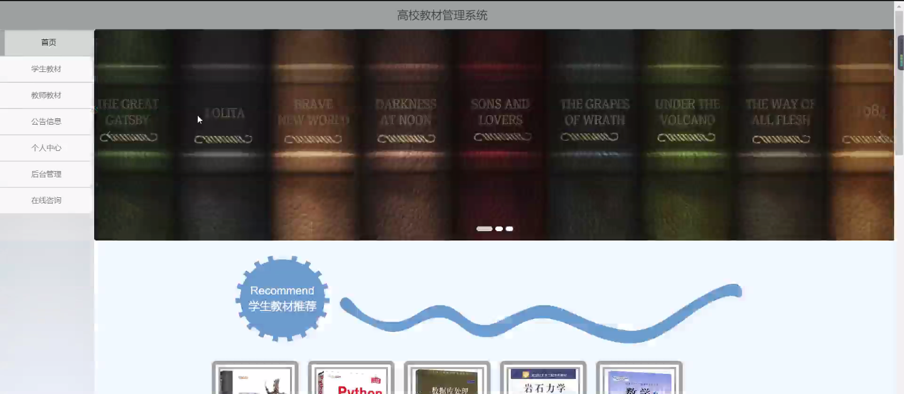

****本项目包含程序+源码+数据库+LW+调试部署环境，文末可获取一份本项目的java源码和数据库参考。****

## ******开题报告******

研究背景：
随着高校教育的不断发展，教材管理成为了一个重要的问题。传统的教材管理方式存在着许多问题，如教材分类不规范、学生购买流程繁琐、教师评价反馈不及时等。这些问题严重影响了教材管理的效率和质量，需要引入新的管理系统来解决。

研究意义：
建立一套高校教材管理系统具有重要的意义。首先，它可以提高教材管理的效率，减少人力资源的浪费。其次，它可以提供更好的教材选择和购买体验，满足学生和教师的需求。此外，通过教材评价功能，可以改进教材质量，提升教学效果。因此，研究高校教材管理系统具有积极的社会影响和经济效益。

研究目的：
本研究旨在设计和开发一套高校教材管理系统，以提高教材管理的效率和质量。通过该系统，学生和教师可以方便地选择、购买和评价教材，教材分类也将更加规范和清晰。同时，该系统还将提供教材入库、学生购买、教师购买等功能，以满足不同用户的需求。

研究内容：
本研究的主要内容包括以下系统功能：专业管理、学生管理、教师管理、教材分类管理、学生教材管理、教师教材管理、教材入库管理、学生购买管理、教师购买管理、学生评价管理、教师评价管理等。通过对这些功能的设计和实现，可以构建一套完整的高校教材管理系统。

拟解决的主要问题：
本研究旨在解决传统教材管理方式存在的问题，包括教材分类不规范、学生购买流程繁琐、教师评价反馈不及时等。通过引入高校教材管理系统，可以提高教材管理的效率和质量，使教材选择、购买和评价更加方便快捷。

研究方案和预期成果：
本研究将采用软件工程的方法，结合需求分析、系统设计和系统开发等技术手段，设计和开发一套高校教材管理系统。预期成果包括一个功能完善、操作简便的系统原型，并通过实际应用验证其效果。同时，预计该系统能够提高教材管理的效率和质量，为学生和教师提供更好的教材选择和购买体验，改进教材质量，提升教学效果。

进度安排：

2022年9月至10月：需求分析和规划，明确系统功能和目标，制定项目计划。

2022年11月至2023年1月：系统设计和编码，完成详细的系统设计并开始编写代码。

2023年2月至3月：用户界面开发和数据库开发，开发用户友好的界面和设计数据库结构。

2023年4月至5月：功能测试、文档编写和上线部署，对系统进行全面的功能测试并编写用户手册。

2023年5月：维护和升级，定期对系统进行维护和升级，修复bug和添加新功能。

参考文献：

[1]邱小群,邓丽艳,陈海潮.基于B/S的信息管理系统设计和实现[J].信息与电脑(理论版),2022,(20):146-148.

[2]谢霜.基于Java技术的网络管理体系结构的应用[J].网络安全技术与应用,2022,(10):14-15.

[3]宋锦华.高职院校Java程序设计课程改革研究[J].科技视界,2022,(20):133-135.

[4]曹嵩彭,王鹏宇.浅析Java语言在软件开发中的应用[J].信息记录材料,2022,(03):114-116.

[5]朱澈,余俊达.武汉东湖学院.基于Java的软硬件信息管理系统V1.0[Z].项目立项编号.鉴定单位.鉴定日期:

****以上是本项目程序开发之前开题报告内容，最终成品以下面界面为准，大家可以酌情参考使用。要源码参考请在文末进行获取！！****

## ******本项目的界面展示******

