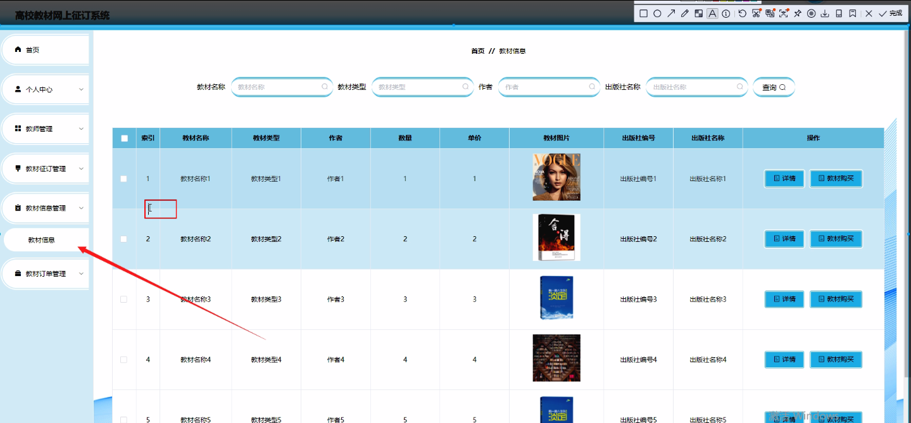
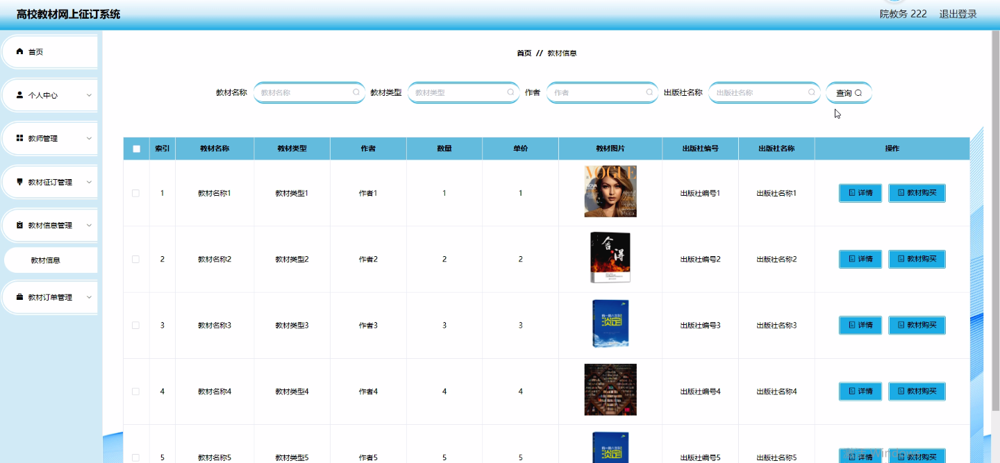
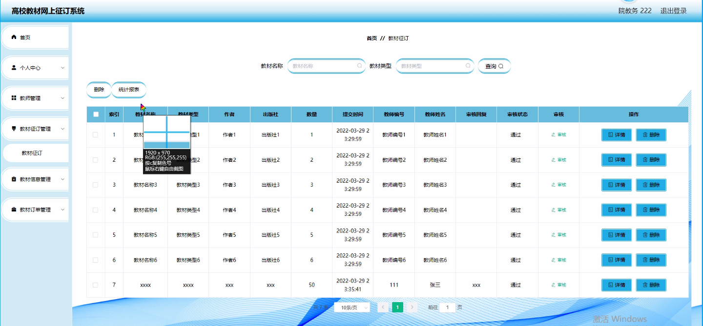
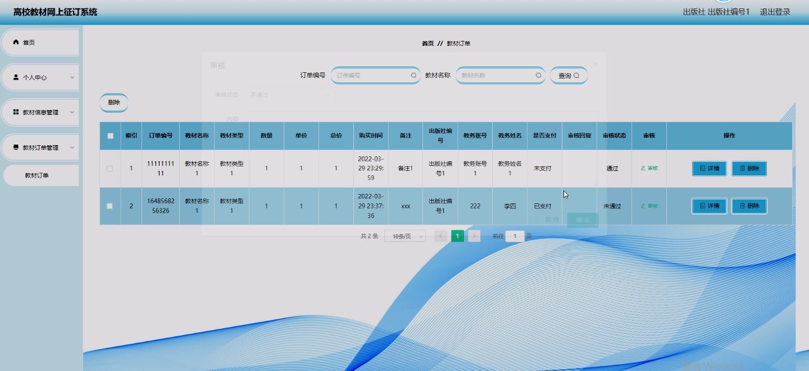
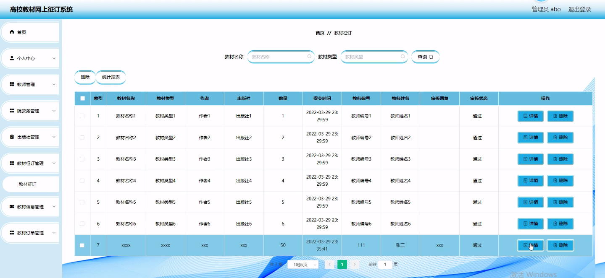

****本项目包含程序+源码+数据库+LW+调试部署环境，文末可获取一份本项目的java源码和数据库参考。****

## ******开题报告******

研究背景：
随着信息技术的迅速发展和互联网的普及，高校教育领域也逐渐进入了数字化时代。传统的教材征订方式存在一些问题，比如手工填写订单、邮寄征订等流程繁琐、效率低下，无法满足现代高校教育管理的需求。因此，开发一个高校教材网上征订系统具有重要的现实意义。

研究意义：
该系统的开发将使高校教材征订过程更加便捷、高效，并且能够提供全面的教材信息服务。教师、院教务、出版社以及学生都可以通过该系统进行在线操作，实现教材的快速征订和信息查询。这不仅能够提高教材征订的效率，减少人力资源的浪费，还能够为教育管理者提供数据支持，促进教育资源的优化配置。

研究目的：
本研究旨在设计和开发一个高校教材网上征订系统，以解决传统教材征订方式存在的问题，并提升高校教育管理的效率和质量。通过该系统，教师可以方便地选择教材、提交订单，院教务可以实时了解教材征订情况，出版社可以及时处理订单并提供相关服务，学生可以便捷地查询教材信息。通过系统的建立和应用，将为高校教育管理提供更加科学、便捷的工具。

研究内容：
本研究的主要内容包括教师功能模块、院教务功能模块、出版社功能模块、教材征订功能模块、教材信息功能模块以及教材订单功能模块。其中，教师功能模块包括教师账号管理、教材选择、订单提交等；院教务功能模块包括教材审核、统计分析等；出版社功能模块包括订单处理、库存管理等；教材征订功能模块包括教材征订流程、征订规则等；教材信息功能模块包括教材查询、评价等；教材订单功能模块包括订单查询、状态更新等。

拟解决的主要问题：

  1. 传统教材征订方式效率低下、流程繁琐的问题；
  2. 教材信息不透明、查询困难的问题；
  3. 教育管理者无法及时掌握教材征订情况的问题；
  4. 教师选择教材和提交订单过程中存在的不便利性问题；
  5. 学生获取教材信息的不便利性问题。

研究方案和预期成果：
本研究将采用系统开发的方法，结合需求分析和系统设计，开发一个高校教材网上征订系统。通过实现各个功能模块，提供用户友好的界面和操作流程，优化教材征订流程，提高教育管理效率。预期成果包括一个稳定可靠的高校教材网上征订系统，能够满足教师、院教务、出版社和学生的需求，提升高校教育管理水平，促进教育资源的合理配置。

进度安排：

2022年9月至10月：需求分析和规划，进行用户需求调研和分析，确定系统功能和目标。

2022年11月至2023年1月：系统设计和开发，完成系统架构设计和技术选型，并开始编写代码。

2023年2月至3月：测试和优化，进行单元测试和集成测试，修复问题并优化系统性能。

2023年4月至5月：文档编写和培训，编写用户手册和系统文档，并进行相关人员的培训。

2023年5月：上线部署和维护，将系统部署到生产环境中，并定期进行维护和升级。

参考文献：

[1]王振华.SpringBoot在教学效果评估系统中的应用[J].电子技术,2023,(05):67-69.

[2]王明泉.基于SpringBoot远程热部署的探索和应用[J].信息与电脑(理论版),2023,(07):1-4.

[3]王亚东,李晓霞,陈强强,剡美娜.基于SpringBoot的需求发布平台设计[J].信息与电脑(理论版),2023,(01):105-107.

[4]陈新府豪.基于SpringBoot和Vue框架的创新方法推理系统的设计与实现[D].导师：黄静.浙江理工大学,2022.

[5]霍福华,韩慧.基于SpringBoot微服务架构下前后端分离的MVVM模型[J].电子技术与软件工程,2022,(01):73-76.

[6]韩策,张娜,王松亭,张凯,何方,袁峰.SpringBoot OPC客户端设计与研究[J].电子世界,2021,(19):25-26.

****以上是本项目程序开发之前开题报告内容，最终成品以下面界面为准，大家可以酌情参考使用。要源码参考请在文末进行获取！！****

## ******本项目的界面展示******

