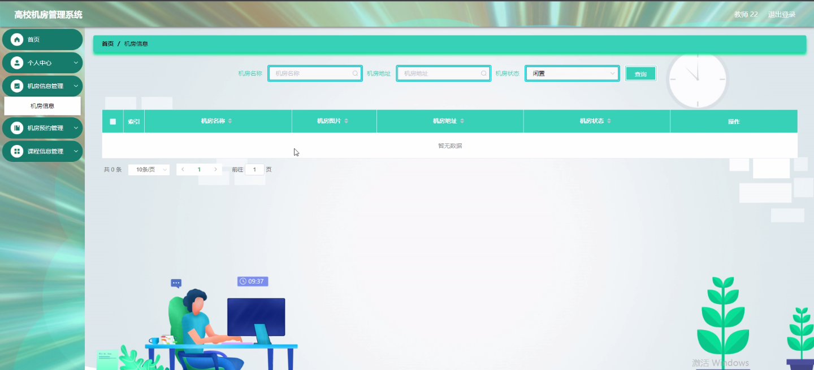

****本项目包含程序+源码+数据库+LW+调试部署环境，文末可获取一份本项目的java源码和数据库参考。****

## ******开题报告******

研究背景：
随着信息技术的快速发展和普及，高校机房成为学生和教师进行计算机学习、科研和教学的重要场所。然而，由于高校机房规模庞大、设备众多、使用频繁，机房管理面临着一系列的挑战和问题。传统的手工管理方式已经无法满足高校机房管理的需求，因此，开发一个高效、智能的高校机房管理系统具有重要的现实意义。

研究意义：
高校机房管理系统的开发和应用可以提高机房资源的利用率，优化机房使用流程，提升学生和教师的学习和教学体验。同时，该系统还可以减轻机房管理员的工作负担，提高管理效率，降低管理成本。此外，通过对机房使用情况的数据分析和统计，还可以为高校决策者提供科学依据，优化机房资源配置，提升整体教育教学水平。

研究目的：
本研究旨在设计和开发一套高校机房管理系统，以解决传统机房管理方式存在的问题，并提升高校机房管理的效率和质量。具体目标包括：提供便捷的学生和教师身份认证方式，实现机房资源的合理分配和使用；建立完善的机房信息管理系统，方便管理员对机房设备、计算机等信息进行维护和管理；提供方便快捷的充值、消费和退款功能，方便用户进行资金管理；实现机房预约和课程信息管理，方便学生和教师进行预约和安排。

研究内容： 本研究将围绕高校机房管理系统的功能需求展开，主要包括以下内容：

  1. 学生管理模块：实现学生身份认证、个人信息管理、上机信息记录等功能。
  2. 教师管理模块：实现教师身份认证、课程信息管理、机房预约审核等功能。
  3. 机房信息管理模块：包括机房设备、计算机配置、机房卡管理等功能。
  4. 充值与消费管理模块：提供学生充值、消费记录、退款申请等功能。
  5. 机房预约管理模块：实现学生和教师对机房的预约、取消预约、查看预约信息等功能。
  6. 数据统计与分析模块：对机房使用情况、消费情况等数据进行统计和分析，为决策提供参考依据。

拟解决的主要问题：

  1. 传统机房管理方式效率低下，无法满足高校机房管理的需求。
  2. 学生和教师身份认证不便捷，存在安全隐患。
  3. 机房设备和计算机信息维护困难，容易出现故障和资源浪费。
  4. 充值、消费和退款流程繁琐，用户体验差。
  5. 机房预约和课程信息管理缺乏统一规范，容易产生冲突和混乱。

研究方案和预期成果：
本研究将采用软件工程的方法，结合需求分析、系统设计、编码实现和测试验证等步骤，开发一套高校机房管理系统。预期成果包括一个功能完善、界面友好、稳定可靠的系统，能够满足高校机房管理的各项需求。同时，通过该系统的应用，预期可以提高机房资源利用率，优化机房使用流程，提升学生和教师的学习和教学体验，降低机房管理成本，为高校决策者提供科学依据，推动高校教育教学的发展。

进度安排：

2022年9月至10月：开题报告编写和提交，完成开题报告的撰写并提交给指导教师进行审核。

2022年11月至2023年1月：系统设计和开发，根据开题报告的要求，进行系统设计和编码工作。

2023年2月至3月：论文撰写和初稿完成，开始撰写论文，并在这个阶段完成论文的初稿。

2023年4月至5月：论文修改和最终定稿，根据指导教师的意见对论文进行修改，并完成最终的定稿。

2023年5月：论文答辩和提交，参加论文答辩并根据答辩结果进行修改，最后将论文提交给学院或学校。

参考文献：

[1]喻佳,吴丹新.基于SpringBoot的Web快速开发框架[J].电脑编程技巧与维护,2021,(09):31-33.

[2]李鹏.基于SpringBoot快速开发平台的实现[J].电子技术与软件工程,2021,(12):36-37.

[3]叶开平,蔡维晟,陈家敏,邓斯妮.基于SpringBoot的综测可视化管理系统的研究与设计[J].电脑知识与技术,2021,(12):100-104.

[4]江健锋,徐振平.Springboot最小系统的设计与实现[J].电脑知识与技术,2021,(04):62-63.

[5]赵炯,司圣杰,周奇才,熊肖磊.通用信息获取系统设计与实现[J].起重运输机械,2020,(16):89-97.

[6]吴英宾.一种内外网数据交互系统的设计与实现[J].软件工程,2020,(08):25-27.

****以上是本项目程序开发之前开题报告内容，最终成品以下面界面为准，大家可以酌情参考使用。要源码参考请在文末进行获取！！****

## ******本项目的界面展示******

