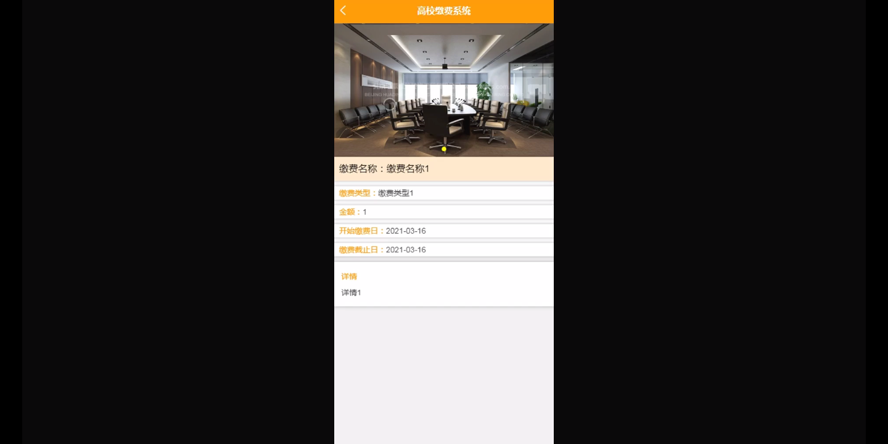

****本项目包含程序+源码+数据库+LW+调试部署环境，文末可获取一份本项目的java源码和数据库参考。****

## ******开题报告******

研究背景：
随着高校规模的不断扩大和教育信息化的快速发展，高校缴费系统在学校管理中扮演着重要的角色。传统的人工缴费方式存在诸多问题，如效率低下、易出错、信息不透明等，给学校和学生带来了很多不便。因此，建立一个高效、准确、安全的高校缴费系统成为了当务之急。

研究意义：
高校缴费系统的建立和优化对于提高学校管理水平、优化学生服务质量具有重要意义。通过引入先进的信息技术手段，可以实现学生缴费的自动化、在线化，极大地提高了缴费效率，减少了人力资源的浪费。同时，高校缴费系统的建立也为学校提供了更加准确、透明的财务管理手段，有助于提升学校的整体管理水平。

研究目的：
本研究旨在设计和开发一套高校缴费系统，以满足高校管理的需求和学生的实际情况。通过对现有高校缴费系统的分析和研究，结合学校的实际情况和需求，设计出一套功能完善、易于使用的高校缴费系统，提高学校管理效率，优化学生服务体验。

研究内容： 本研究的主要内容包括以下几个方面：

  1. 学生信息管理：建立学生信息数据库，包括学生基本信息、专业信息等，实现学生信息的录入、查询和管理。
  2. 缴费名称管理：设置缴费项目的名称和相关信息，包括费用标准、缴费时间等，方便学生进行缴费操作。
  3. 缴费清单管理：生成学生的缴费清单，包括应缴费用、已缴费用等信息，提供给学生查询和管理。
  4. 缴费类型管理：设置不同的缴费类型，如学费、住宿费、图书馆借阅费等，方便学生按照不同类型进行缴费。
  5. 专业信息管理：管理学校的专业信息，包括专业名称、专业代码等，为学生选择缴费项目提供参考。
  6. 学生缴费管理：实现学生的在线缴费功能，包括选择缴费项目、支付方式等，确保缴费过程的安全和便捷。

拟解决的主要问题：
本研究旨在解决传统高校缴费方式存在的效率低下、易出错、信息不透明等问题。通过引入先进的信息技术手段，设计和开发一套高效、准确、安全的高校缴费系统，提高学校管理效率，优化学生服务体验。

研究方案和预期成果：
本研究将采用软件工程的方法，结合需求分析、系统设计、系统实现等步骤，设计和开发一套高校缴费系统。预期成果包括一个功能完善、易于使用的高校缴费系统，并进行实际应用和验证。通过该系统的应用，预计能够提高学校管理效率，优化学生服务体验，为高校管理和学生缴费提供更加便捷、高效的解决方案。

进度安排：

2022年9月至10月：需求分析和规划，进行用户需求调研和分析，确定系统功能和目标。

2022年11月至2023年1月：系统设计和开发，完成系统架构设计和技术选型，并开始编写代码。

2023年2月至3月：测试和优化，进行单元测试和集成测试，修复问题并优化系统性能。

2023年4月至5月：文档编写和培训，编写用户手册和系统文档，并进行相关人员的培训。

2023年5月：上线部署和维护，将系统部署到生产环境中，并定期进行维护和升级。

参考文献：

[1]王振华.SpringBoot在教学效果评估系统中的应用[J].电子技术,2023,(05):67-69.

[2]王明泉.基于SpringBoot远程热部署的探索和应用[J].信息与电脑(理论版),2023,(07):1-4.

[3]王亚东,李晓霞,陈强强,剡美娜.基于SpringBoot的需求发布平台设计[J].信息与电脑(理论版),2023,(01):105-107.

[4]陈新府豪.基于SpringBoot和Vue框架的创新方法推理系统的设计与实现[D].导师：黄静.浙江理工大学,2022.

[5]霍福华,韩慧.基于SpringBoot微服务架构下前后端分离的MVVM模型[J].电子技术与软件工程,2022,(01):73-76.

[6]韩策,张娜,王松亭,张凯,何方,袁峰.SpringBoot OPC客户端设计与研究[J].电子世界,2021,(19):25-26.

****以上是本项目程序开发之前开题报告内容，最终成品以下面界面为准，大家可以酌情参考使用。要源码参考请在文末进行获取！！****

## ******本项目的界面展示******

