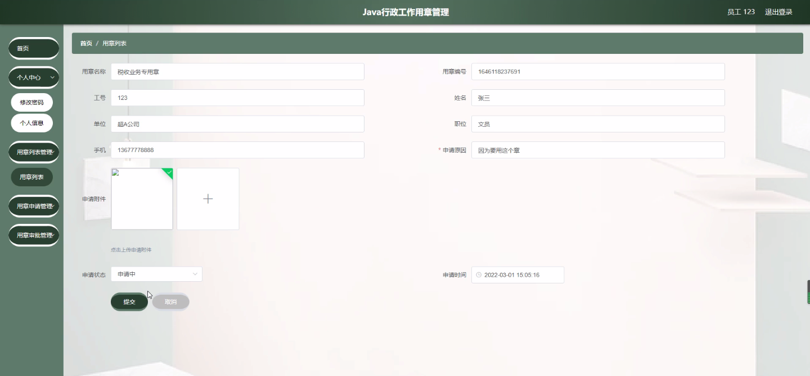

****本项目包含程序+源码+数据库+LW+调试部署环境，文末可获取一份本项目的java源码和数据库参考。****

## ******开题报告******

研究背景：
随着高校行政工作的不断发展和扩大，用章管理成为了一项重要的工作内容。用章是高校行政工作中常见的一种行为，涉及到各个部门的文件、合同、证明等重要文件的签署和认可。然而，由于用章管理涉及到多个环节和多个人员的参与，存在着一些问题和挑战，如用章流程复杂、审批时间长、用章信息不透明等。因此，对高校行政工作用章管理进行深入研究具有重要的现实意义。

研究意义：
高校行政工作用章管理的优化和改进，可以提高行政工作效率，减少行政成本，保障文件的合法性和安全性。同时，通过研究用章管理系统的设计和实施，可以为其他行业和组织提供借鉴和参考，推动用章管理工作的规范化和智能化发展。

研究目的：
本研究旨在探索和分析高校行政工作用章管理的现状和问题，并提出相应的解决方案，以提高用章管理的效率和质量。具体目标包括：1.分析用章管理的流程和环节，找出存在的问题和瓶颈；2.设计和开发一套高效、安全、智能的用章管理系统；3.优化用章管理的工作流程，减少审批时间和人力成本；4.提升用章信息的透明度和可追溯性。

研究内容：
本研究将围绕高校行政工作用章管理展开，主要包括以下内容：1.分析现有用章管理的流程和问题，调研相关的法律法规和政策文件；2.设计和开发用章管理系统，包括员工、经办人、审批人、用章列表、用章申请、用章审批等功能模块；3.优化用章管理的工作流程，建立快速、高效的审批机制；4.加强用章信息的安全保障，确保用章的合法性和真实性；5.评估和验证研究成果的有效性和可行性。

拟解决的主要问题：
本研究旨在解决高校行政工作用章管理中存在的一些主要问题，包括但不限于：用章流程复杂、审批时间长、用章信息不透明、用章安全性不高等。通过优化用章管理的流程和设计智能化的用章管理系统，可以有效解决这些问题，提高用章管理的效率和质量。

研究方案和预期成果：
本研究将采用综合性的研究方法，包括文献调研、案例分析、系统设计与开发等。预期的研究成果包括：1.对高校行政工作用章管理的问题和挑战进行深入分析和总结；2.设计和开发一套高效、安全、智能的用章管理系统；3.优化用章管理的工作流程，减少审批时间和人力成本；4.提升用章信息的透明度和可追溯性；5.验证研究成果的有效性和可行性，并提出进一步改进的建议。

进度安排：

2022年9月至10月：需求分析和规划，明确系统功能和目标，制定项目计划。

2022年11月至2023年1月：系统设计和编码，完成详细的系统设计并开始编写代码。

2023年2月至3月：用户界面开发和数据库开发，开发用户友好的界面和设计数据库结构。

2023年4月至5月：功能测试、文档编写和上线部署，对系统进行全面的功能测试并编写用户手册。

2023年5月：维护和升级，定期对系统进行维护和升级，修复bug和添加新功能。

参考文献：

[1]邱小群,邓丽艳,陈海潮.基于B/S的信息管理系统设计和实现[J].信息与电脑(理论版),2022,(20):146-148.

[2]谢霜.基于Java技术的网络管理体系结构的应用[J].网络安全技术与应用,2022,(10):14-15.

[3]宋锦华.高职院校Java程序设计课程改革研究[J].科技视界,2022,(20):133-135.

[4]曹嵩彭,王鹏宇.浅析Java语言在软件开发中的应用[J].信息记录材料,2022,(03):114-116.

[5]朱澈,余俊达.武汉东湖学院.基于Java的软硬件信息管理系统V1.0[Z].项目立项编号.鉴定单位.鉴定日期:

****以上是本项目程序开发之前开题报告内容，最终成品以下面界面为准，大家可以酌情参考使用。要源码参考请在文末进行获取！！****

## ******本项目的界面展示******

