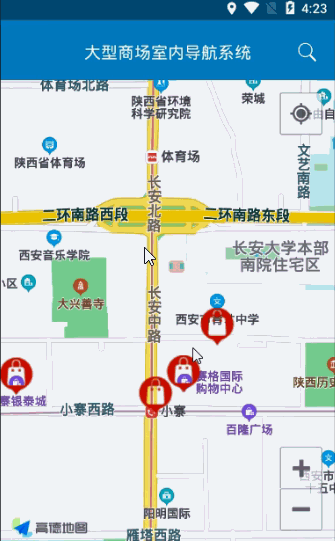
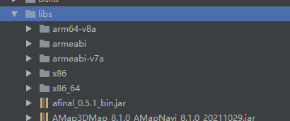

> **博主介绍：**
> 本人专注于Android/java/数据库/微信小程序技术领域的开发，以及有好几年的计算机毕业设计方面的实战开发经验和技术积累；尤其是在安卓（Android）的app的开发和微信小程序的开发，很是熟悉和了解；本人也是多年的Android开发人员；希望我发布的此篇文件可以帮助到您；
>
> 🍅 **希望文章对您有帮助** 🍅

#### 一、功能演示

#### 二、实现方式

因为客户端显示的位置数据都是调用api获取的；所以我只说明一下导航的逻辑就可以了

##### 1：导入高德配置文件

说明：这块需要导航的jar文件以及定位jar文件

##### 2：配置AndroidManifest.xml

>
>     <!-- 设置talkingdata应用的appkey -->
>     <service android:name="com.amap.api.location.APSService" >
>     </service>
>  
>     <meta-data
>         android:name="com.amap.api.v2.apikey"
>         android:value="您的key文件" >
>     </meta-data>
>  

##### 3：进行导航

>
>     **LatLng startInfor = new
> LatLng(Double.valueOf(mAmapLocation.getLatitude()),
> mAmapLocation.getLongitude())** ;//起始地址
>     **LatLng endInfor = new LatLng(Double.valueOf(mallModel.getMallLat()),
> Double.valueOf(mallModel.getMallLon()))** ;//终到地址
>     AmapNaviParams params = new AmapNaviParams(new
> Poi(mAmapLocation.getAddress(),startInfor, ""), null, new
> Poi(mallModel.getMallName(), endInfor, ""), AmapNaviType.DRIVER);
>     params.setUseInnerVoice(true);
>     AmapNaviPage.getInstance().showRouteActivity(this, params, this);

说明：这块的代码是高德的api提供的；主要是调起导航的功能，只需要提供这几个参数信息就可以了；

完整的代码如下：

>
>     public class OrderLookActivity extends BaseActivity implements
> INaviInfoCallback, AMapLocationListener {
>  
>         // 标题
>         private TextView mTvTitle;
>         // 返回
>         private ImageView mIvBack;
>         private TextView mIvStu;
>         private TextView userName;
>         private TextView userPhone;
>  
>         private Button naviInfor;
>  
>         private ListView mListMessage;
>  
>         AMapLocation mAmapLocation;
>  
>         // 声明mlocationClient对象
>         public AMapLocationClient mlocationClient;
>         // 声明mLocationOption对象
>         public AMapLocationClientOption mLocationOption = null;
>  
>         @Override
>         protected void onCreate(Bundle savedInstanceState) {
>             super.onCreate(savedInstanceState);
>             setContentView(R.layout.activity_order_look);
>             initWidget();
>             initData();
>             initAddress();
>         }
>  
>  
>  
>         private void initAddress() {
>  
>             try {
>                 mlocationClient = new AMapLocationClient(this);
>             } catch (Exception e) {
>                 e.printStackTrace();
>             }
>             // 初始化定位参数
>             mLocationOption = new AMapLocationClientOption();
>             // 设置定位监听
>             mlocationClient.setLocationListener(this);
>             // 设置定位模式为高精度模式，Battery_Saving为低功耗模式，Device_Sensors是仅设备模式
>
> mLocationOption.setLocationMode(AMapLocationClientOption.AMapLocationMode.Device_Sensors);
>             // 设置定位间隔,单位毫秒,默认为2000ms
>             mLocationOption.setInterval(10000);
>             mLocationOption.setOnceLocation(false);
>             //设置是否返回地址信息（默认返回地址信息）
>             mLocationOption.setNeedAddress(true);
>             // 此方法为每隔固定时间会发起一次定位请求，为了减少电量消耗或网络流量消耗，
>             //
> 注意设置合适的定位时间的间隔（最小间隔支持为1000ms），并且在合适时间调用stopLocation()方法来取消定位请求
>             // 在定位结束后，在合适的生命周期调用onDestroy()方法
>             // 在单次定位情况下，定位无论成功与否，都无需调用stopLocation()方法移除请求，定位sdk内部会移除
>             // 启动定位
>
> mLocationOption.setLocationPurpose(AMapLocationClientOption.AMapLocationPurpose.Sport);
>  
>             mlocationClient.setLocationOption(mLocationOption);
>             //设置场景模式后最好调用一次stop，再调用start以保证场景模式生效
>             mlocationClient.stopLocation();
>             mlocationClient.startLocation();
>         }
>         @Override
>         public void onClick(View v) {
>             switch (v.getId()) {
>                 case R.id.mIvBack:
>                     OrderLookActivity.this.finish();
>                     break;
>  
>                 case R.id.naviInfor:
>  
>                     LatLng startInfor = new
> LatLng(Double.valueOf(mAmapLocation.getLatitude()),
> mAmapLocation.getLongitude());//故宫博物院
>                     LatLng endInfor = new
> LatLng(Double.valueOf(mallModel.getMallLat()),
> Double.valueOf(mallModel.getMallLon()));//北京站
>                     AmapNaviParams params = new AmapNaviParams(new
> Poi(mAmapLocation.getAddress(),startInfor, ""), null, new
> Poi(mallModel.getMallName(), endInfor, ""), AmapNaviType.DRIVER);
>                     params.setUseInnerVoice(true);
>                     AmapNaviPage.getInstance().showRouteActivity(this,
> params, this);
>                     break;
>  
>  
>             }
>         }
>  
>         @Override
>         public void initWidget() {
>  
>  
>             mListMessage = (ListView) findViewById(R.id.mListMessage);
>             userName = (TextView) findViewById(R.id.userName);
>             userPhone = (TextView) findViewById(R.id.userPhone);
>  
>  
>  
>             mIvBack = (ImageView) findViewById(R.id.mIvBack);
>             mTvTitle = (TextView) findViewById(R.id.mTvTitle);
>             mIvStu = (TextView) findViewById(R.id.mIvStu);
>             mTvTitle.setText("商场公告");
>             mIvBack.setVisibility(View.VISIBLE);
>             mIvBack.setOnClickListener(this);
>             mIvStu.setOnClickListener(this);
>             mIvStu.setVisibility(View.GONE);
>             naviInfor = (Button) findViewById(R.id.naviInfor);
>             naviInfor.setOnClickListener(this);
>  
>  
>         }
>  
>         MallModel mallModel;
>  
>         @Override
>         public void initData() {
>  
>  
>             mallModel = (MallModel)
> this.getIntent().getSerializableExtra("msg");
>             userName.setText(mallModel.getMallName());
>             userPhone.setText("地址："+mallModel.getMallAddress() + "");
>             listMessageNews(false);
>  
>  
>             mListMessage.setOnItemClickListener(new
> AdapterView.OnItemClickListener() {
>                 @Override
>                 public void onItemClick(AdapterView<?> parent, View view,
> int position, long id) {
>                     Intent intent = new Intent(OrderLookActivity.this,
> NoticeMessageActivity.class);
>                     intent.putExtra("msg", list_result.get(position));
>                     OrderLookActivity.this.startActivity(intent);
>                 }
>             });
>  
>  
>  
>         }
>  
>  
>         private void listMessageNews(boolean isShow) {
>             AjaxParams params = new AjaxParams();
>             params.put("action_flag", "listMessageNews");
>             params.put("newsMallId",mallModel.getMallId()+"");
>             httpPost(Consts.URL + Consts.APP.MessageAction, params,
> Consts.actionId.resultFlag, isShow, "正在加载...");
>         }
>  
>         private List<NewsModel> list_result = new ArrayList<NewsModel>();
>  
>         @Override
>         protected void callBackSuccess(ResponseEntry entry, int actionId) {
>             super.callBackSuccess(entry, actionId);
>  
>             switch (actionId) {
>                 case Consts.actionId.resultFlag:
>                     if (null != entry.getData() &&
> !TextUtils.isEmpty(entry.getData())) {
>  
>                         String jsonMsg = entry.getData().substring(1,
> entry.getData().length() - 1);
>                         if (null != jsonMsg && !TextUtils.isEmpty(jsonMsg))
> {
>                             list_result.clear();
>                             list_result = mGson.fromJson(entry.getData(),
> new TypeToken<List<NewsModel>>() {
>                             }.getType());
>                             NoticeAdapter noticeAdapter= new
> NoticeAdapter(this, list_result);
>                             mListMessage.setAdapter(noticeAdapter);
>                         } else {
>                         }
>                     }
>                     break;
>  
>             }
>  
>         }
>  
>  
>         @Override
>         public void onLocationChanged(AMapLocation amapLocation) {
>             if (amapLocation != null) {
>                 if (amapLocation.getErrorCode() == 0) {
>  
>                     mAmapLocation = amapLocation;
>                     // 定位成功回调信息，设置相关消息
>                     amapLocation.getLocationType();//
> 获取当前定位结果来源，如网络定位结果，详见定位类型表
>                     amapLocation.getAccuracy();// 获取精度信息
>                     Log.i("pony_log", "获取定位数据：" +
> amapLocation.getAddress());
>  
>                 } else {
>                     Log.e("AmapError", "location Error, ErrCode:" +
> amapLocation.getErrorCode() + ", errInfo:" + amapLocation.getErrorInfo());
>                 }
>             }
>         }
>  
>  
>         @Override
>         public void onInitNaviFailure() {
>  
>         }
>  
>         @Override
>         public void onGetNavigationText(String s) {
>  
>         }
>  
>         @Override
>         public void onLocationChange(AMapNaviLocation aMapNaviLocation) {
>  
>         }
>  
>         @Override
>         public void onArriveDestination(boolean b) {
>  
>         }
>  
>         @Override
>         public void onStartNavi(int i) {
>  
>         }
>  
>         @Override
>         public void onCalculateRouteSuccess(int[] ints) {
>  
>         }
>  
>         @Override
>         public void onCalculateRouteFailure(int i) {
>  
>         }
>  
>         @Override
>         public void onStopSpeaking() {
>  
>         }
>  
>         @Override
>         public void onReCalculateRoute(int i) {
>  
>         }
>  
>         @Override
>         public void onExitPage(int i) {
>  
>         }
>  
>         @Override
>         public void onStrategyChanged(int i) {
>  
>         }
>  
>         @Override
>         public void onArrivedWayPoint(int i) {
>  
>         }
>  
>         @Override
>         public void onMapTypeChanged(int i) {
>  
>         }
>  
>         @Override
>         public void onNaviDirectionChanged(int i) {
>  
>         }
>  
>         @Override
>         public void onDayAndNightModeChanged(int i) {
>  
>         }
>  
>         @Override
>         public void onBroadcastModeChanged(int i) {
>  
>         }
>  
>         @Override
>         public void onScaleAutoChanged(boolean b) {
>  
>         }
>  
>         @Override
>         public View getCustomMiddleView() {
>             return null;
>         }
>  
>         @Override
>         public View getCustomNaviView() {
>             return null;
>         }
>  
>         @Override
>         public View getCustomNaviBottomView() {
>             return null;
>         }
>  
>  
>     }

**具体逻辑是：**

**1：首先获取定位数据拿到当前坐标和当前的地址信息**

**2：通过上个页面传递的值传递到需要导航的方法里面去**

**3：进行导航**

#### 三、留个脚印吧

> 大家要是感觉此篇文章有意义；那就给个关注、点赞，收藏吧；
>
> 🍅 **也可以关注文档末尾公众号** 🍅

