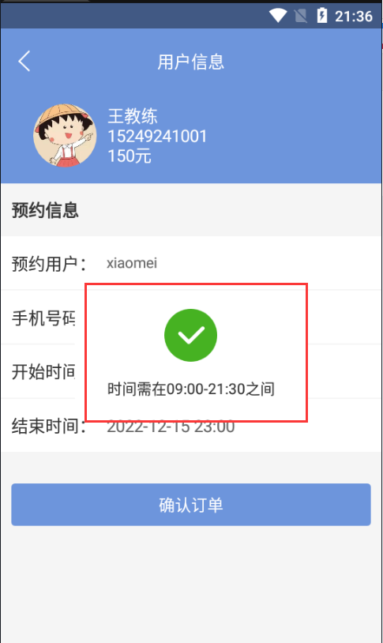

效果展示：

具体代码：

>
>     String startTimeZoom = "08:00";//时间区间-开始时间
>     String endTimeZoom = "22:00";//时间区间-结束时间
>  
>     String startTimeChoice = "08:00";//时间区间-选择的开始时间
>     String endTimeChoice = "22:00";//时间区间-选择的结束时间
>  
>     SimpleDateFormat dfChoice = new SimpleDateFormat("HH:mm");// 设置日期格式
>  
>     Date startChoice = dfChoice.parse(startTimeChoice);
>     Date endChoice = dfChoice.parse(endTimeChoice);
>  
>  
>     String format = "HH:mm";
>     Date startTimeFr = new SimpleDateFormat(format).parse(startTimeZoom);
>     Date endTimeFr = new SimpleDateFormat(format).parse(endTimeZoom);
>  
>  
>     if (!isEffectiveDate(startChoice,startTimeFr, endTimeFr)) {
>        CustomToast.showToast(this,
> "时间需在"+startTimeZoom+"-"+endTimeZoom+"之间");
>        return;
>     }
>  
>     if (!isEffectiveDate(endChoice, startTimeFr, endTimeFr)) {
>        CustomToast.showToast(this,
> "时间需在"+startTimeZoom+"-"+endTimeZoom+"之间");
>        return;
>     }

时间处理方法：

>
>     public static boolean isEffectiveDate(Date nowTime, Date startTime, Date
> endTime) {
>        if (nowTime.getTime() == startTime.getTime()
>              || nowTime.getTime() == endTime.getTime()) {
>           return true;
>        }
>  
>        Calendar date = Calendar.getInstance();
>        date.setTime(nowTime);
>  
>        Calendar begin = Calendar.getInstance();
>        begin.setTime(startTime);
>  
>        Calendar end = Calendar.getInstance();
>        end.setTime(endTime);
>  
>        if (date.after(begin) && date.before(end)) {
>           return true;
>        } else {
>           return false;
>        }
>     }

