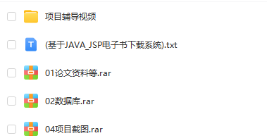
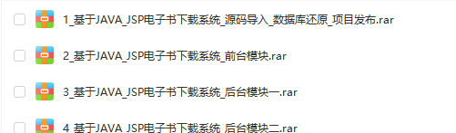
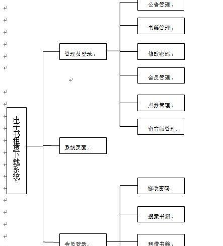
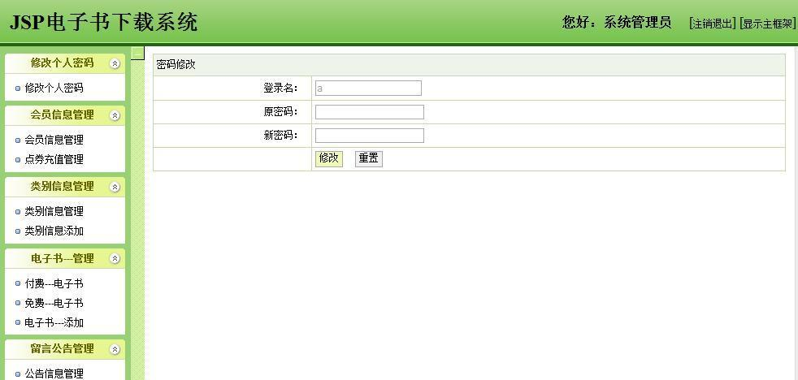

> **博主介绍：**
> 本人专注于Android/java/数据库/微信小程序技术领域的开发，以及有好几年的计算机毕业设计方面的实战开发经验和技术积累；尤其是在安卓（Android）的app的开发和微信小程序的开发，很是熟悉和了解；本人也是多年的Android开发人员；希望我发布的此篇文件可以帮助到您；
>
> 🍅 **文章末尾获取源码下载方式** 🍅

**目录**

分享内容信息截图：

一、项目介绍

二、运行环境

三、软件截图

1：功能图说明

2：软件首页信息

3：软件后台管理

四、部分代码

1：用户信息

2：数据库操作文件

五、源码获取

* * *

#### 分享内容信息截图：

#### 一、项目介绍

基于JAVA_JSP电子书下载系统主要用功能包括：图书信息分类查询、书名和作者查询、用户注册、点券充值、留言板；公告阅览、会员管理、书籍管理、书籍类别管理、公告管理等等功能

> **1：后台管理:**  
>  个人信息管理：实现个密码信息的修改  
>  会员信息管理：实现会员信息的查询、删除  
>  点券充值管理：实现充值信息的查询、审核、删除  
>  类别信息管理：实现图书类别信息增加、删除、修改、查看功能  
>  电子书信息管理：实现电子书信息的增加、删除、修改、查看功能  
>  留言公告管理：实现公告信息的增加、删除、修改、查看功能  
>  实现留言信息的查询和删除
>
> **2：前台管理：**  
>  实现电子书信息的分类查询、作者、书名查询  
>  实现用户信息的注册  
>  实现用户的登录和退出  
>  实现登录用户的留言、重置、书籍下载

#### 二、运行环境

> 1：操作系统是Windows10或者Windows11  
>  2：Myeclipse 2014  
>  3：数据库使用SQL Server  
>  4：服务端tomcat是7.0

#### 三、软件截图

##### 1：功能图说明

##### 2：软件首页信息

##### 3：软件后台管理

#### 四、部分代码

##### 1：用户信息

    
    
    public class user_servlet extends HttpServlet
    {
    	public void service(HttpServletRequest req,HttpServletResponse res)throws ServletException, IOException 
    	{
            String type=req.getParameter("type");
    		
    		
    		if(type.endsWith("userReg"))
    		{
    			userReg(req, res);
    		}
    		if(type.endsWith("userLogout"))
    		{
    			userLogout(req, res);
    		}
    		if(type.endsWith("userEdit"))
    		{
    			userEdit(req, res);
    		}
    		if(type.endsWith("userMana"))
    		{
    			userMana(req, res);
    		}
    		if(type.endsWith("userDel"))
    		{
    			userDel(req, res);
    		}
    		if(type.endsWith("userDetail"))
    		{
    			userDetail(req, res);
    		}
    	}
    	
    	
    	public void userReg(HttpServletRequest req,HttpServletResponse res)
    	{
    		String id=String.valueOf(new Date().getTime());
    		String loginname=req.getParameter("loginname");
    		String loginpw=req.getParameter("loginpw");
    		String name=req.getParameter("name");
    		String sex=req.getParameter("sex");
    		String age=req.getParameter("age");
    		String address=req.getParameter("address");
    		String tel=req.getParameter("tel");
    		String email=req.getParameter("email");
    		String qq=req.getParameter("qq");
    		int dianquan=0;
    		String del="no";
    		
    		String sql="insert into t_user values(?,?,?,?,?,?,?,?,?,?,?,?)";
    		Object[] params={id,loginname,loginpw,name,sex,age,address,tel,email,qq,dianquan,del};
    		DB mydb=new DB();
    		mydb.doPstm(sql, params);
    		mydb.closed();
    		
            String targetURL = "/common/add_success.jsp";
    		dispatch(targetURL, req, res);
    	}
    	
    	
    	
    	public void userLogout(HttpServletRequest req,HttpServletResponse res)
    	{
    		req.getSession().setAttribute("user", null);
    		String targetURL = "/qiantai/default.jsp";
    		dispatch(targetURL, req, res);		
    	}
    	
    	public void userEdit(HttpServletRequest req,HttpServletResponse res)
    	{
    		String id=req.getParameter("id");
    		String loginname=req.getParameter("loginname");
    		String loginpw=req.getParameter("loginpw");
    		String name=req.getParameter("name");
    		String sex=req.getParameter("sex");
    		String age=req.getParameter("age");
    		String address=req.getParameter("address");
    		String tel=req.getParameter("tel");
    		String email=req.getParameter("email");
    		String qq=req.getParameter("qq");
    		
    		String sql="update t_user set loginpw=?,name=?,sex=?,age=?,address=?,tel=?,email=?,qq=? where id=?";
    		Object[] params={loginpw,name,sex,age,address,tel,email,qq,id};
    		DB mydb=new DB();
    		mydb.doPstm(sql, params);
    		mydb.closed();
    		
    		String targetURL = "/common/add_success.jsp";
    		dispatch(targetURL, req, res);
    	}
    	
    	
    	public void userDel(HttpServletRequest req,HttpServletResponse res)
    	{
    		String id=req.getParameter("id");
    		
    		String sql="update t_user set del='yes' where id=?";
    		Object[] params={id};
    		DB mydb=new DB();
    		mydb.doPstm(sql, params);
    		mydb.closed();
    		
    		req.setAttribute("message", "²Ù×÷³É¹¦");
    		req.setAttribute("path", "user?type=userMana");
    		
            String targetURL = "/common/success.jsp";
    		dispatch(targetURL, req, res);
    	}
    
    	public void userMana(HttpServletRequest req,HttpServletResponse res) throws ServletException, IOException
    	{
    		List userList=new ArrayList();
    		String sql="select * from t_user where del='no'";
    		Object[] params={};
    		DB mydb=new DB();
    		try
    		{
    			mydb.doPstm(sql, params);
    			ResultSet rs=mydb.getRs();
    			while(rs.next())
    			{
    				Tuser user=new Tuser();
    				
    				user.setId(rs.getString("id"));
    				user.setLoginname(rs.getString("loginname"));
    				user.setLoginpw(rs.getString("loginpw"));
    				user.setLoginpw(rs.getString("loginpw"));
    				user.setName(rs.getString("name"));
    				user.setSex(rs.getString("sex"));
    				user.setAge(rs.getString("age"));
    				user.setAddress(rs.getString("address"));
    				user.setTel(rs.getString("tel"));
    				user.setEmail(rs.getString("email"));
    				user.setQq(rs.getString("qq"));
    				user.setDianquan(rs.getInt("dianquan"));
    				
    				userList.add(user);
    		    }
    			rs.close();
    		}
    		catch(Exception e)
    		{
    			e.printStackTrace();
    		}
    		mydb.closed();
    		
    		req.setAttribute("userList", userList);
    		req.getRequestDispatcher("admin/user/userMana.jsp").forward(req, res);
    	}
    	
    	
    	
    	public void userDetail(HttpServletRequest req,HttpServletResponse res) throws ServletException, IOException
    	{
    		List userList=new ArrayList();
    		String sql="select * from t_user where id=?";
    		Object[] params={req.getParameter("id")};
    		DB mydb=new DB();
    		try
    		{
    			mydb.doPstm(sql, params);
    			ResultSet rs=mydb.getRs();
    			while(rs.next())
    			{
    				Tuser user=new Tuser();
    				
    				user.setId(rs.getString("id"));
    				user.setLoginname(rs.getString("loginname"));
    				user.setLoginpw(rs.getString("loginpw"));
    				user.setLoginpw(rs.getString("loginpw"));
    				user.setName(rs.getString("name"));
    				user.setSex(rs.getString("sex"));
    				user.setAge(rs.getString("age"));
    				user.setAddress(rs.getString("address"));
    				user.setTel(rs.getString("tel"));
    				user.setEmail(rs.getString("email"));
    				user.setQq(rs.getString("qq"));
    				user.setDianquan(rs.getInt("dianquan"));
    				
    				userList.add(user);
    		    }
    			rs.close();
    		}
    		catch(Exception e)
    		{
    			e.printStackTrace();
    		}
    		mydb.closed();
    		
    		req.setAttribute("userList", userList);
    		req.getRequestDispatcher("admin/user/userDetail.jsp").forward(req, res);
    	}
    	
    	public void dispatch(String targetURI,HttpServletRequest request,HttpServletResponse response) 
    	{
    		RequestDispatcher dispatch = getServletContext().getRequestDispatcher(targetURI);
    		try 
    		{
    		    dispatch.forward(request, response);
    		    return;
    		} 
    		catch (ServletException e) 
    		{
                        e.printStackTrace();
    		} 
    		catch (IOException e) 
    		{
    			
    		    e.printStackTrace();
    		}
    	}
    	public void init(ServletConfig config) throws ServletException 
    	{
    		super.init(config);
    	}
    	
    	public void destroy() 
    	{
    		
    	}
    }
    

##### 2：数据库操作文件

    
    
    package cn.itbaizhan.dao;
    
    import java.sql.Connection;
    import java.sql.DriverManager;
    import java.sql.PreparedStatement;
    import java.sql.ResultSet;
    import java.sql.SQLException;
    
    public class DB
    {
    	private Connection con;
    
    	private PreparedStatement pstm;
    
    	private String user = "sa";
    
    	private String password = "123456";
    
    	private String className = "com.microsoft.sqlserver.jdbc.SQLServerDriver";
    
    	private String url = "jdbc:sqlserver://192.168.0.132:1433;databaseName=db_book";
     
    	
    	public DB()
    	{
    		try
    		{
    			Class.forName(className);
    		} catch (ClassNotFoundException e)
    		{
    			System.out.println("¼ÓÔØÊý¾Ý¿âÇý¶¯Ê§°Ü£¡");
    			e.printStackTrace();
    		}
    	}
    
    	/** ´´½¨Êý¾Ý¿âÁ¬½Ó */
    	public Connection getCon()
    	{
    		try
    		{
    			con = DriverManager.getConnection(url, user, password);
    		} catch (SQLException e)
    		{
    			System.out.println("´´½¨Êý¾Ý¿âÁ¬½Óʧ°Ü£¡");
    			con = null;
    			e.printStackTrace();
    		}
    		return con;
    	}
    
    	public void doPstm(String sql, Object[] params)
    	{
    		if (sql != null && !sql.equals(""))
    		{
    			if (params == null)
    				params = new Object[0];
    
    			getCon();
    			if (con != null)
    			{
    				try
    				{
    					System.out.println(sql);
    					pstm = con.prepareStatement(sql,
    							ResultSet.TYPE_SCROLL_INSENSITIVE,
    							ResultSet.CONCUR_READ_ONLY);
    					for (int i = 0; i < params.length; i++)
    					{
    						pstm.setObject(i + 1, params[i]);
    					}
    					pstm.execute();
    				} catch (SQLException e)
    				{
    					System.out.println("doPstm()·½·¨³ö´í£¡");
    					e.printStackTrace();
    				}
    			}
    		}
    	}
    
    	public ResultSet getRs() throws SQLException
    	{
    		return pstm.getResultSet();
    	}
    
    	public int getCount() throws SQLException
    	{
    		return pstm.getUpdateCount();
    	}
    
    	public void closed()
    	{
    		try
    		{
    			if (pstm != null)
    				pstm.close();
    		} catch (SQLException e)
    		{
    			System.out.println("¹Ø±Õpstm¶ÔÏóʧ°Ü£¡");
    			e.printStackTrace();
    		}
    		try
    		{
    			if (con != null)
    			{
    				con.close();
    			}
    		} catch (SQLException e)
    		{
    			System.out.println("¹Ø±Õcon¶ÔÏóʧ°Ü£¡");
    			e.printStackTrace();
    		}
    	}
    }
    

#### 五、源码获取

> 大家 **点赞、收藏、关注、评论** 啦 、👇🏻👇🏻👇🏻后期分享更多优质毕业设计源码👇🏻👇🏻👇🏻
>
> 🍅 **搜索微信关注公众号：毕设code；或者扫描下方二维码；** 🍅
>
> 回复： **电子书下载**
>
> 就可免费下载源码信息；

